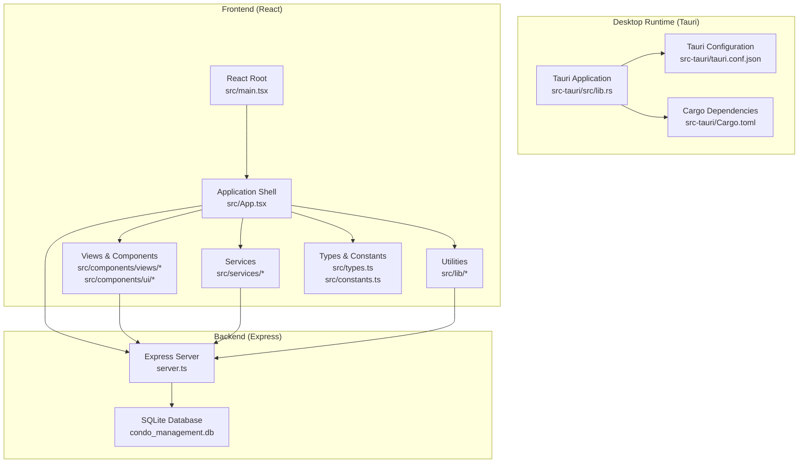
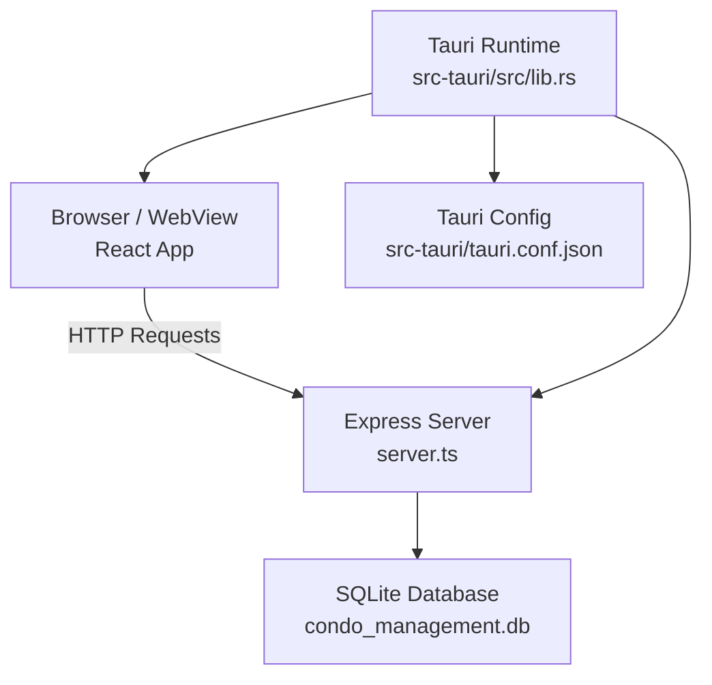
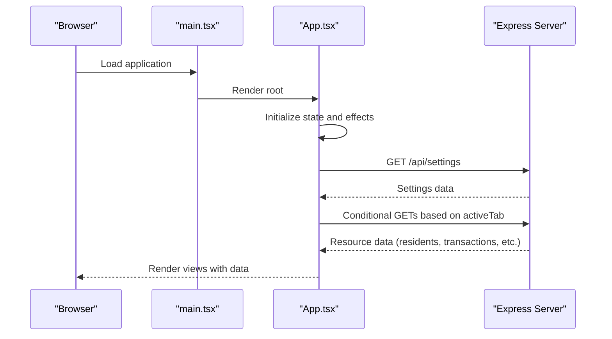
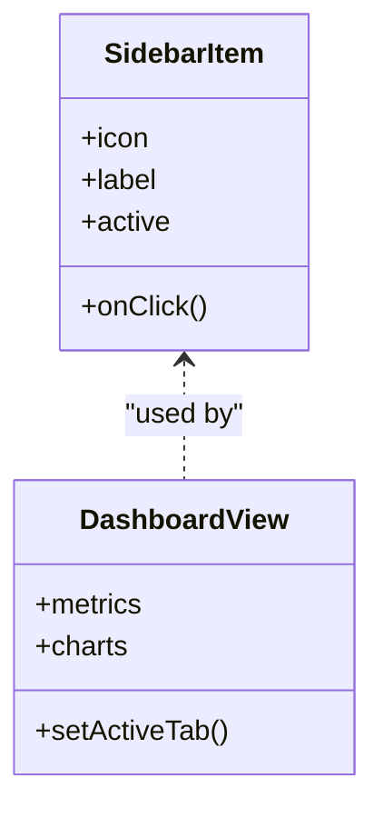
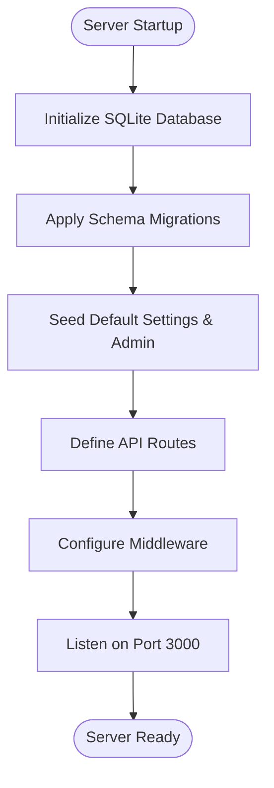
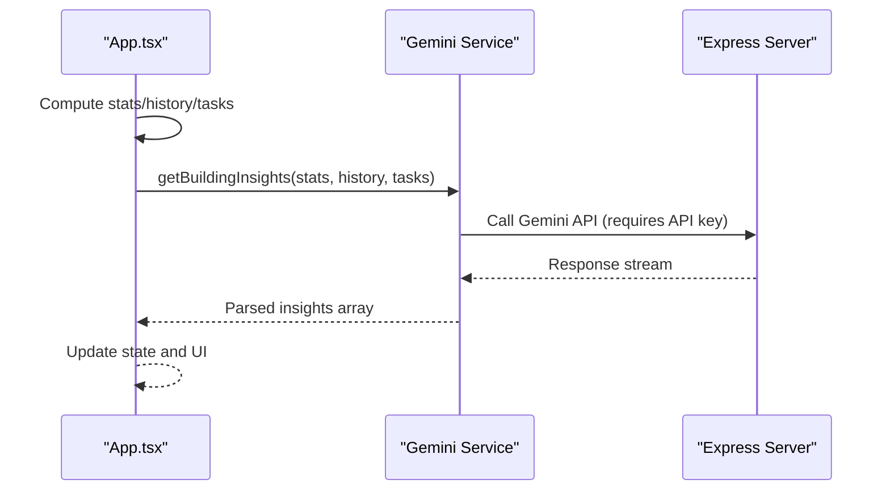
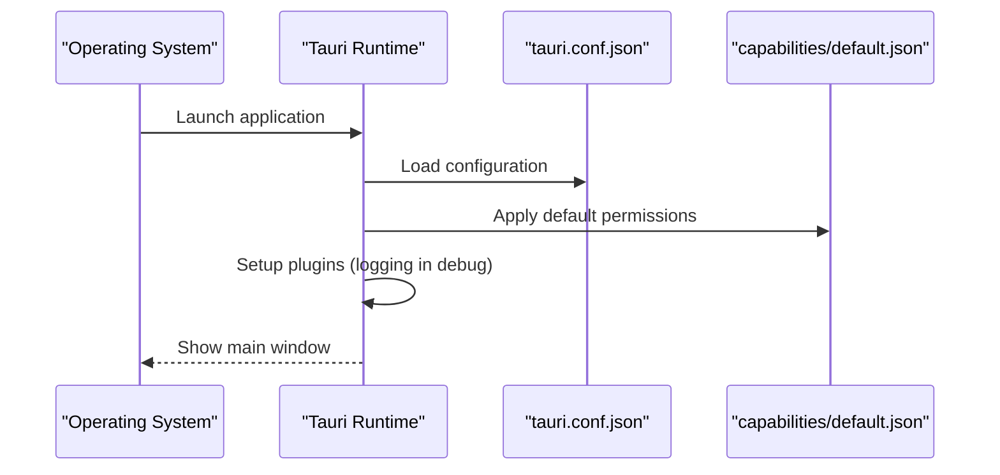
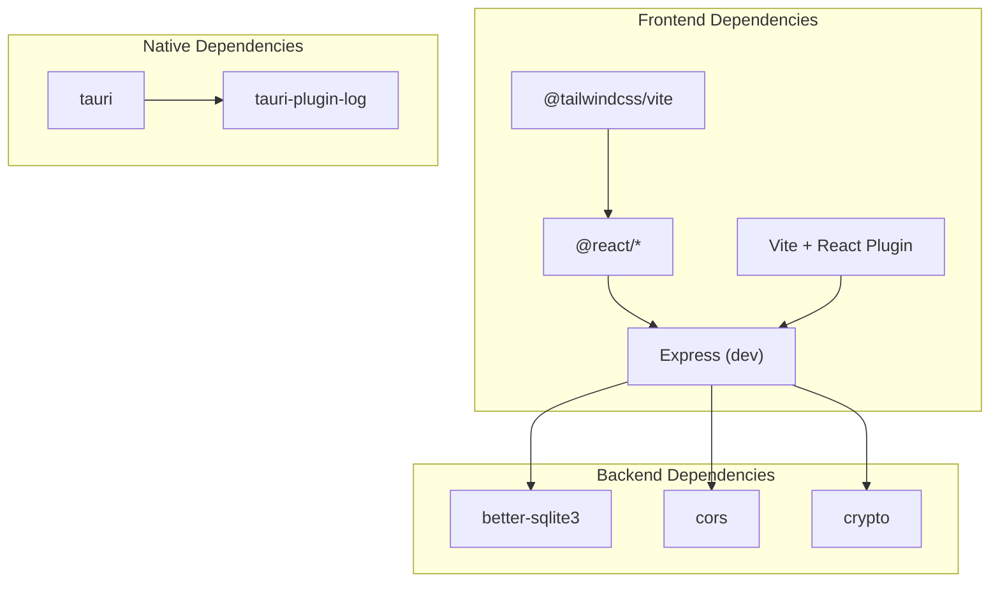

# Architecture Overview

<cite>
**Referenced Files in This Document**
- [README.md](file://README.md)
- [package.json](file://package.json)
- [vite.config.ts](file://vite.config.ts)
- [server.ts](file://server.ts)
- [src/main.tsx](file://src/main.tsx)
- [src/App.tsx](file://src/App.tsx)
- [src/components/ui/SidebarItem.tsx](file://src/components/ui/SidebarItem.tsx)
- [src/components/views/DashboardView.tsx](file://src/components/views/DashboardView.tsx)
- [src/services/geminiService.ts](file://src/services/geminiService.ts)
- [src/lib/pdf.ts](file://src/lib/pdf.ts)
- [src/constants.ts](file://src/constants.ts)
- [src/types.ts](file://src/types.ts)
- [src-tauri/Cargo.toml](file://src-tauri/Cargo.toml)
- [src-tauri/tauri.conf.json](file://src-tauri/tauri.conf.json)
- [src-tauri/src/lib.rs](file://src-tauri/src/lib.rs)
- [src-tauri/src/main.rs](file://src-tauri/src/main.rs)
- [src-tauri/capabilities/default.json](file://src-tauri/capabilities/default.json)
</cite>

## Table of Contents
1. [Introduction](#introduction)
2. [Project Structure](#project-structure)
3. [Core Components](#core-components)
4. [Architecture Overview](#architecture-overview)
5. [Detailed Component Analysis](#detailed-component-analysis)
6. [Dependency Analysis](#dependency-analysis)
7. [Performance Considerations](#performance-considerations)
8. [Security Model](#security-model)
9. [System Integration](#system-integration)
10. [Technology Stack Rationale](#technology-stack-rationale)
11. [Troubleshooting Guide](#troubleshooting-guide)
12. [Conclusion](#conclusion)

## Introduction
This document describes the architecture of the EdiIA Building Management System, a hybrid desktop application that combines a modern React frontend with a Tauri-powered native runtime. The system provides a comprehensive building management solution with financial tracking, resident management, HR workflows, maintenance operations, and reporting capabilities. It leverages a local Express server backed by a SQLite database for persistence, while the React application communicates with the backend via HTTP APIs. The Tauri layer packages the application into a native desktop experience with controlled system capabilities.

## Project Structure
The project follows a clear separation of concerns:
- Frontend: React application built with Vite, TypeScript, Tailwind CSS, and component-based architecture
- Backend: Express server with SQLite database for data persistence
- Native Runtime: Tauri application wrapper for desktop deployment
- Shared Types and Services: Common TypeScript interfaces and utility modules

**Diagram sources**
- [src-tauri/src/lib.rs:1-17](file://src-tauri/src/lib.rs#L1-L17)
- [src-tauri/tauri.conf.json:1-41](file://src-tauri/tauri.conf.json#L1-L41)
- [src-tauri/Cargo.toml:1-26](file://src-tauri/Cargo.toml#L1-L26)
- [src/main.tsx:1-11](file://src/main.tsx#L1-L11)
- [src/App.tsx:1-200](file://src/App.tsx#L1-L200)
- [server.ts:1-100](file://server.ts#L1-L100)

**Section sources**
- [README.md:1-21](file://README.md#L1-L21)
- [package.json:1-45](file://package.json#L1-L45)
- [vite.config.ts:1-25](file://vite.config.ts#L1-L25)
- [src-tauri/tauri.conf.json:1-41](file://src-tauri/tauri.conf.json#L1-L41)

## Core Components
- React Application Shell: Orchestrates navigation, state management, and API interactions
- View Components: Feature-specific screens for dashboard, finance, residents, HR, projects, maintenance, reports, communications, and settings
- UI Components: Reusable elements like sidebar items and metric cards
- Services: Business logic modules for AI insights and PDF generation
- Backend Server: Express routes providing CRUD operations and authentication
- Tauri Runtime: Desktop packaging and capability management

**Section sources**
- [src/App.tsx:55-120](file://src/App.tsx#L55-L120)
- [src/components/views/DashboardView.tsx:1-200](file://src/components/views/DashboardView.tsx#L1-L200)
- [src/components/ui/SidebarItem.tsx:1-21](file://src/components/ui/SidebarItem.tsx#L1-L21)
- [src/services/geminiService.ts:1-49](file://src/services/geminiService.ts#L1-L49)
- [src/lib/pdf.ts:1-58](file://src/lib/pdf.ts#L1-L58)
- [server.ts:189-633](file://server.ts#L189-L633)
- [src-tauri/src/lib.rs:1-17](file://src-tauri/src/lib.rs#L1-L17)

## Architecture Overview
The EdiIA system employs a hybrid desktop architecture:
- Web Interface: React SPA served by Vite in development and bundled for production
- Native Runtime: Tauri wraps the web assets into a native desktop application
- Backend Service: Express server runs locally on port 3000, providing REST APIs
- Data Persistence: SQLite database file managed by the backend
- Inter-Process Communication: React frontend communicates with the backend via HTTP requests; Tauri manages the packaged application lifecycle

**Diagram sources**
- [src-tauri/src/lib.rs:1-17](file://src-tauri/src/lib.rs#L1-L17)
- [src-tauri/tauri.conf.json:6-11](file://src-tauri/tauri.conf.json#L6-L11)
- [server.ts:45-656](file://server.ts#L45-L656)

## Detailed Component Analysis

### React Application Shell
The React application initializes the root and renders the main App component. The App component manages global state, user authentication, navigation, and orchestrates data fetching from the backend. It lazily loads view components to optimize initial bundle size and uses suspense boundaries for smooth loading experiences.

**Diagram sources**
- [src/main.tsx:1-11](file://src/main.tsx#L1-L11)
- [src/App.tsx:125-293](file://src/App.tsx#L125-L293)
- [server.ts:191-217](file://server.ts#L191-L217)

**Section sources**
- [src/main.tsx:1-11](file://src/main.tsx#L1-L11)
- [src/App.tsx:75-120](file://src/App.tsx#L75-L120)

### View Components and Navigation
The application uses a sidebar-driven navigation pattern. Each view component encapsulates its own state and interactions, communicating with the backend through dedicated API endpoints. The dashboard view demonstrates chart rendering and summary metrics using reusable UI components.

**Diagram sources**
- [src/components/ui/SidebarItem.tsx:1-21](file://src/components/ui/SidebarItem.tsx#L1-L21)
- [src/components/views/DashboardView.tsx:60-90](file://src/components/views/DashboardView.tsx#L60-L90)

**Section sources**
- [src/App.tsx:338-494](file://src/App.tsx#L338-L494)
- [src/components/ui/SidebarItem.tsx:1-21](file://src/components/ui/SidebarItem.tsx#L1-L21)
- [src/components/views/DashboardView.tsx:1-200](file://src/components/views/DashboardView.tsx#L1-L200)

### Backend API and Data Layer
The Express server defines comprehensive REST endpoints for managing building settings, residents, financial records, maintenance tickets, employees, vacations, payroll, and user accounts. It includes database initialization, migrations, and security measures such as rate limiting and secure PIN storage.

**Diagram sources**
- [server.ts:52-187](file://server.ts#L52-L187)
- [server.ts:189-633](file://server.ts#L189-L633)

**Section sources**
- [server.ts:189-633](file://server.ts#L189-L633)

### AI Insights and Reporting
The system integrates AI-powered insights using the Gemini API for actionable recommendations. PDF generation capabilities enable report exports with branded templates and structured tables.

**Diagram sources**
- [src/App.tsx:141-150](file://src/App.tsx#L141-L150)
- [src/services/geminiService.ts:11-48](file://src/services/geminiService.ts#L11-L48)
- [src/constants.ts:11-35](file://src/constants.ts#L11-L35)

**Section sources**
- [src/services/geminiService.ts:1-49](file://src/services/geminiService.ts#L1-L49)
- [src/lib/pdf.ts:1-58](file://src/lib/pdf.ts#L1-L58)
- [src/constants.ts:1-36](file://src/constants.ts#L1-L36)

### Tauri Native Runtime
Tauri provides the desktop packaging and capability management. The runtime initializes logging in debug builds, loads default capabilities, and configures the application window and bundling options.

**Diagram sources**
- [src-tauri/src/lib.rs:1-17](file://src-tauri/src/lib.rs#L1-L17)
- [src-tauri/tauri.conf.json:1-41](file://src-tauri/tauri.conf.json#L1-L41)
- [src-tauri/capabilities/default.json:1-12](file://src-tauri/capabilities/default.json#L1-L12)

**Section sources**
- [src-tauri/src/lib.rs:1-17](file://src-tauri/src/lib.rs#L1-L17)
- [src-tauri/tauri.conf.json:1-41](file://src-tauri/tauri.conf.json#L1-L41)
- [src-tauri/capabilities/default.json:1-12](file://src-tauri/capabilities/default.json#L1-L12)

## Dependency Analysis
The application maintains clear boundaries between frontend, backend, and native layers. Dependencies are declared in package manifests and Cargo configurations.

**Diagram sources**
- [package.json:14-42](file://package.json#L14-L42)
- [src-tauri/Cargo.toml:17-26](file://src-tauri/Cargo.toml#L17-L26)

**Section sources**
- [package.json:14-42](file://package.json#L14-L42)
- [src-tauri/Cargo.toml:1-26](file://src-tauri/Cargo.toml#L1-L26)

## Performance Considerations
- Bundle Optimization: Lazy loading of views reduces initial load time; suspense boundaries improve perceived performance
- Data Fetching: Coordinated API calls based on active tabs minimize unnecessary network requests
- Rendering: Chart libraries and animation libraries are used selectively to balance richness and performance
- Database: SQLite provides lightweight, embedded persistence suitable for desktop deployments
- Memory Management: React state cleanup via useEffect return handlers prevents memory leaks
- Cross-Platform: Tauri ensures consistent resource usage across Windows, macOS, and Linux

## Security Model
- Authentication: PIN-based login with PBKDF2 hashing and rate limiting to prevent brute force attacks
- Authorization: Role-based access control for administrative functions
- Data Protection: Secure PIN storage and migration from plaintext to hashed values
- Network Security: Localhost-only development server; CSP configuration in Tauri
- Capability Management: Tauri default capabilities restrict system access to minimal required permissions

**Section sources**
- [server.ts:22-43](file://server.ts#L22-L43)
- [server.ts:522-558](file://server.ts#L522-L558)
- [src-tauri/tauri.conf.json:22-24](file://src-tauri/tauri.conf.json#L22-L24)
- [src-tauri/capabilities/default.json:1-12](file://src-tauri/capabilities/default.json#L1-L12)

## System Integration
- Desktop Packaging: Tauri bundles the React app and Express server into native installers
- Development Workflow: Vite dev server proxies to Express during development
- Build Pipeline: Vite builds the frontend; Tauri handles native bundling and distribution
- Environment Configuration: API keys and environment variables are injected at build time

**Section sources**
- [vite.config.ts:10-12](file://vite.config.ts#L10-L12)
- [src-tauri/tauri.conf.json:6-11](file://src-tauri/tauri.conf.json#L6-L11)
- [README.md:16-20](file://README.md#L16-L20)

## Technology Stack Rationale
- React + TypeScript: Modern, type-safe UI framework with excellent developer ergonomics
- Vite: Fast build tool and dev server enabling rapid iteration
- Express + better-sqlite3: Lightweight backend with embedded database for simplicity
- Tauri: Native packaging with minimal overhead compared to Electron
- Tailwind CSS: Utility-first styling for rapid UI development
- Recharts: Data visualization for financial dashboards
- jsPDF: Client-side PDF generation for reports

## Troubleshooting Guide
- Development Server Issues: Verify Express server is running on port 3000 and database file exists
- API Connectivity: Check that frontend can reach localhost:3000 and CORS is properly configured
- Authentication Problems: Ensure PIN matches stored hash and rate limit is not exceeded
- PDF Generation: Confirm jsPDF and autotable dependencies are installed and accessible
- Tauri Packaging: Validate tauri.conf.json settings and capability permissions

**Section sources**
- [server.ts:650-652](file://server.ts#L650-L652)
- [server.ts:522-558](file://server.ts#L522-L558)
- [src-tauri/tauri.conf.json:1-41](file://src-tauri/tauri.conf.json#L1-L41)

## Conclusion
The EdiIA Building Management System demonstrates a robust hybrid architecture that leverages the strengths of React for user interfaces, Express for backend services, and Tauri for native desktop deployment. The clear separation between web interface and native functionality, combined with thoughtful security and performance considerations, provides a scalable foundation for building comprehensive building management solutions across platforms.