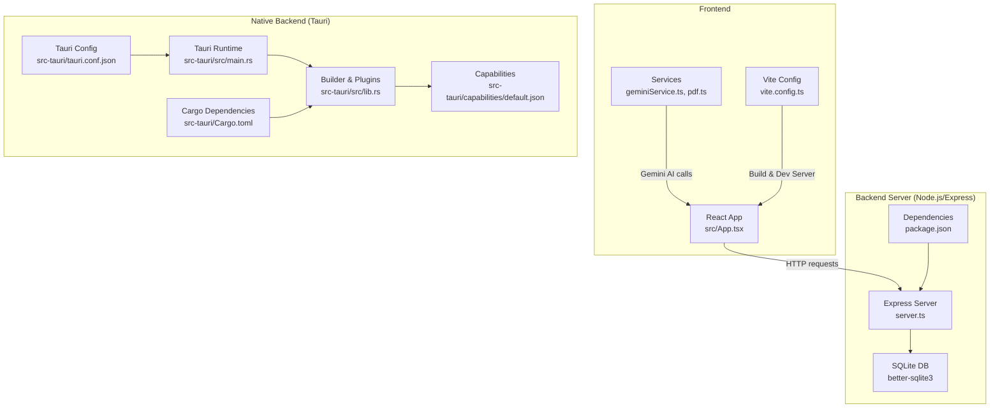
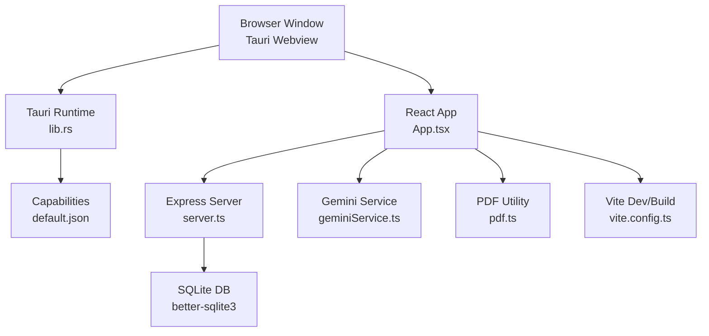
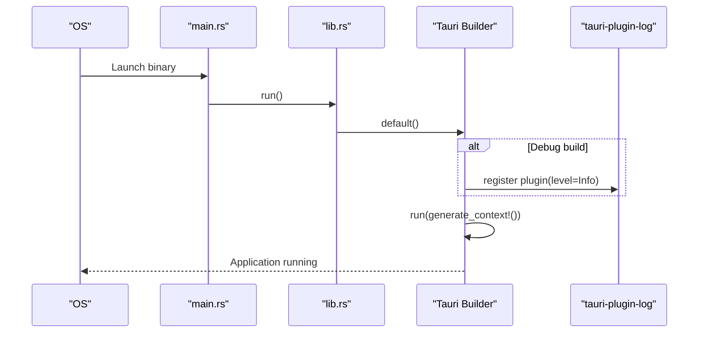
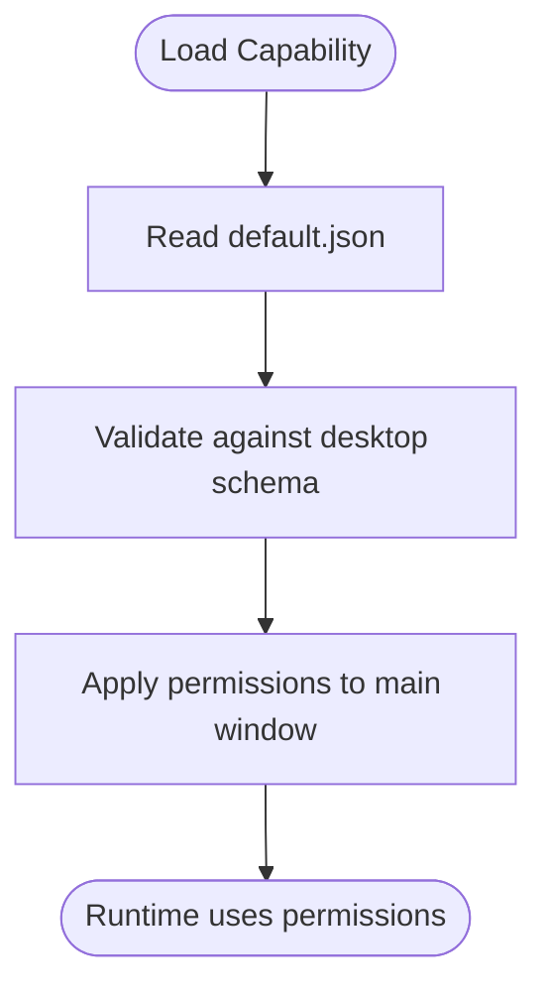
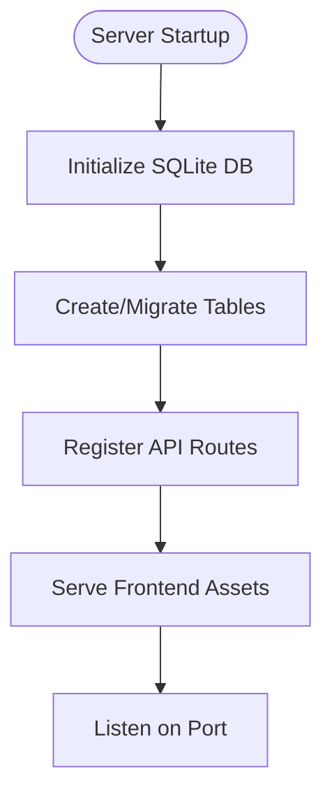
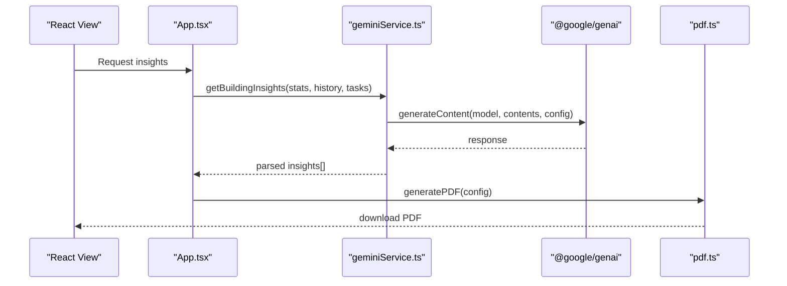
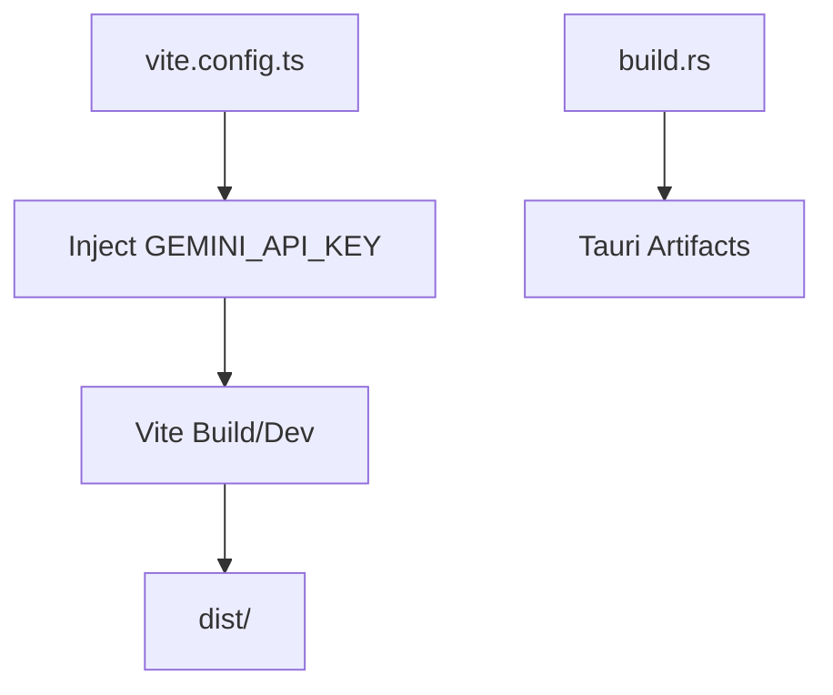
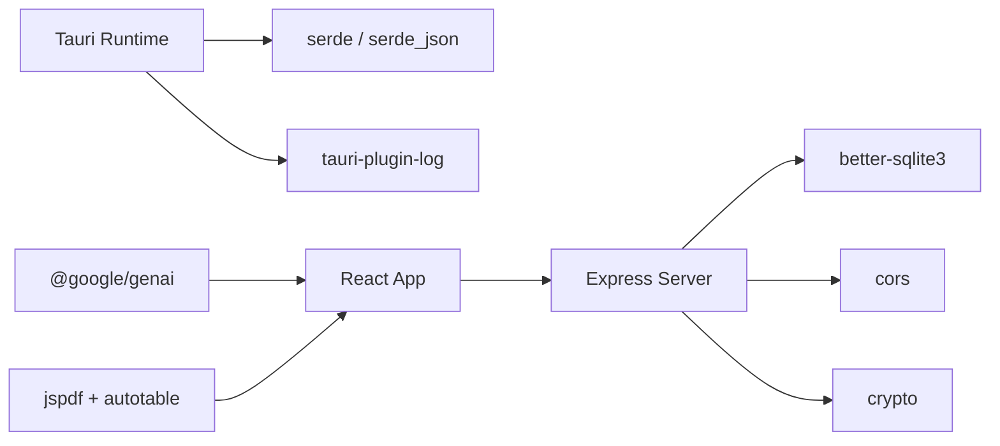
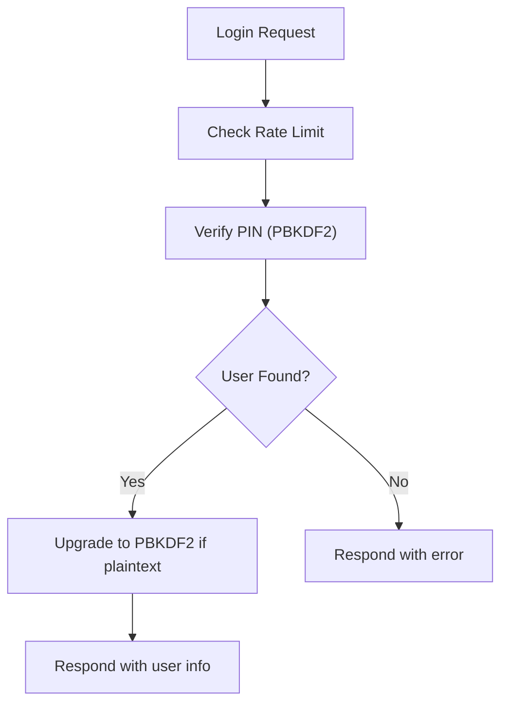
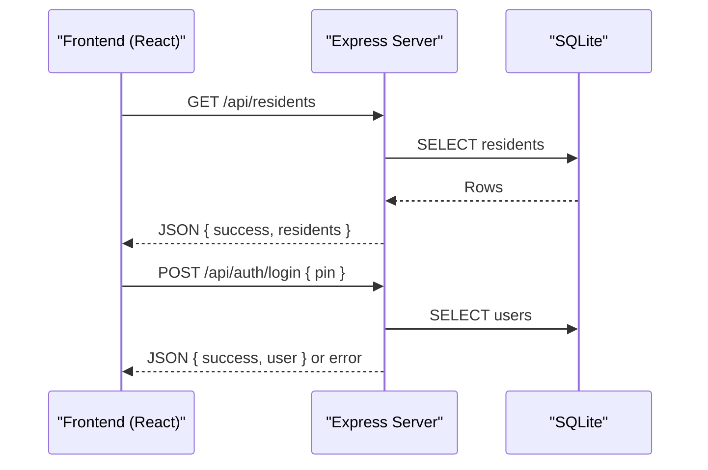

# Backend Architecture

<cite>
**Referenced Files in This Document**
- [Cargo.toml](file://src-tauri/Cargo.toml)
- [tauri.conf.json](file://src-tauri/tauri.conf.json)
- [lib.rs](file://src-tauri/src/lib.rs)
- [main.rs](file://src-tauri/src/main.rs)
- [build.rs](file://src-tauri/build.rs)
- [default.json](file://src-tauri/capabilities/default.json)
- [server.ts](file://server.ts)
- [package.json](file://package.json)
- [vite.config.ts](file://vite.config.ts)
- [geminiService.ts](file://src/services/geminiService.ts)
- [pdf.ts](file://src/lib/pdf.ts)
- [App.tsx](file://src/App.tsx)
- [constants.ts](file://src/constants.ts)
- [types.ts](file://src/types.ts)
</cite>

## Table of Contents
1. [Introduction](#introduction)
2. [Project Structure](#project-structure)
3. [Core Components](#core-components)
4. [Architecture Overview](#architecture-overview)
5. [Detailed Component Analysis](#detailed-component-analysis)
6. [Dependency Analysis](#dependency-analysis)
7. [Performance Considerations](#performance-considerations)
8. [Security Model and Capability Configuration](#security-model-and-capability-configuration)
9. [Inter-Process Communication](#inter-process-communication)
10. [Troubleshooting Guide](#troubleshooting-guide)
11. [Conclusion](#conclusion)

## Introduction
This document describes the backend architecture of the Tauri-based native application. It explains how the Rust-based Tauri runtime integrates with a Node.js/Express backend server, how the frontend interacts with both, and how native capabilities are configured. It also covers service layer patterns for AI insights and PDF generation, performance characteristics, and platform-specific considerations.

## Project Structure
The project is organized into:
- Frontend (React + Vite): TypeScript/JSX code under src/, with a Vite configuration that injects environment variables and sets up HMR.
- Native backend (Tauri): Rust crate under src-tauri/ that initializes the Tauri runtime and exposes capabilities.
- Backend server (Node.js/Express): A local development server that serves the frontend and provides REST APIs backed by a SQLite database.

**Diagram sources**
- [main.rs:1-7](file://src-tauri/src/main.rs#L1-L7)
- [lib.rs:1-17](file://src-tauri/src/lib.rs#L1-L17)
- [default.json:1-12](file://src-tauri/capabilities/default.json#L1-L12)
- [tauri.conf.json:1-42](file://src-tauri/tauri.conf.json#L1-L42)
- [Cargo.toml:1-26](file://src-tauri/Cargo.toml#L1-L26)
- [server.ts:1-656](file://server.ts#L1-L656)
- [package.json:1-45](file://package.json#L1-L45)
- [vite.config.ts:1-25](file://vite.config.ts#L1-L25)
- [geminiService.ts:1-49](file://src/services/geminiService.ts#L1-L49)
- [pdf.ts:1-58](file://src/lib/pdf.ts#L1-L58)
- [App.tsx:1-2375](file://src/App.tsx#L1-L2375)

**Section sources**
- [main.rs:1-7](file://src-tauri/src/main.rs#L1-L7)
- [lib.rs:1-17](file://src-tauri/src/lib.rs#L1-L17)
- [tauri.conf.json:1-42](file://src-tauri/tauri.conf.json#L1-L42)
- [Cargo.toml:1-26](file://src-tauri/Cargo.toml#L1-L26)
- [server.ts:1-656](file://server.ts#L1-L656)
- [package.json:1-45](file://package.json#L1-L45)
- [vite.config.ts:1-25](file://vite.config.ts#L1-L25)

## Core Components
- Tauri runtime bootstrap and plugin initialization
- Capability configuration for default permissions
- Express server with SQLite-backed REST APIs
- Frontend services for AI and PDF generation
- Build configuration for Tauri and Vite

Key implementation references:
- Tauri runtime entrypoint and builder: [main.rs:1-7](file://src-tauri/src/main.rs#L1-L7), [lib.rs:1-17](file://src-tauri/src/lib.rs#L1-L17)
- Capability defaults: [default.json:1-12](file://src-tauri/capabilities/default.json#L1-L12)
- Tauri configuration (window, security, bundling): [tauri.conf.json:1-42](file://src-tauri/tauri.conf.json#L1-L42)
- Tauri dependencies and crate types: [Cargo.toml:1-26](file://src-tauri/Cargo.toml#L1-L26)
- Express server and routes: [server.ts:1-656](file://server.ts#L1-L656)
- Frontend Gemini service: [geminiService.ts:1-49](file://src/services/geminiService.ts#L1-L49)
- Frontend PDF utility: [pdf.ts:1-58](file://src/lib/pdf.ts#L1-L58)
- Vite environment injection: [vite.config.ts:1-25](file://vite.config.ts#L1-L25)

**Section sources**
- [main.rs:1-7](file://src-tauri/src/main.rs#L1-L7)
- [lib.rs:1-17](file://src-tauri/src/lib.rs#L1-L17)
- [default.json:1-12](file://src-tauri/capabilities/default.json#L1-L12)
- [tauri.conf.json:1-42](file://src-tauri/tauri.conf.json#L1-L42)
- [Cargo.toml:1-26](file://src-tauri/Cargo.toml#L1-L26)
- [server.ts:1-656](file://server.ts#L1-L656)
- [geminiService.ts:1-49](file://src/services/geminiService.ts#L1-L49)
- [pdf.ts:1-58](file://src/lib/pdf.ts#L1-L58)
- [vite.config.ts:1-25](file://vite.config.ts#L1-L25)

## Architecture Overview
The system comprises three layers:
- Native layer (Tauri): Initializes the app and manages capabilities.
- Backend layer (Node.js/Express): Provides REST APIs and static assets.
- Frontend layer (React/Vite): Consumes APIs and renders UI.

**Diagram sources**
- [lib.rs:1-17](file://src-tauri/src/lib.rs#L1-L17)
- [default.json:1-12](file://src-tauri/capabilities/default.json#L1-L12)
- [App.tsx:1-2375](file://src/App.tsx#L1-L2375)
- [server.ts:1-656](file://server.ts#L1-L656)
- [geminiService.ts:1-49](file://src/services/geminiService.ts#L1-L49)
- [pdf.ts:1-58](file://src/lib/pdf.ts#L1-L58)
- [vite.config.ts:1-25](file://vite.config.ts#L1-L25)

## Detailed Component Analysis

### Tauri Runtime and Builder
- The Tauri runtime is initialized from the main entrypoint and delegates to a builder that sets up logging in debug builds and runs the generated context.
- The builder attaches a log plugin conditionally and registers the app lifecycle.

**Diagram sources**
- [main.rs:1-7](file://src-tauri/src/main.rs#L1-L7)
- [lib.rs:1-17](file://src-tauri/src/lib.rs#L1-L17)

**Section sources**
- [main.rs:1-7](file://src-tauri/src/main.rs#L1-L7)
- [lib.rs:1-17](file://src-tauri/src/lib.rs#L1-L17)

### Capability Configuration
- The default capability enables core permissions for the main window and references a desktop schema for validation.
- This defines the baseline permission set for the app’s webview.

**Diagram sources**
- [default.json:1-12](file://src-tauri/capabilities/default.json#L1-L12)

**Section sources**
- [default.json:1-12](file://src-tauri/capabilities/default.json#L1-L12)

### Express Backend and Data Access
- The server initializes an in-memory rate limiter, sets up CORS, and configures a SQLite database using better-sqlite3.
- It creates and migrates tables for users, settings, residents, transactions, maintenance, employees, vacations, and payroll.
- It exposes REST endpoints for all major domain areas and serves the SPA in development or production.

**Diagram sources**
- [server.ts:45-656](file://server.ts#L45-L656)

**Section sources**
- [server.ts:1-656](file://server.ts#L1-L656)

### Frontend Services: Gemini AI and PDF Generation
- Gemini service constructs a prompt from building statistics and tasks, calls the GenAI SDK, and parses a JSON response. It includes a fallback behavior on error.
- PDF utility generates reports with branding, titles, subtitles, dates, and styled tables using jsPDF and jspdf-autotable.

**Diagram sources**
- [App.tsx:143-150](file://src/App.tsx#L143-L150)
- [geminiService.ts:1-49](file://src/services/geminiService.ts#L1-L49)
- [pdf.ts:1-58](file://src/lib/pdf.ts#L1-L58)

**Section sources**
- [geminiService.ts:1-49](file://src/services/geminiService.ts#L1-L49)
- [pdf.ts:1-58](file://src/lib/pdf.ts#L1-L58)
- [App.tsx:143-150](file://src/App.tsx#L143-L150)

### Build and Environment Configuration
- Tauri build script invokes tauri-build to generate bindings and resources.
- Vite injects the Gemini API key from environment variables into the frontend bundle and configures aliases and HMR behavior.

**Diagram sources**
- [vite.config.ts:1-25](file://vite.config.ts#L1-L25)
- [build.rs:1-4](file://src-tauri/build.rs#L1-L4)

**Section sources**
- [vite.config.ts:1-25](file://vite.config.ts#L1-L25)
- [build.rs:1-4](file://src-tauri/build.rs#L1-L4)

## Dependency Analysis
- Tauri runtime and plugins are declared in Cargo.toml with serde, serde_json, and tauri-plugin-log.
- The frontend depends on @google/genai for AI, jspdf and jspdf-autotable for PDFs, and better-sqlite3 is used by the backend server.
- The Express server uses cors and crypto for rate limiting and hashing.

**Diagram sources**
- [Cargo.toml:20-26](file://src-tauri/Cargo.toml#L20-L26)
- [package.json:14-33](file://package.json#L14-L33)
- [server.ts:6-12](file://server.ts#L6-L12)

**Section sources**
- [Cargo.toml:20-26](file://src-tauri/Cargo.toml#L20-L26)
- [package.json:14-33](file://package.json#L14-L33)
- [server.ts:6-12](file://server.ts#L6-L12)

## Performance Considerations
- SQLite operations are synchronous and single-threaded; ensure queries are optimized and avoid long-running transactions. The server wraps sensitive write operations in explicit transactions to maintain consistency.
- Rate limiting reduces brute-force login attempts and protects the authentication endpoint.
- Vite HMR is configurable; disabling it can reduce flickering during development when editing agents.
- PDF generation uses client-side libraries; keep row counts reasonable and avoid excessive table styling for large datasets.

[No sources needed since this section provides general guidance]

## Security Model and Capability Configuration
- Tauri capability default.json grants core permissions for the main window and references a desktop schema for validation.
- The Express server enables CORS broadly in development and serves static assets in production.
- Authentication uses PBKDF2-based PIN hashing with migration from plaintext PINs. Login attempts are rate-limited per IP.

**Diagram sources**
- [server.ts:522-558](file://server.ts#L522-L558)

**Section sources**
- [default.json:1-12](file://src-tauri/capabilities/default.json#L1-L12)
- [server.ts:17-43](file://server.ts#L17-L43)
- [server.ts:522-558](file://server.ts#L522-L558)

## Inter-Process Communication
- The frontend communicates with the backend via HTTP requests to the local Express server. The React app fetches data from endpoints for residents, finances, maintenance, HR, and settings.
- The Gemini service calls the GenAI SDK directly in the browser context, using an injected API key from the Vite environment.
- PDF generation is performed client-side using jsPDF and jspdf-autotable.

**Diagram sources**
- [App.tsx:176-186](file://src/App.tsx#L176-L186)
- [server.ts:522-558](file://server.ts#L522-L558)

**Section sources**
- [App.tsx:152-273](file://src/App.tsx#L152-L273)
- [server.ts:190-217](file://server.ts#L190-L217)

## Troubleshooting Guide
- If the Tauri app fails to start, verify the builder registration and plugin initialization paths.
- If Gemini calls fail, ensure the GEMINI_API_KEY is present in the Vite environment and correctly injected.
- If PDF generation does not produce files, confirm jsPDF and jspdf-autotable are installed and the generatePDF function receives valid column/row data.
- If login fails repeatedly, check rate-limiting thresholds and ensure the PIN matches PBKDF2 hash in the database.

**Section sources**
- [lib.rs:1-17](file://src-tauri/src/lib.rs#L1-L17)
- [vite.config.ts:10-11](file://vite.config.ts#L10-L11)
- [pdf.ts:1-58](file://src/lib/pdf.ts#L1-L58)
- [server.ts:522-558](file://server.ts#L522-L558)

## Conclusion
The backend architecture combines a Tauri-native runtime with a Node.js/Express server and a React frontend. Tauri manages capabilities and runtime behavior, while the Express server provides a robust REST API backed by SQLite. The frontend consumes these services to deliver AI-driven insights and PDF reporting. The configuration emphasizes clarity around environment variables, capability permissions, and performance-conscious data handling.