# Frontend Architecture

<cite>
**Referenced Files in This Document**
- [App.tsx](file://src/App.tsx)
- [main.tsx](file://src/main.tsx)
- [types.ts](file://src/types.ts)
- [vite.config.ts](file://vite.config.ts)
- [tsconfig.json](file://tsconfig.json)
- [package.json](file://package.json)
- [constants.ts](file://src/constants.ts)
- [pdf.ts](file://src/lib/pdf.ts)
- [FormField.tsx](file://src/components/ui/FormField.tsx)
- [MetricCard.tsx](file://src/components/ui/MetricCard.tsx)
- [SidebarItem.tsx](file://src/components/ui/SidebarItem.tsx)
- [DashboardView.tsx](file://src/components/views/DashboardView.tsx)
- [FinanceView.tsx](file://src/components/views/FinanceView.tsx)
- [MaintenanceView.tsx](file://src/components/views/MaintenanceView.tsx)
- [ResidentsView.tsx](file://src/components/views/ResidentsView.tsx)
</cite>

## Table of Contents
1. [Introduction](#introduction)
2. [Project Structure](#project-structure)
3. [Core Components](#core-components)
4. [Architecture Overview](#architecture-overview)
5. [Detailed Component Analysis](#detailed-component-analysis)
6. [Dependency Analysis](#dependency-analysis)
7. [Performance Considerations](#performance-considerations)
8. [Troubleshooting Guide](#troubleshooting-guide)
9. [Conclusion](#conclusion)
10. [Appendices](#appendices)

## Introduction
This document describes the frontend architecture of the EdiIA React application. It focuses on the component-based design, UI component library, routing and navigation patterns, state management, TypeScript configuration, build pipeline with Vite, and styling approach. The application is organized into view components for functional areas (Dashboard, Finance, Maintenance, Residents, etc.) and a shared UI component library (FormField, MetricCard, SidebarItem). The App container orchestrates navigation, global state, and lazy-loaded views.

## Project Structure
The frontend is structured around a small set of entry points and a modular component hierarchy:
- Entry point renders the root App component.
- App defines the shell with sidebar navigation, lazy-loaded views, and global state.
- UI components live under a dedicated library for reuse across views.
- View components encapsulate domain-specific layouts and interactions.
- Shared utilities include constants, PDF generation, and TypeScript types.

```mermaid
graph TB
main_tsx["src/main.tsx<br/>Root render"] --> app_tsx["src/App.tsx<br/>Shell + Navigation + Lazy Views"]
app_tsx --> sidebar_item["src/components/ui/SidebarItem.tsx<br/>Navigation item"]
app_tsx --> metric_card["src/components/ui/MetricCard.tsx<br/>Metric card"]
app_txs --> form_field["src/components/ui/FormField.tsx<br/>Form field wrapper"]
app_tsx --> dashboard_view["src/components/views/DashboardView.tsx"]
app_tsx --> finance_view["src/components/views/FinanceView.tsx"]
app_tsx --> maintenance_view["src/components/views/MaintenanceView.tsx"]
app_tsx --> residents_view["src/components/views/ResidentsView.tsx"]
app_tsx --> constants_ts["src/constants.ts<br/>Currency/formatting + mock data"]
app_tsx --> pdf_ts["src/lib/pdf.ts<br/>PDF export"]
app_tsx --> types_ts["src/types.ts<br/>Domain types + helpers"]
app_tsx --> vite_config["vite.config.ts<br/>Vite config + plugins"]
app_tsx --> tsconfig_json["tsconfig.json<br/>TS compiler options"]
app_tsx --> package_json["package.json<br/>Dependencies + scripts"]
```

**Diagram sources**
- [main.tsx:1-11](file://src/main.tsx#L1-L11)
- [App.tsx:1-200](file://src/App.tsx#L1-L200)
- [SidebarItem.tsx:1-21](file://src/components/ui/SidebarItem.tsx#L1-L21)
- [MetricCard.tsx:1-36](file://src/components/ui/MetricCard.tsx#L1-L36)
- [FormField.tsx:1-19](file://src/components/ui/FormField.tsx#L1-L19)
- [DashboardView.tsx:1-376](file://src/components/views/DashboardView.tsx#L1-L376)
- [FinanceView.tsx:1-273](file://src/components/views/FinanceView.tsx#L1-L273)
- [MaintenanceView.tsx:1-130](file://src/components/views/MaintenanceView.tsx#L1-L130)
- [ResidentsView.tsx:1-200](file://src/components/views/ResidentsView.tsx#L1-L200)
- [constants.ts:1-36](file://src/constants.ts#L1-L36)
- [pdf.ts:1-58](file://src/lib/pdf.ts#L1-L58)
- [types.ts:1-88](file://src/types.ts#L1-L88)
- [vite.config.ts:1-25](file://vite.config.ts#L1-L25)
- [tsconfig.json:1-27](file://tsconfig.json#L1-L27)
- [package.json:1-45](file://package.json#L1-L45)

**Section sources**
- [main.tsx:1-11](file://src/main.tsx#L1-L11)
- [App.tsx:1-200](file://src/App.tsx#L1-L200)
- [vite.config.ts:1-25](file://vite.config.ts#L1-L25)
- [tsconfig.json:1-27](file://tsconfig.json#L1-L27)
- [package.json:1-45](file://package.json#L1-L45)

## Core Components
- App container manages:
  - Global state for navigation, modals, filters, and data lists.
  - Lazy loading of views for performance.
  - Sidebar navigation and header rendering.
  - Integration with backend APIs for residents, transactions, maintenance, HR, and settings.
- UI component library:
  - FormField: reusable form label/error wrapper.
  - MetricCard: animated metric display with trend indicator.
  - SidebarItem: navigation button with active state and icon.
- View components:
  - DashboardView: metrics, charts, and quick actions.
  - FinanceView: cash flow charts, transaction list, fixed expenses, and PDF export.
  - MaintenanceView: ticket list with filtering and PDF export.
  - ResidentsView: resident cards, actions, and PDF export.

**Section sources**
- [App.tsx:75-494](file://src/App.tsx#L75-L494)
- [FormField.tsx:1-19](file://src/components/ui/FormField.tsx#L1-L19)
- [MetricCard.tsx:1-36](file://src/components/ui/MetricCard.tsx#L1-L36)
- [SidebarItem.tsx:1-21](file://src/components/ui/SidebarItem.tsx#L1-L21)
- [DashboardView.tsx:60-91](file://src/components/views/DashboardView.tsx#L60-L91)
- [FinanceView.tsx:31-53](file://src/components/views/FinanceView.tsx#L31-L53)
- [MaintenanceView.tsx:16-32](file://src/components/views/MaintenanceView.tsx#L16-L32)
- [ResidentsView.tsx:19-43](file://src/components/views/ResidentsView.tsx#L19-L43)

## Architecture Overview
The application follows a shell-and-views pattern:
- App acts as the shell, hosting the sidebar, header, and a Suspense boundary around lazy-loaded views.
- Views are self-contained and receive props for data and callbacks.
- UI components are pure presentational and accept props for customization.
- State is centralized in App for navigation and cross-view coordination, while each view maintains its own local state for UI interactions.

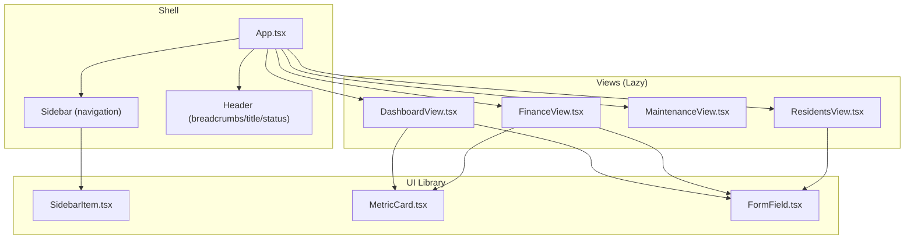

**Diagram sources**
- [App.tsx:299-494](file://src/App.tsx#L299-L494)
- [SidebarItem.tsx:1-21](file://src/components/ui/SidebarItem.tsx#L1-L21)
- [MetricCard.tsx:1-36](file://src/components/ui/MetricCard.tsx#L1-L36)
- [FormField.tsx:1-19](file://src/components/ui/FormField.tsx#L1-L19)
- [DashboardView.tsx:64-376](file://src/components/views/DashboardView.tsx#L64-L376)
- [FinanceView.tsx:43-273](file://src/components/views/FinanceView.tsx#L43-L273)
- [MaintenanceView.tsx:25-130](file://src/components/views/MaintenanceView.tsx#L25-L130)
- [ResidentsView.tsx:32-200](file://src/components/views/ResidentsView.tsx#L32-L200)

## Detailed Component Analysis

### App Shell and Navigation
- State orchestration:
  - Navigation tabs, modal flags, filters, and lists are managed centrally.
  - Side effects load data when switching tabs and on mount.
- Lazy loading:
  - Views are imported lazily and rendered inside a Suspense boundary.
- Composition:
  - Sidebar composed of SidebarItem entries.
  - Header displays active view title and system status.
  - Views receive props for data and callbacks to trigger modals and actions.

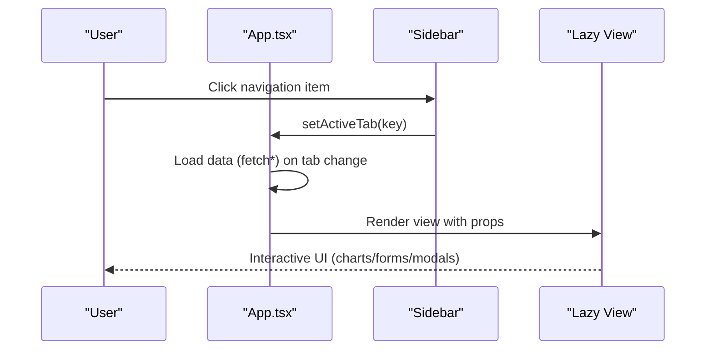

**Diagram sources**
- [App.tsx:338-427](file://src/App.tsx#L338-L427)
- [SidebarItem.tsx:9-20](file://src/components/ui/SidebarItem.tsx#L9-L20)

**Section sources**
- [App.tsx:75-494](file://src/App.tsx#L75-L494)

### UI Component Library

#### SidebarItem
- Purpose: Navigation item with active state and icon animation.
- Props: icon, label, active flag, onClick handler.
- Styling: Uses a merge function for conditional classes and hover/active transitions.

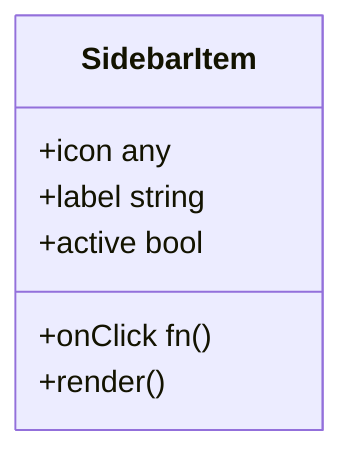

**Diagram sources**
- [SidebarItem.tsx:9-20](file://src/components/ui/SidebarItem.tsx#L9-L20)

**Section sources**
- [SidebarItem.tsx:1-21](file://src/components/ui/SidebarItem.tsx#L1-L21)

#### MetricCard
- Purpose: Present metrics with optional trend and icon.
- Props: label, value, trend, icon.
- Behavior: Animated entrance and subtle glow on hover.

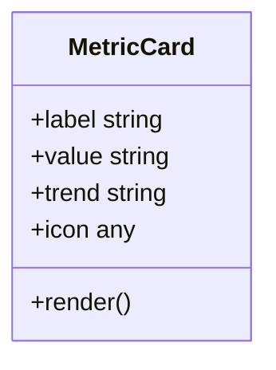

**Diagram sources**
- [MetricCard.tsx:10-35](file://src/components/ui/MetricCard.tsx#L10-L35)

**Section sources**
- [MetricCard.tsx:1-36](file://src/components/ui/MetricCard.tsx#L1-L36)

#### FormField
- Purpose: Wraps form controls with label and error messaging.
- Props: label, error, children.
- Behavior: Animated error display.

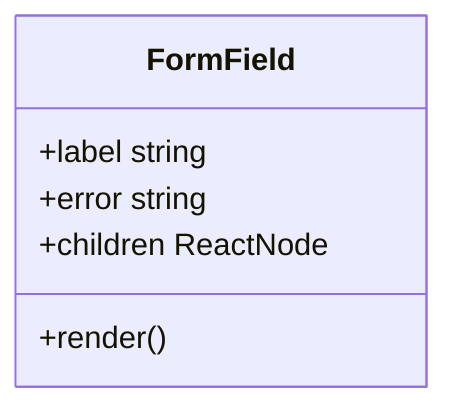

**Diagram sources**
- [FormField.tsx:4-18](file://src/components/ui/FormField.tsx#L4-L18)

**Section sources**
- [FormField.tsx:1-19](file://src/components/ui/FormField.tsx#L1-L19)

### View Components

#### DashboardView
- Purpose: Overview dashboard with metrics, charts, and quick actions.
- Data: Uses mock constants for stats and history.
- Composition: Contains nested MetricCard components and Recharts charts.

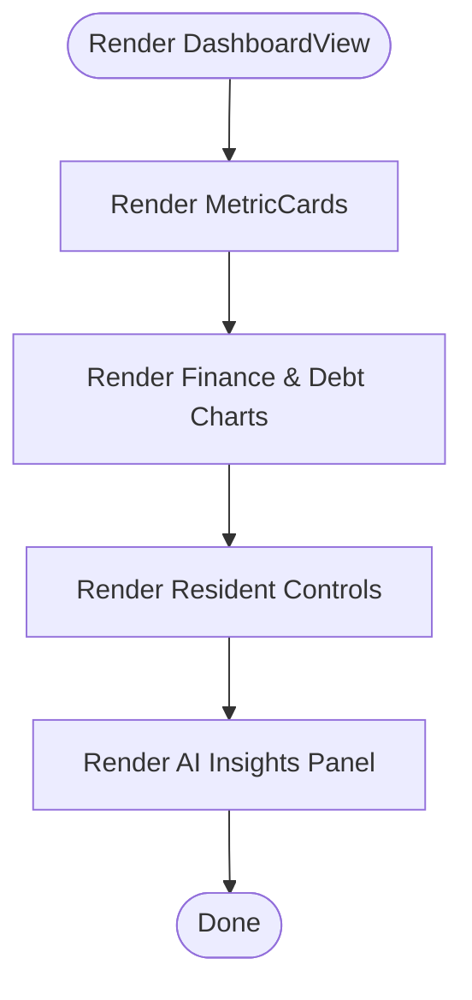

**Diagram sources**
- [DashboardView.tsx:64-376](file://src/components/views/DashboardView.tsx#L64-L376)
- [constants.ts:11-35](file://src/constants.ts#L11-L35)

**Section sources**
- [DashboardView.tsx:1-376](file://src/components/views/DashboardView.tsx#L1-L376)
- [constants.ts:1-36](file://src/constants.ts#L1-L36)

#### FinanceView
- Purpose: Finance management with charts, transaction list, and fixed/extra fees.
- Actions: Generates PDF reports and opens modals for transactions/expenses/fees.
- Props: allTransactions, fixedExpenses, extraFees, callbacks.

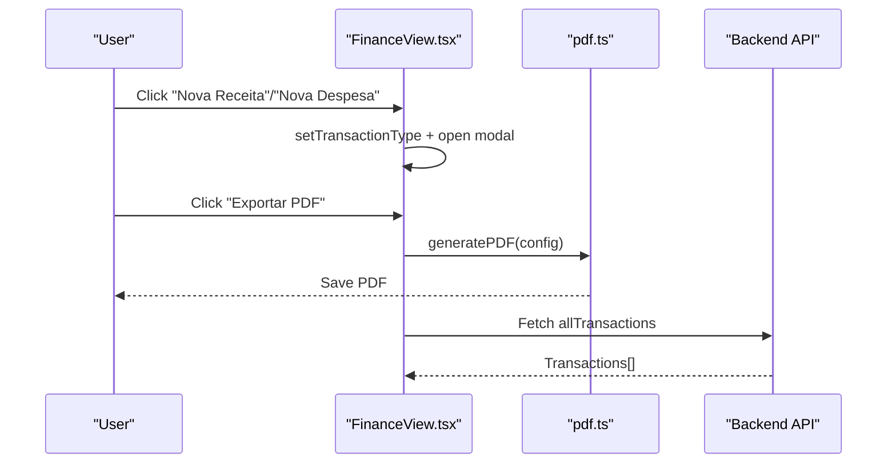

**Diagram sources**
- [FinanceView.tsx:43-273](file://src/components/views/FinanceView.tsx#L43-L273)
- [pdf.ts:12-57](file://src/lib/pdf.ts#L12-L57)
- [App.tsx:239-249](file://src/App.tsx#L239-L249)

**Section sources**
- [FinanceView.tsx:1-273](file://src/components/views/FinanceView.tsx#L1-L273)
- [pdf.ts:1-58](file://src/lib/pdf.ts#L1-L58)
- [App.tsx:152-277](file://src/App.tsx#L152-L277)

#### MaintenanceView
- Purpose: Manage maintenance tickets with filtering and PDF export.
- Props: maintenanceTickets, filter, callbacks.

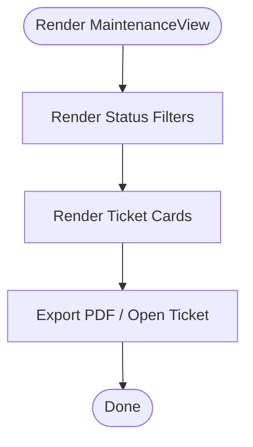

**Diagram sources**
- [MaintenanceView.tsx:25-130](file://src/components/views/MaintenanceView.tsx#L25-L130)

**Section sources**
- [MaintenanceView.tsx:1-130](file://src/components/views/MaintenanceView.tsx#L1-L130)

#### ResidentsView
- Purpose: Resident management with cards, actions, and PDF export.
- Props: residents, callbacks for editing, payments, and history.

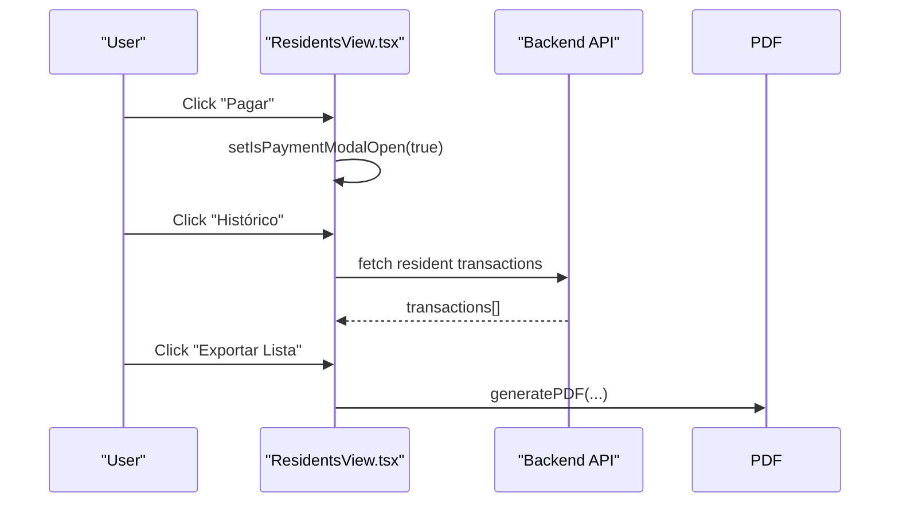

**Diagram sources**
- [ResidentsView.tsx:32-200](file://src/components/views/ResidentsView.tsx#L32-L200)
- [pdf.ts:12-57](file://src/lib/pdf.ts#L12-L57)
- [App.tsx:224-237](file://src/App.tsx#L224-L237)

**Section sources**
- [ResidentsView.tsx:1-200](file://src/components/views/ResidentsView.tsx#L1-L200)
- [pdf.ts:1-58](file://src/lib/pdf.ts#L1-L58)
- [App.tsx:176-237](file://src/App.tsx#L176-L237)

## Dependency Analysis
- Runtime dependencies include React, Tailwind-based styling, Framer Motion for animations, Recharts for charts, jsPDF + autotable for PDFs, and lucide-react for icons.
- Build-time dependencies include Vite, React plugin, TailwindCSS plugin, TypeScript, and Tauri CLI for desktop packaging.
- App imports UI components and lazy-loads views, minimizing initial bundle size.

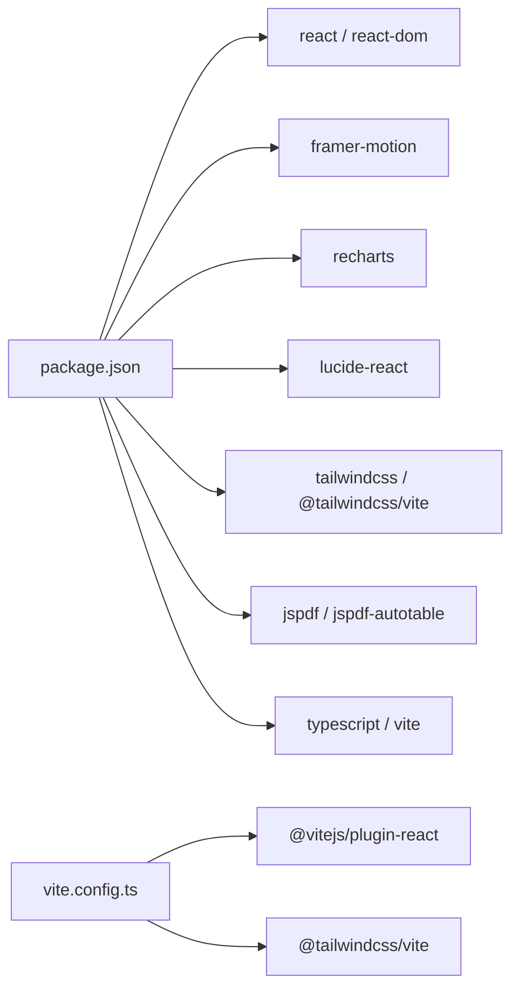

**Diagram sources**
- [package.json:14-43](file://package.json#L14-L43)
- [vite.config.ts:1-25](file://vite.config.ts#L1-L25)

**Section sources**
- [package.json:1-45](file://package.json#L1-L45)
- [vite.config.ts:1-25](file://vite.config.ts#L1-L25)

## Performance Considerations
- Lazy loading of views reduces initial JS payload.
- Local state per view minimizes unnecessary re-renders in the shell.
- Charts and animations are scoped to views to avoid global layout thrashing.
- Consider memoizing heavy computations and chart data to further optimize.

## Troubleshooting Guide
- PDF generation:
  - Ensure generatePDF receives valid columns/rows and filename.
  - Verify locale/date formatting for generated content.
- API connectivity:
  - Confirm endpoints exist and return success objects with expected fields.
  - Inspect network tab for failed requests and error messages.
- State synchronization:
  - When switching tabs, confirm data fetching effects run and state updates are visible.
- Styling and animations:
  - Tailwind classes should be valid; ensure aliases and merge utilities are applied consistently.

**Section sources**
- [pdf.ts:12-57](file://src/lib/pdf.ts#L12-L57)
- [App.tsx:152-293](file://src/App.tsx#L152-L293)

## Conclusion
EdiIA’s frontend is a component-driven React application with a clear separation between shell, UI components, and feature views. The App container coordinates navigation and state, while UI components promote reuse and consistency. The build pipeline leverages Vite with Tailwind and TypeScript, and the styling approach emphasizes utility-first CSS with motion and responsive charts. This architecture supports scalability across functional domains and maintains a clean developer experience.

## Appendices

### TypeScript Configuration
- Compiler targets modern environments, enables JSX transform, and resolves modules via bundler.
- Path aliases configured for root imports.
- No emit in dev to leverage Vite’s fast TS checks.

**Section sources**
- [tsconfig.json:1-27](file://tsconfig.json#L1-L27)

### Build and Dev Scripts
- Scripts include dev server, build, preview, and lint.
- Vite handles development and production builds with configured plugins.

**Section sources**
- [package.json:6-12](file://package.json#L6-L12)
- [vite.config.ts:6-24](file://vite.config.ts#L6-L24)

### Domain Types and Helpers
- Strongly typed enums and interfaces for financial records, employees, maintenance tasks, and residents.
- Helper to map role identifiers to localized labels.

**Section sources**
- [types.ts:1-88](file://src/types.ts#L1-L88)