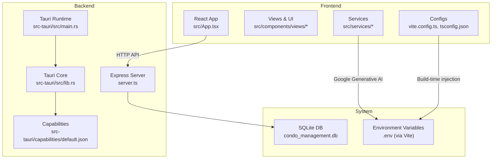
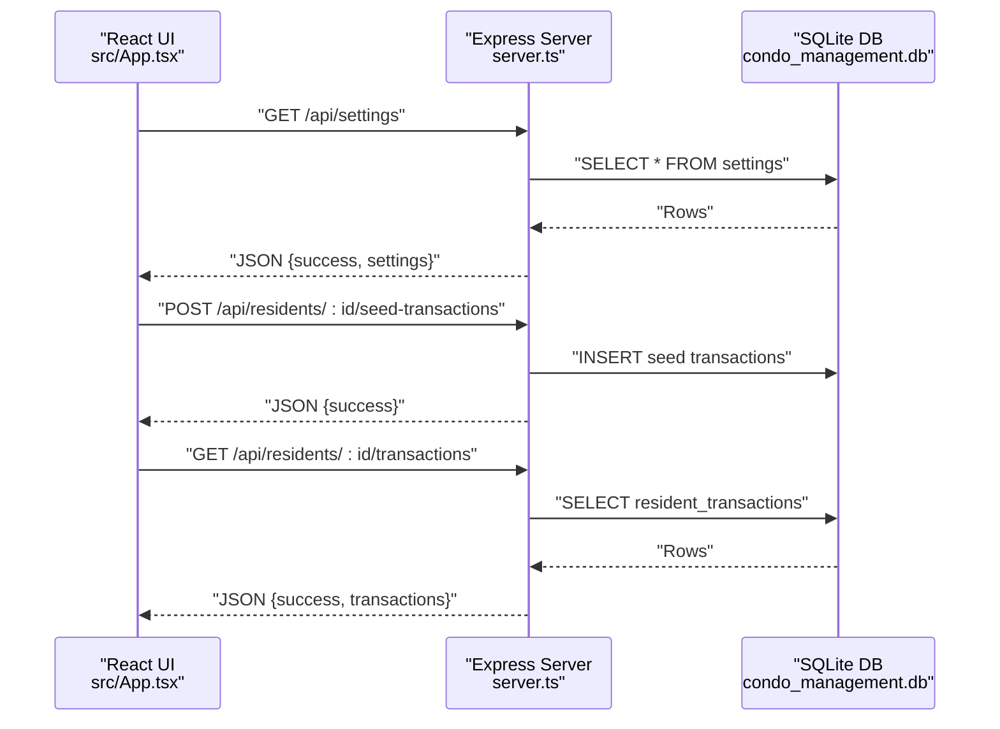
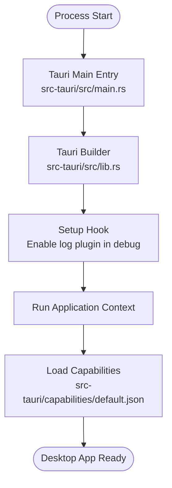
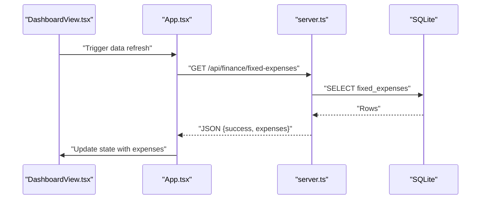
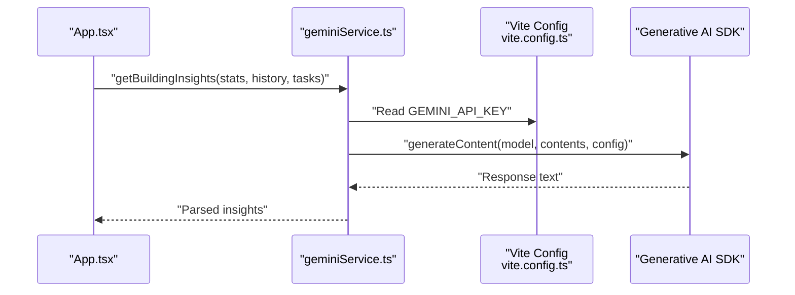
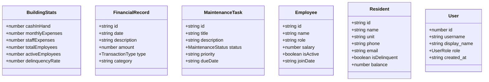
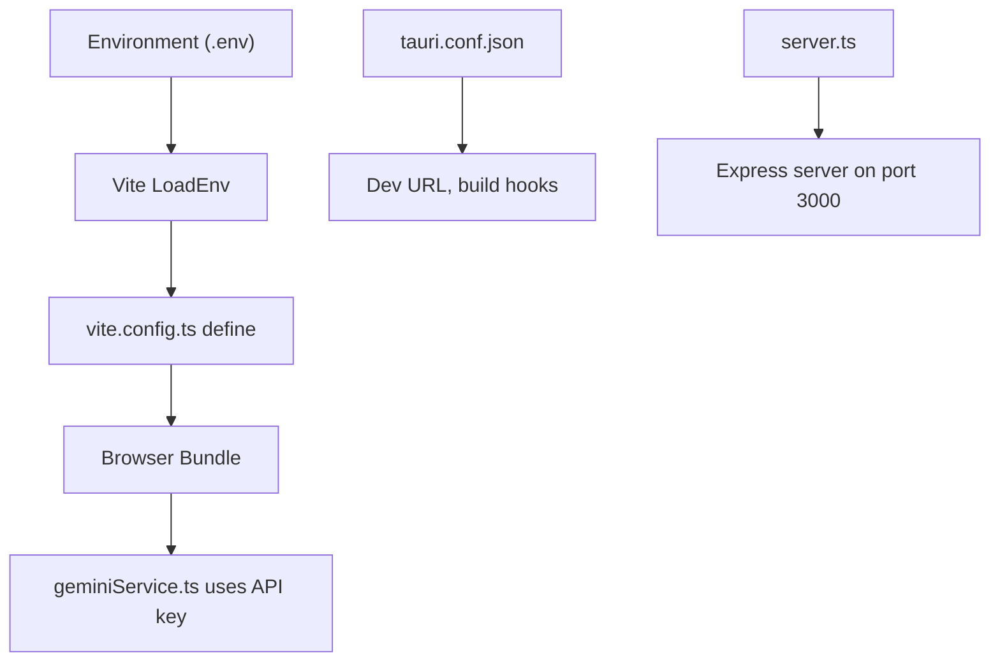
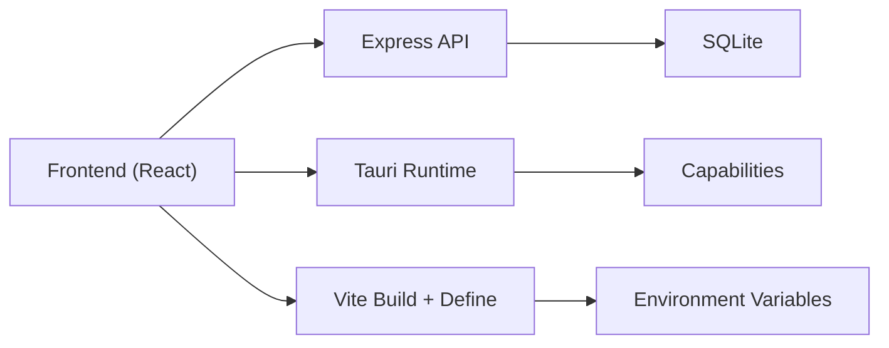

# Integration Patterns

<cite>
**Referenced Files in This Document**
- [main.rs](file://src-tauri/src/main.rs)
- [lib.rs](file://src-tauri/src/lib.rs)
- [tauri.conf.json](file://src-tauri/tauri.conf.json)
- [default.json](file://src-tauri/capabilities/default.json)
- [App.tsx](file://src/App.tsx)
- [DashboardView.tsx](file://src/components/views/DashboardView.tsx)
- [geminiService.ts](file://src/services/geminiService.ts)
- [types.ts](file://src/types.ts)
- [constants.ts](file://src/constants.ts)
- [server.ts](file://server.ts)
- [vite.config.ts](file://vite.config.ts)
- [package.json](file://package.json)
- [tsconfig.json](file://tsconfig.json)
</cite>

## Table of Contents
1. [Introduction](#introduction)
2. [Project Structure](#project-structure)
3. [Core Components](#core-components)
4. [Architecture Overview](#architecture-overview)
5. [Detailed Component Analysis](#detailed-component-analysis)
6. [Dependency Analysis](#dependency-analysis)
7. [Performance Considerations](#performance-considerations)
8. [Troubleshooting Guide](#troubleshooting-guide)
9. [Conclusion](#conclusion)
10. [Appendices](#appendices)

## Introduction
This document describes the integration patterns for the EdiIA hybrid application. It explains how the React frontend communicates with the Tauri backend, how commands and events are handled, how data flows across the JavaScript–Rust boundary, and how the capability-based security model governs access to system resources. It also documents configuration management, environment variables, type safety across languages, error handling, logging, and debugging strategies for cross-language integration.

## Project Structure
The application follows a hybrid desktop architecture:
- React frontend built with Vite and served by an Express development server in development mode.
- Tauri runtime initializes the Rust backend and exposes a secure plugin ecosystem.
- A local Express server provides API endpoints for database-backed CRUD operations and authentication.
- Environment variables are injected at build time for frontend secrets.

**Diagram sources**
- [main.rs:1-7](file://src-tauri/src/main.rs#L1-L7)
- [lib.rs:1-17](file://src-tauri/src/lib.rs#L1-L17)
- [default.json:1-12](file://src-tauri/capabilities/default.json#L1-L12)
- [server.ts:1-656](file://server.ts#L1-L656)
- [App.tsx:1-2375](file://src/App.tsx#L1-L2375)
- [vite.config.ts:1-25](file://vite.config.ts#L1-L25)
- [tsconfig.json:1-27](file://tsconfig.json#L1-L27)

**Section sources**
- [main.rs:1-7](file://src-tauri/src/main.rs#L1-L7)
- [lib.rs:1-17](file://src-tauri/src/lib.rs#L1-L17)
- [tauri.conf.json:1-42](file://src-tauri/tauri.conf.json#L1-L42)
- [default.json:1-12](file://src-tauri/capabilities/default.json#L1-L12)
- [server.ts:1-656](file://server.ts#L1-L656)
- [vite.config.ts:1-25](file://vite.config.ts#L1-L25)
- [tsconfig.json:1-27](file://tsconfig.json#L1-L27)

## Core Components
- Tauri entrypoint and builder initialize the desktop shell and optional logging plugin in debug builds.
- Capability configuration defines default permissions for the main window.
- Frontend App orchestrates navigation, state, and API calls to the embedded Express server.
- Gemini service encapsulates AI model interactions and environment variable usage.
- Types and constants define shared data contracts and formatting utilities.
- Build-time configuration injects environment variables into the frontend bundle.

Key integration touchpoints:
- Tauri runtime lifecycle and plugin setup.
- Capability-based permissions for the main window.
- Frontend fetch-based API consumption.
- AI service using environment variables.
- Build-time environment injection.

**Section sources**
- [lib.rs:1-17](file://src-tauri/src/lib.rs#L1-L17)
- [default.json:1-12](file://src-tauri/capabilities/default.json#L1-L12)
- [App.tsx:140-293](file://src/App.tsx#L140-L293)
- [geminiService.ts:1-49](file://src/services/geminiService.ts#L1-L49)
- [types.ts:1-88](file://src/types.ts#L1-L88)
- [constants.ts:1-36](file://src/constants.ts#L1-L36)
- [vite.config.ts:10-12](file://vite.config.ts#L10-L12)

## Architecture Overview
The hybrid architecture separates concerns:
- Tauri manages the native desktop shell and security boundaries.
- Express serves the SPA and provides REST endpoints backed by SQLite.
- Frontend consumes APIs and renders views, with AI insights integrated via a service layer.
- Capabilities restrict what the frontend can access from the Rust side.

**Diagram sources**
- [App.tsx:224-249](file://src/App.tsx#L224-L249)
- [server.ts:314-340](file://server.ts#L314-L340)
- [server.ts:342-355](file://server.ts#L342-L355)

**Section sources**
- [App.tsx:140-293](file://src/App.tsx#L140-L293)
- [server.ts:189-520](file://server.ts#L189-L520)

## Detailed Component Analysis

### Tauri Runtime and Capabilities
- The main entrypoint delegates to a Rust library that configures Tauri, sets up logging in debug mode, and runs the application context.
- The capability definition grants default permissions for the main window, enabling core features while maintaining a minimal surface.

**Diagram sources**
- [main.rs:1-7](file://src-tauri/src/main.rs#L1-L7)
- [lib.rs:1-17](file://src-tauri/src/lib.rs#L1-L17)
- [default.json:1-12](file://src-tauri/capabilities/default.json#L1-L12)

**Section sources**
- [main.rs:4-6](file://src-tauri/src/main.rs#L4-L6)
- [lib.rs:3-15](file://src-tauri/src/lib.rs#L3-L15)
- [default.json:8-11](file://src-tauri/capabilities/default.json#L8-L11)

### Frontend API Consumption Pattern
- The React App centralizes data fetching and state updates for multiple domains (residents, finance, maintenance, HR, settings).
- It uses fetch to call Express endpoints and updates local state accordingly.
- On tab changes, it triggers domain-specific fetches to keep views synchronized.

**Diagram sources**
- [DashboardView.tsx:1-200](file://src/components/views/DashboardView.tsx#L1-L200)
- [App.tsx:152-162](file://src/App.tsx#L152-L162)
- [server.ts:273-280](file://server.ts#L273-L280)

**Section sources**
- [App.tsx:152-293](file://src/App.tsx#L152-L293)
- [server.ts:262-292](file://server.ts#L262-L292)

### AI Integration via Service Layer
- The Gemini service constructs prompts and calls the Generative AI SDK using a secret configured via environment variables.
- The build system injects the API key at compile time for the browser bundle.

**Diagram sources**
- [geminiService.ts:9-48](file://src/services/geminiService.ts#L9-L48)
- [vite.config.ts:10-12](file://vite.config.ts#L10-L12)
- [App.tsx:143-149](file://src/App.tsx#L143-L149)

**Section sources**
- [geminiService.ts:9-48](file://src/services/geminiService.ts#L9-L48)
- [vite.config.ts:10-12](file://vite.config.ts#L10-L12)
- [App.tsx:143-149](file://src/App.tsx#L143-L149)

### Type Safety Across Languages
- TypeScript types define enums, interfaces, and helpers for consistent frontend contracts.
- Backend routes return structured JSON payloads aligned with these types to maintain consistency.

**Diagram sources**
- [types.ts:23-87](file://src/types.ts#L23-L87)

**Section sources**
- [types.ts:6-87](file://src/types.ts#L6-L87)

### Configuration Management and Environment Variables
- Frontend environment variables are injected at build time via Vite’s define option.
- The Express server runs on a fixed port and serves static assets in production or proxies Vite middleware in development.
- Tauri configuration controls bundling, dev URL, and window properties.

**Diagram sources**
- [vite.config.ts:7-12](file://vite.config.ts#L7-L12)
- [geminiService.ts:9-9](file://src/services/geminiService.ts#L9-L9)
- [tauri.conf.json:6-11](file://src-tauri/tauri.conf.json#L6-L11)
- [server.ts:47-50](file://server.ts#L47-L50)

**Section sources**
- [vite.config.ts:7-12](file://vite.config.ts#L7-L12)
- [geminiService.ts:9-9](file://src/services/geminiService.ts#L9-L9)
- [tauri.conf.json:6-11](file://src-tauri/tauri.conf.json#L6-L11)
- [server.ts:47-50](file://server.ts#L47-L50)

## Dependency Analysis
- Frontend depends on Express for API endpoints and SQLite for persistence.
- Tauri provides the desktop runtime and capability system.
- Build toolchain injects environment variables into the frontend bundle.

**Diagram sources**
- [App.tsx:140-293](file://src/App.tsx#L140-L293)
- [server.ts:1-656](file://server.ts#L1-L656)
- [lib.rs:1-17](file://src-tauri/src/lib.rs#L1-L17)
- [default.json:1-12](file://src-tauri/capabilities/default.json#L1-L12)
- [vite.config.ts:10-12](file://vite.config.ts#L10-L12)

**Section sources**
- [App.tsx:140-293](file://src/App.tsx#L140-L293)
- [server.ts:1-656](file://server.ts#L1-L656)
- [lib.rs:1-17](file://src-tauri/src/lib.rs#L1-L17)
- [default.json:1-12](file://src-tauri/capabilities/default.json#L1-L12)
- [vite.config.ts:10-12](file://vite.config.ts#L10-L12)

## Performance Considerations
- Minimize network round trips by batching related fetches on tab activation.
- Use optimistic UI updates with subsequent sync to reduce perceived latency.
- Cache frequently accessed settings and small datasets in memory to avoid repeated fetches.
- Keep AI prompts concise and deterministic to reduce token usage and latency.
- Prefer server-side filtering and pagination for large lists to limit payload sizes.

## Troubleshooting Guide
- Logging
  - Enable Tauri log plugin in debug builds for verbose logs.
  - Use console logging in the frontend and inspect the Express server logs.
- Authentication
  - Verify PIN hashing and migration behavior; ensure rate-limiting does not block legitimate users.
- API Errors
  - Inspect Express route responses for success flags and messages; confirm CORS is enabled in development.
- Environment Variables
  - Confirm the API key is present in the built bundle and not exposed in development logs.
- Database Initialization
  - Ensure migrations run and default records are inserted on first run.

**Section sources**
- [lib.rs:5-11](file://src-tauri/src/lib.rs#L5-L11)
- [server.ts:522-558](file://server.ts#L522-L558)
- [vite.config.ts:10-12](file://vite.config.ts#L10-L12)

## Conclusion
EdiIA integrates a React frontend with a Tauri-powered desktop runtime and an Express-backed API server. Data flows through typed frontend components to REST endpoints backed by SQLite, with capability-based permissions governing access. Build-time environment injection secures secrets, while logging and error handling provide operational visibility. Following the patterns documented here ensures predictable, secure, and maintainable cross-language integration.

## Appendices

### API Boundary Definitions
- Settings: GET/PUT /api/settings
- Residents: GET/POST/PUT/DELETE /api/residents[/id]
- Transactions: GET/POST /api/residents/:id/transactions and seed endpoint
- Finance: Fixed expenses and extra fees endpoints
- Maintenance: Tickets endpoints
- HR: Employees, vacations, payroll endpoints
- Users: GET/POST/PUT/DELETE /api/users[/id]
- Auth: POST /api/auth/login
- Health: GET /api/health

**Section sources**
- [server.ts:189-633](file://server.ts#L189-L633)

### Capability-Based Security Model
- The main window is granted default permissions via the capability definition.
- Restrict additional permissions to specific windows or features as needed.
- Review and minimize capabilities to reduce attack surface.

**Section sources**
- [default.json:8-11](file://src-tauri/capabilities/default.json#L8-L11)