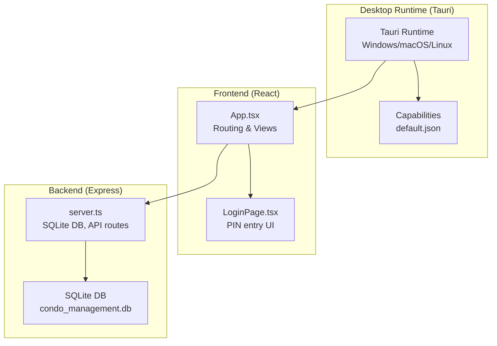
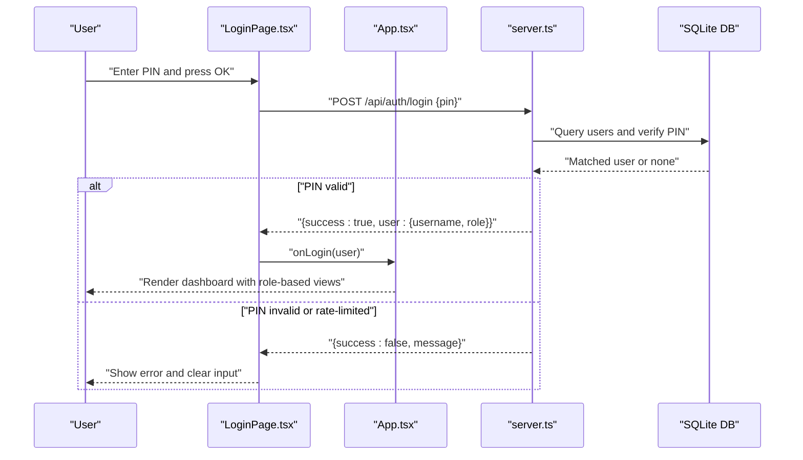
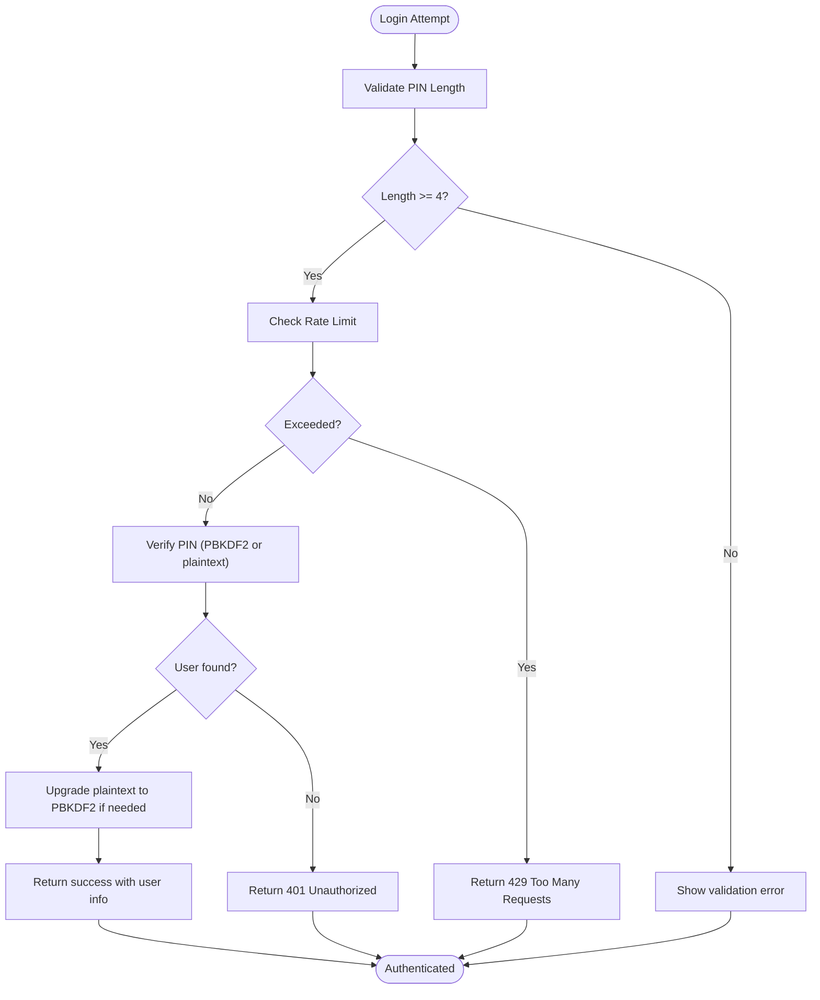
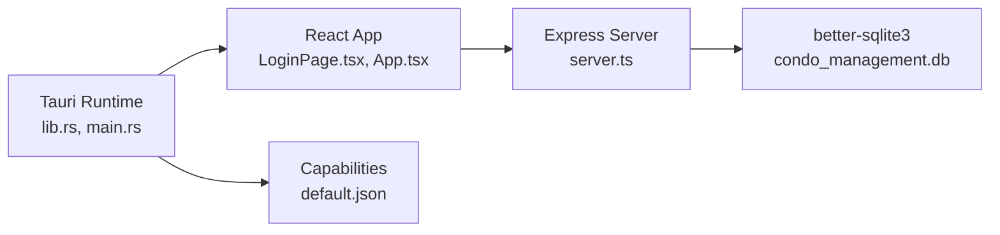

# Authentication & Security

<cite>
**Referenced Files in This Document**
- [LoginPage.tsx](file://src/components/LoginPage.tsx)
- [App.tsx](file://src/App.tsx)
- [server.ts](file://server.ts)
- [types.ts](file://src/types.ts)
- [constants.ts](file://src/constants.ts)
- [default.json](file://src-tauri/capabilities/default.json)
- [tauri.conf.json](file://src-tauri/tauri.conf.json)
- [lib.rs](file://src-tauri/src/lib.rs)
- [main.rs](file://src-tauri/src/main.rs)
- [Cargo.toml](file://src-tauri/Cargo.toml)
- [package.json](file://package.json)
</cite>

## Table of Contents
1. [Introduction](#introduction)
2. [Project Structure](#project-structure)
3. [Core Components](#core-components)
4. [Architecture Overview](#architecture-overview)
5. [Detailed Component Analysis](#detailed-component-analysis)
6. [Dependency Analysis](#dependency-analysis)
7. [Performance Considerations](#performance-considerations)
8. [Security Best Practices](#security-best-practices)
9. [Troubleshooting Guide](#troubleshooting-guide)
10. [Conclusion](#conclusion)

## Introduction
This document explains the EdiIA authentication and security implementation. It covers the login page functionality, user authentication flow, session management, and security capabilities. It also documents Tauri capability configuration, permission models, secure data handling practices, role management, access control patterns, and audit logging capabilities. Guidance on security best practices, threat mitigation strategies, and compliance considerations is included.

## Project Structure
EdiIA is a Tauri desktop application with a React frontend and an Express server that serves both the frontend and the API. Authentication is handled via a PIN-based login against a local SQLite database. Tauri manages runtime permissions and capabilities for native access.

**Diagram sources**
- [lib.rs:1-17](file://src-tauri/src/lib.rs#L1-L17)
- [main.rs:1-7](file://src-tauri/src/main.rs#L1-L7)
- [tauri.conf.json:1-41](file://src-tauri/tauri.conf.json#L1-L41)
- [default.json:1-12](file://src-tauri/capabilities/default.json#L1-L12)
- [LoginPage.tsx:1-125](file://src/components/LoginPage.tsx#L1-L125)
- [App.tsx:295-297](file://src/App.tsx#L295-L297)
- [server.ts:45-656](file://server.ts#L45-L656)

**Section sources**
- [lib.rs:1-17](file://src-tauri/src/lib.rs#L1-L17)
- [main.rs:1-7](file://src-tauri/src/main.rs#L1-L7)
- [tauri.conf.json:1-41](file://src-tauri/tauri.conf.json#L1-L41)
- [default.json:1-12](file://src-tauri/capabilities/default.json#L1-L12)
- [LoginPage.tsx:1-125](file://src/components/LoginPage.tsx#L1-L125)
- [App.tsx:295-297](file://src/App.tsx#L295-L297)
- [server.ts:45-656](file://server.ts#L45-L656)

## Core Components
- Login Page: Collects a numeric PIN, validates length, and submits to the backend authentication endpoint.
- Backend Authentication: Verifies PIN against stored credentials, applies rate limiting, and upgrades legacy plaintext PINs to PBKDF2 hashes.
- Role Management: Defines user roles and exposes a user management API.
- Tauri Capabilities: Controls IPC permissions for the desktop runtime.

Key implementation references:
- Login submission and error handling: [LoginPage.tsx:16-42](file://src/components/LoginPage.tsx#L16-L42)
- Authentication route and rate limiting: [server.ts:522-558](file://server.ts#L522-L558)
- User roles and labels: [types.ts:69-87](file://src/types.ts#L69-L87)
- User management API: [server.ts:566-633](file://server.ts#L566-L633)
- Tauri capabilities: [default.json:1-12](file://src-tauri/capabilities/default.json#L1-L12)

**Section sources**
- [LoginPage.tsx:16-42](file://src/components/LoginPage.tsx#L16-L42)
- [server.ts:522-558](file://server.ts#L522-L558)
- [types.ts:69-87](file://src/types.ts#L69-L87)
- [server.ts:566-633](file://server.ts#L566-L633)
- [default.json:1-12](file://src-tauri/capabilities/default.json#L1-L12)

## Architecture Overview
The authentication flow is client-server based. The React login page posts the PIN to the backend, which verifies it against the database and returns the user’s role. The frontend stores the user object in memory and renders protected views.

**Diagram sources**
- [LoginPage.tsx:16-42](file://src/components/LoginPage.tsx#L16-L42)
- [App.tsx:295-297](file://src/App.tsx#L295-L297)
- [server.ts:522-558](file://server.ts#L522-L558)

## Detailed Component Analysis

### Login Page Functionality
- PIN input handling with a maximum length and visual feedback.
- Submission guarded by minimum length validation.
- Error handling for network failures and server-side errors.
- No client-side session storage; authentication state is held in memory.

Implementation highlights:
- PIN state and handlers: [LoginPage.tsx:11-48](file://src/components/LoginPage.tsx#L11-L48)
- Submission and response handling: [LoginPage.tsx:16-42](file://src/components/LoginPage.tsx#L16-L42)

Security considerations:
- PIN is transmitted over localhost; ensure HTTPS in production deployments.
- Minimal client-side state reduces attack surface.

**Section sources**
- [LoginPage.tsx:11-48](file://src/components/LoginPage.tsx#L11-L48)
- [LoginPage.tsx:16-42](file://src/components/LoginPage.tsx#L16-L42)

### Authentication Flow and Session Management
- Backend route validates PIN using PBKDF2 verification and supports legacy plaintext migration.
- Rate limiting prevents brute-force attempts.
- On success, the server returns user identity without issuing tokens or cookies.
- Frontend maintains user object in memory; no persistent session is created.

**Diagram sources**
- [LoginPage.tsx:16-42](file://src/components/LoginPage.tsx#L16-L42)
- [server.ts:522-558](file://server.ts#L522-L558)

**Section sources**
- [server.ts:522-558](file://server.ts#L522-L558)

### Secure Data Handling Practices
- Password hashing: PBKDF2 with random salt is used for PIN hashing.
- Legacy plaintext migration: Verified plaintext PINs are upgraded to PBKDF2 on successful login.
- Database initialization: Creates required tables and seeds default admin with a hashed PIN.
- CORS: Enabled for development; consider restricting origins in production.

References:
- Hashing and verification: [server.ts:22-43](file://server.ts#L22-L43)
- Default admin creation: [server.ts:182-187](file://server.ts#L182-L187)
- CORS usage: [server.ts](file://server.ts#L50)

**Section sources**
- [server.ts:22-43](file://server.ts#L22-L43)
- [server.ts:182-187](file://server.ts#L182-L187)
- [server.ts](file://server.ts#L50)

### Tauri Capability Configuration and Permission Model
- Default capability enables core permissions for the main window.
- The desktop schema defines the capability model and permission identifiers.
- Tauri runtime enforces IPC access based on configured capabilities.

References:
- Default capability: [default.json:1-12](file://src-tauri/capabilities/default.json#L1-L12)
- Capability schema definition: [desktop-schema.json:39-86](file://src-tauri/gen/schemas/desktop-schema.json#L39-L86)
- Runtime setup: [lib.rs:1-17](file://src-tauri/src/lib.rs#L1-L17)

**Section sources**
- [default.json:1-12](file://src-tauri/capabilities/default.json#L1-L12)
- [desktop-schema.json:39-86](file://src-tauri/gen/schemas/desktop-schema.json#L39-L86)
- [lib.rs:1-17](file://src-tauri/src/lib.rs#L1-L17)

### User Role Management and Access Control Patterns
- Roles: administrator, gestor, operador, visualizador.
- Role labels mapped for UI presentation.
- User management API supports CRUD operations and role assignment.
- Access control is enforced by checking the user role in the frontend.

References:
- Role types and labels: [types.ts:69-87](file://src/types.ts#L69-L87)
- User list and role display: [App.tsx:649-671](file://src/App.tsx#L649-L671)
- User management routes: [server.ts:566-633](file://server.ts#L566-L633)

**Section sources**
- [types.ts:69-87](file://src/types.ts#L69-L87)
- [App.tsx:649-671](file://src/App.tsx#L649-L671)
- [server.ts:566-633](file://server.ts#L566-L633)

### Audit Logging Capabilities
- Logging plugin is conditionally enabled in debug builds.
- Console logs can be used for basic audit trails during development.
- Production deployments should integrate structured logging and centralized audit systems.

References:
- Debug logging setup: [lib.rs:5-12](file://src-tauri/src/lib.rs#L5-L12)
- Tauri logging permissions: [desktop-schema.json:2197-2212](file://src-tauri/gen/schemas/desktop-schema.json#L2197-L2212)

**Section sources**
- [lib.rs:5-12](file://src-tauri/src/lib.rs#L5-L12)
- [desktop-schema.json:2197-2212](file://src-tauri/gen/schemas/desktop-schema.json#L2197-L2212)

## Dependency Analysis
- Frontend depends on React and Tailwind; authentication UI is self-contained.
- Backend depends on Express, better-sqlite3, and crypto for hashing.
- Tauri runtime depends on tauri and tauri-plugin-log.

**Diagram sources**
- [LoginPage.tsx:1-125](file://src/components/LoginPage.tsx#L1-L125)
- [App.tsx:295-297](file://src/App.tsx#L295-L297)
- [server.ts:45-656](file://server.ts#L45-L656)
- [lib.rs:1-17](file://src-tauri/src/lib.rs#L1-L17)
- [main.rs:1-7](file://src-tauri/src/main.rs#L1-L7)
- [default.json:1-12](file://src-tauri/capabilities/default.json#L1-L12)

**Section sources**
- [package.json:14-43](file://package.json#L14-L43)
- [Cargo.toml:20-26](file://src-tauri/Cargo.toml#L20-L26)
- [server.ts:45-656](file://server.ts#L45-L656)
- [lib.rs:1-17](file://src-tauri/src/lib.rs#L1-L17)

## Performance Considerations
- Rate limiting is in-memory and per-process; consider external caching for multi-instance deployments.
- PBKDF2 iteration count is moderate; adjust for higher security if needed.
- SQLite is suitable for small to medium workloads; evaluate scaling options for larger deployments.

## Security Best Practices
- Transport security: Use HTTPS/TLS in production; avoid transmitting secrets over plaintext.
- Secrets management: Store sensitive configuration outside the repository; use environment variables.
- Least privilege: Restrict Tauri capabilities to only what is necessary for the application.
- Input validation: Enforce stricter validation on the backend; sanitize and limit request sizes.
- Logging: Avoid logging sensitive data; use structured logs with redaction.
- Dependency hygiene: Regularly update dependencies and monitor for security advisories.
- Database hardening: Use prepared statements (already used); restrict filesystem access if not needed.

## Troubleshooting Guide
Common issues and remedies:
- Login fails immediately: Ensure PIN meets minimum length and that the server is running.
  - References: [LoginPage.tsx:16-18](file://src/components/LoginPage.tsx#L16-L18), [server.ts:522-558](file://server.ts#L522-L558)
- Rate limit exceeded: Wait for the window to reset or reduce login attempts.
  - References: [server.ts:17-21](file://server.ts#L17-L21), [server.ts:525-537](file://server.ts#L525-L537)
- User not found: Confirm user exists and PIN is correct; check database initialization.
  - References: [server.ts:539-557](file://server.ts#L539-L557)
- Role-based UI not updating: Verify user role is returned and state is updated.
  - References: [App.tsx:295-297](file://src/App.tsx#L295-L297), [types.ts:69-87](file://src/types.ts#L69-L87)

**Section sources**
- [LoginPage.tsx:16-18](file://src/components/LoginPage.tsx#L16-L18)
- [server.ts:17-21](file://server.ts#L17-L21)
- [server.ts:525-558](file://server.ts#L525-L558)
- [App.tsx:295-297](file://src/App.tsx#L295-L297)
- [types.ts:69-87](file://src/types.ts#L69-L87)

## Conclusion
EdiIA implements a straightforward, secure PIN-based authentication system with PBKDF2 hashing, legacy migration, and rate limiting. The React frontend holds authentication state in memory, while Tauri manages runtime capabilities. For production, enforce transport encryption, tighten capabilities, and implement robust logging and auditing. Role-based access control is present in both the backend and frontend, enabling granular feature visibility.