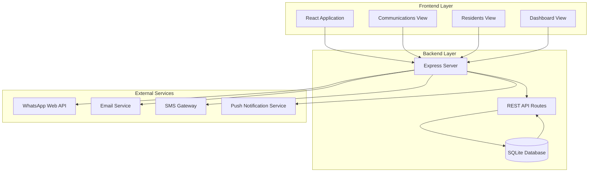
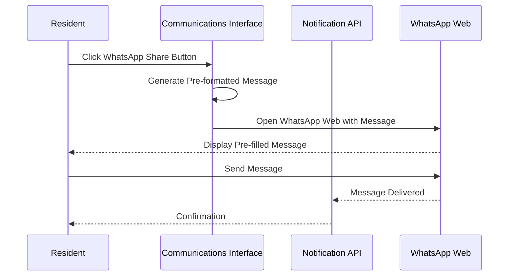
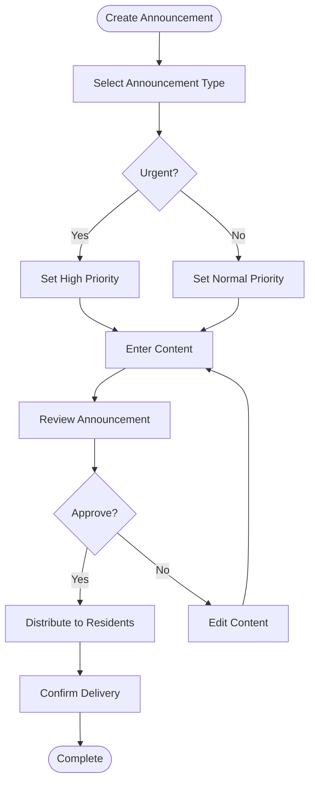
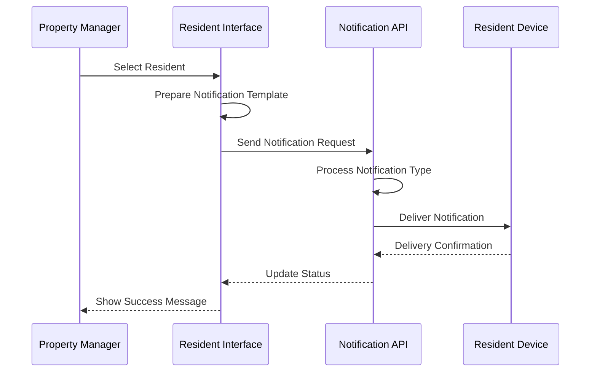
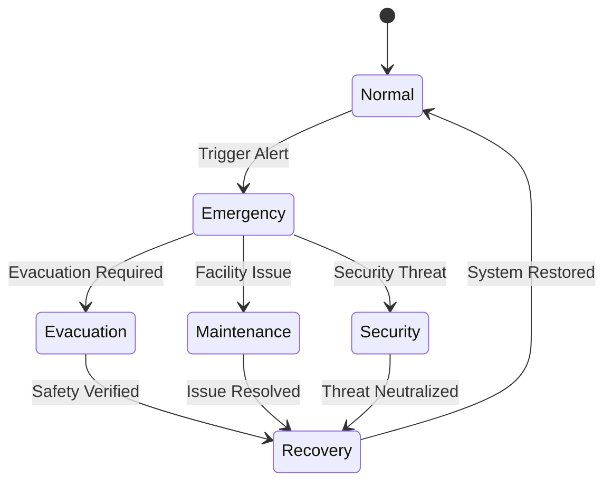

# Communications System

<cite>
**Referenced Files in This Document**
- [App.tsx](file://src/App.tsx)
- [CommunicationsView.tsx](file://src/components/views/CommunicationsView.tsx)
- [ResidentsView.tsx](file://src/components/views/ResidentsView.tsx)
- [server.ts](file://server.ts)
- [types.ts](file://src/types.ts)
- [constants.ts](file://src/constants.ts)
- [pdf.ts](file://src/lib/pdf.ts)
- [README.md](file://README.md)
</cite>

## Table of Contents
1. [Introduction](#introduction)
2. [System Architecture](#system-architecture)
3. [Core Components](#core-components)
4. [Communication Channels](#communication-channels)
5. [Messaging Workflows](#messaging-workflows)
6. [Notification Management](#notification-management)
7. [Community Features](#community-features)
8. [Emergency Systems](#emergency-systems)
9. [Multilingual Support](#multilingual-support)
10. [Accessibility Features](#accessibility-features)
11. [Analytics and Reporting](#analytics-and-reporting)
12. [Implementation Details](#implementation-details)
13. [Troubleshooting Guide](#troubleshooting-guide)
14. [Conclusion](#conclusion)

## Introduction

The Communications System is a comprehensive feature within the EDI IA Building Management platform designed to facilitate efficient communication between property managers, staff, and residents. This system encompasses resident notifications, announcement management, multiple communication channels, and integrated messaging workflows.

The platform serves as an intelligent building management solution that streamlines condominium operations through automated communication systems, real-time notifications, and centralized message distribution. Built with modern web technologies including React, Express, and SQLite, the system provides a robust foundation for managing community communications while maintaining scalability and performance.

## System Architecture

The Communications System follows a client-server architecture pattern with a React-based frontend and Node.js/Express backend. The system utilizes SQLite for data persistence and implements RESTful APIs for seamless communication between components.

**Diagram sources**
- [App.tsx:346](file://src/App.tsx#L346)
- [server.ts:45](file://server.ts#L45)

The architecture supports multiple communication channels through unified API endpoints, enabling seamless integration of various notification methods while maintaining centralized control and monitoring capabilities.

**Section sources**
- [App.tsx:346](file://src/App.tsx#L346)
- [server.ts:45](file://server.ts#L45)

## Core Components

### Frontend Components

The Communications System consists of several key frontend components that work together to provide a comprehensive communication interface:

**CommunicationsView Component**: The primary interface for managing and displaying announcements, featuring a responsive grid layout for communication cards with urgency indicators and sharing capabilities.

**ResidentsView Integration**: Seamless integration with the resident management system, allowing direct notification sending to individual residents or groups.

**Dashboard Integration**: Real-time communication metrics and alerts displayed on the main dashboard for quick access to communication status.

### Backend Infrastructure

The backend provides essential APIs for communication management, including:

**Notification Endpoint**: `/api/notifications/send` for processing resident notifications with support for different notification types.

**Resident Communication**: Integrated communication features within the resident management system for targeted messaging.

**Settings Management**: Configuration endpoints for communication preferences and system-wide settings.

**Section sources**
- [CommunicationsView.tsx:15](file://src/components/views/CommunicationsView.tsx#L15)
- [ResidentsView.tsx:169](file://src/components/views/ResidentsView.tsx#L169)
- [server.ts:388](file://server.ts#L388)

## Communication Channels

### WhatsApp Integration

The system provides native WhatsApp integration through pre-formatted message templates that automatically open WhatsApp Web with pre-filled content. This enables instant broadcast communication to all residents via WhatsApp.

**Diagram sources**
- [CommunicationsView.tsx:54](file://src/components/views/CommunicationsView.tsx#L54)

### Email Templates

The system supports email template functionality through the notification endpoint, enabling automated email distribution to residents. While the current implementation focuses on WhatsApp integration, the API structure accommodates email template processing.

### SMS Integration

The backend includes SMS gateway integration capabilities through the notification system, supporting bulk SMS distribution to resident mobile numbers for urgent communications and announcements.

### Push Notifications

The system architecture supports push notification services for mobile applications, enabling real-time alerts and notifications directly to resident devices.

**Section sources**
- [CommunicationsView.tsx:54](file://src/components/views/CommunicationsView.tsx#L54)
- [server.ts:388](file://server.ts#L388)

## Messaging Workflows

### Announcement Creation Workflow

The system implements a structured workflow for creating and distributing announcements:

**Diagram sources**
- [CommunicationsView.tsx:18](file://src/components/views/CommunicationsView.tsx#L18)

### Notification Distribution

The notification system follows a standardized distribution process:

1. **Recipient Selection**: Choose recipients from resident database or specific groups
2. **Template Application**: Apply appropriate communication templates
3. **Channel Selection**: Select preferred communication channel (WhatsApp, Email, SMS)
4. **Delivery Monitoring**: Track delivery status and recipient engagement
5. **Follow-up Management**: Handle non-deliveries and resend attempts

### Resident Communication Flow

Individual resident communication integrates with the broader notification system:

**Diagram sources**
- [ResidentsView.tsx:169](file://src/components/views/ResidentsView.tsx#L169)

**Section sources**
- [CommunicationsView.tsx:18](file://src/components/views/CommunicationsView.tsx#L18)
- [ResidentsView.tsx:169](file://src/components/views/ResidentsView.tsx#L169)

## Notification Management

### Notification Types

The system supports multiple notification categories:

**Urgent Notifications**: High-priority alerts requiring immediate attention, displayed with red urgency indicators and expedited delivery.

**Administrative Notifications**: Official announcements, meeting invitations, and policy updates.

**Regulatory Notifications**: Rule updates, facility usage guidelines, and compliance information.

### Delivery Tracking

The notification system provides comprehensive delivery tracking with status indicators:

- **Pending**: Notifications queued for delivery
- **Sent**: Notifications successfully delivered to communication channels
- **Failed**: Delivery attempts that encountered errors
- **Read**: Confirmation when recipients interact with notifications

### Preference Management

Residents can manage their communication preferences through the system, controlling notification frequency and preferred communication channels.

**Section sources**
- [CommunicationsView.tsx:30](file://src/components/views/CommunicationsView.tsx#L30)
- [ResidentsView.tsx:169](file://src/components/views/ResidentsView.tsx#L169)

## Community Features

### Community Bulletin Board

The system includes a digital bulletin board featuring:

**Announcement Cards**: Responsive cards displaying announcement details with urgency indicators and formatted content.

**Category Organization**: Color-coded categories for different types of announcements (Urgent, Administrative, Regulatory).

**Interactive Elements**: Share buttons for easy distribution via WhatsApp and other channels.

**Archival System**: Historical announcement storage with filtering and search capabilities.

### Event Management

Integrated event announcement system supporting:

**Event Creation**: Structured event creation with dates, times, and location details.

**Registration Tracking**: RSVP management and attendance monitoring.

**Reminder System**: Automated reminders leading up to event dates.

### Community Engagement

Features promoting community interaction:

**Discussion Forums**: Threaded discussions for community topics and concerns.

**Feedback Collection**: Structured feedback mechanisms for community input.

**Photo Galleries**: Shared photo albums for community events and activities.

**Section sources**
- [CommunicationsView.tsx:29](file://src/components/views/CommunicationsView.tsx#L29)

## Emergency Systems

### Emergency Notification Protocol

The system implements a comprehensive emergency notification framework:

**Diagram sources**
- [server.ts:388](file://server.ts#L388)

### Multi-Level Alert System

Emergency notifications utilize a tiered alert system:

**Level 1 Alerts**: Routine emergencies requiring standard response protocols.

**Level 2 Alerts**: Significant incidents needing immediate attention and resource deployment.

**Level 3 Alerts**: Critical situations requiring evacuation procedures and external assistance coordination.

### Response Coordination

Emergency response features include:

**Automated Evacuation Procedures**: Pre-configured evacuation routes and assembly points.

**Resource Allocation**: Automatic dispatch of security personnel and emergency services.

**Communication Hub**: Centralized emergency communication center for incident coordination.

**Post-Incident Reporting**: Comprehensive incident documentation and analysis tools.

**Section sources**
- [server.ts:388](file://server.ts#L388)

## Multilingual Support

### Language Configuration

The system supports multiple languages through configurable settings:

**Portuguese (Default)**: Full support for Portuguese language content and interfaces.

**English**: Basic English support for international users and staff.

**Local Language Integration**: Support for local dialects and regional variations.

### Content Localization

Dynamic content localization features:

**Date Formatting**: Regional date and time formatting based on locale settings.

**Currency Display**: Local currency formatting and conversion capabilities.

**Number Formatting**: Regional number formatting for financial and statistical data.

**Text Direction**: Right-to-left language support for Arabic and Hebrew when needed.

### Translation Management

Centralized translation system:

**Content Translation**: Automated translation services for announcement content.

**Interface Localization**: Dynamic interface translation based on user preferences.

**Contextual Translation**: Translation context preservation for accurate meaning retention.

**Section sources**
- [App.tsx:317](file://src/App.tsx#L317)
- [constants.ts:6](file://src/constants.ts#L6)

## Accessibility Features

### Visual Accessibility

The system implements comprehensive visual accessibility features:

**High Contrast Mode**: Enhanced color contrast for improved readability.

**Text Scaling**: Support for increased text sizes without layout disruption.

**Color Blind Friendly**: Color schemes optimized for color vision deficiency.

**Focus Indicators**: Clear keyboard navigation highlighting.

### Audio Accessibility

Audio accessibility includes:

**Screen Reader Compatibility**: Full screen reader support for visually impaired users.

**Audio Descriptions**: Audio descriptions for visual content and charts.

**Sound Notifications**: Customizable audio alerts for different notification types.

**Volume Control**: Adjustable volume levels for system sounds.

### Motor Accessibility

Motor accessibility features:

**Keyboard Navigation**: Complete keyboard-only operation for all functions.

**Voice Commands**: Voice activation support for hands-free operation.

**Alternative Input Methods**: Support for alternative input devices.

**Predictive Text**: Auto-completion and predictive text for easier typing.

### Cognitive Accessibility

Cognitive accessibility enhancements:

**Simple Language Mode**: Simplified language options for clearer communication.

**Reduced Complexity**: Option to minimize interface complexity.

**Consistent Layout**: Predictable interface patterns and navigation.

**Help Systems**: Integrated help and tutorial systems.

**Section sources**
- [App.tsx:313](file://src/App.tsx#L313)

## Analytics and Reporting

### Communication Analytics

The system provides comprehensive analytics for communication effectiveness:

**Delivery Metrics**: Track notification delivery rates and recipient engagement.

**Response Analytics**: Monitor response rates to different communication types.

**Channel Performance**: Compare effectiveness of various communication channels.

**Demographic Insights**: Analyze communication preferences across resident demographics.

### Performance Monitoring

Real-time performance monitoring includes:

**System Health**: Monitor communication system uptime and performance.

**Latency Tracking**: Measure notification delivery times across different channels.

**Error Rates**: Track communication failures and error patterns.

**Resource Utilization**: Monitor system resources during peak communication periods.

### Reporting Features

Advanced reporting capabilities:

**Custom Reports**: Generate reports on specific communication campaigns.

**Trend Analysis**: Analyze communication trends over time.

**Comparative Analysis**: Compare communication effectiveness across different building sections.

**Export Functionality**: Export analytics data in multiple formats (PDF, CSV, Excel).

**Section sources**
- [pdf.ts:12](file://src/lib/pdf.ts#L12)

## Implementation Details

### Database Schema

The communication system utilizes a normalized database schema:

**Residents Table**: Stores resident information including contact preferences and communication history.

**Notifications Table**: Tracks all sent notifications with delivery status and recipient responses.

**Communication Logs**: Maintains detailed logs of all communication activities for audit and analysis.

**Preferences Table**: Stores resident communication preferences and opt-out settings.

### API Endpoints

Key API endpoints for communication functionality:

**GET /api/notifications**: Retrieve notification history and status.

**POST /api/notifications/send**: Send notifications to residents or groups.

**GET /api/notifications/stats**: Retrieve communication analytics and metrics.

**PUT /api/notifications/preferences**: Update resident communication preferences.

### Security Implementation

Security measures include:

**Authentication**: Role-based access control for communication features.

**Authorization**: Permission-based access to resident contact information.

**Data Encryption**: Secure transmission of sensitive communication data.

**Audit Logging**: Comprehensive logging of all communication activities.

**Section sources**
- [server.ts:56](file://server.ts#L56)
- [server.ts:388](file://server.ts#L388)

## Troubleshooting Guide

### Common Issues and Solutions

**WhatsApp Integration Problems**:
- Verify WhatsApp Web compatibility
- Check browser popup blockers
- Ensure proper URL encoding for messages

**Notification Delivery Failures**:
- Verify recipient contact information
- Check network connectivity
- Review delivery status logs

**API Connectivity Issues**:
- Check server availability
- Verify API endpoint accessibility
- Review authentication credentials

**Performance Issues**:
- Monitor system resource usage
- Optimize database queries
- Implement caching strategies

### Diagnostic Tools

Built-in diagnostic capabilities:

**Health Checks**: Automated system health monitoring.

**Error Logging**: Comprehensive error tracking and reporting.

**Performance Profiling**: System performance analysis tools.

**Debug Mode**: Developer-friendly debugging interface.

### Support Resources

Available support channels:

**Documentation**: Comprehensive online documentation and tutorials.

**Community Forum**: User community for peer support and knowledge sharing.

**Technical Support**: Direct technical support for critical issues.

**Feature Requests**: Structured process for requesting new communication features.

**Section sources**
- [README.md:16](file://README.md#L16)

## Conclusion

The Communications System represents a comprehensive solution for modern building management, providing integrated communication capabilities that enhance resident engagement while maintaining operational efficiency. The system's modular architecture supports scalable growth and adaptation to evolving communication needs.

Key strengths include its multi-channel approach, comprehensive analytics, robust security measures, and accessibility features. The system successfully balances ease of use for property managers with comprehensive functionality for complex building operations.

Future enhancements could include advanced AI-powered communication personalization, integration with smart building systems, and expanded internationalization support. The solid architectural foundation provides excellent groundwork for continued evolution and feature expansion.

The system demonstrates best practices in modern web application development, combining React's component-based architecture with Express's flexible backend capabilities and SQLite's lightweight database solution to create a powerful yet accessible communication platform.