# Core Features

<cite>
**Referenced Files in This Document**
- [App.tsx](file://src/App.tsx)
- [main.tsx](file://src/main.tsx)
- [types.ts](file://src/types.ts)
- [constants.ts](file://src/constants.ts)
- [DashboardView.tsx](file://src/components/views/DashboardView.tsx)
- [FinanceView.tsx](file://src/components/views/FinanceView.tsx)
- [ResidentsView.tsx](file://src/components/views/ResidentsView.tsx)
- [MaintenanceView.tsx](file://src/components/views/MaintenanceView.tsx)
- [ProjectsView.tsx](file://src/components/views/ProjectsView.tsx)
- [ReportsView.tsx](file://src/components/views/ReportsView.tsx)
- [SettingsView.tsx](file://src/components/views/SettingsView.tsx)
- [CommunicationsView.tsx](file://src/components/views/CommunicationsView.tsx)
- [StaffView.tsx](file://src/components/views/StaffView.tsx)
- [geminiService.ts](file://src/services/geminiService.ts)
- [pdf.ts](file://src/lib/pdf.ts)
- [LoginPage.tsx](file://src/components/LoginPage.tsx)
- [README.md](file://README.md)
</cite>

## Table of Contents
1. [Introduction](#introduction)
2. [Project Structure](#project-structure)
3. [Core Components](#core-components)
4. [Architecture Overview](#architecture-overview)
5. [Detailed Component Analysis](#detailed-component-analysis)
6. [Dependency Analysis](#dependency-analysis)
7. [Performance Considerations](#performance-considerations)
8. [Troubleshooting Guide](#troubleshooting-guide)
9. [Conclusion](#conclusion)
10. [Appendices](#appendices)

## Introduction
This document describes the EdiIA Building Management System core features and how they are implemented in the frontend. It covers the complete feature set including dashboard analytics, resident management, financial tracking, maintenance operations, staff coordination, project management, communications, reporting, and system settings. For each feature, we explain purpose, user workflows, data models, integration patterns, and administrative controls. Screenshots, user personas, and typical use cases are included to help operators, managers, and administrators understand and use the system effectively.

## Project Structure
The application is a React single-page application with a Tauri backend shell. The UI is organized around a sidebar navigation that routes to feature-specific views. Data fetching is performed via client-side HTTP calls to API endpoints, and charts are rendered with Recharts. PDF generation is supported through a dedicated library.

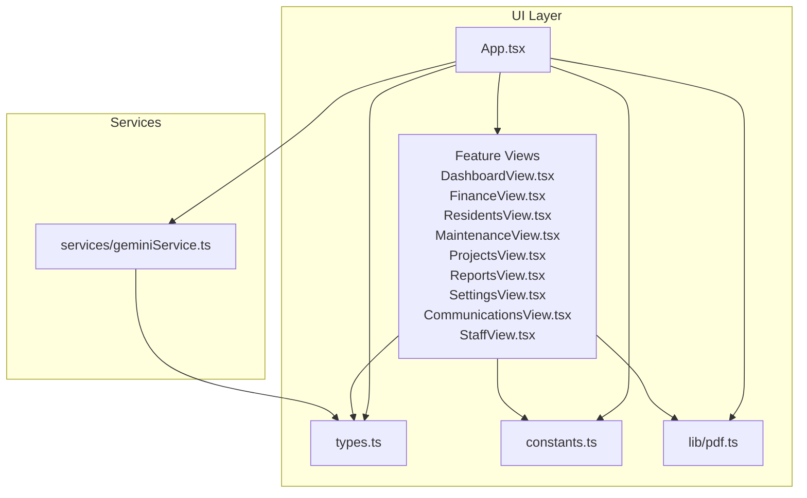

**Diagram sources**
- [App.tsx:1-297](file://src/App.tsx#L1-L297)
- [DashboardView.tsx:1-376](file://src/components/views/DashboardView.tsx#L1-L376)
- [FinanceView.tsx:1-273](file://src/components/views/FinanceView.tsx#L1-L273)
- [ResidentsView.tsx:1-200](file://src/components/views/ResidentsView.tsx#L1-L200)
- [MaintenanceView.tsx:1-130](file://src/components/views/MaintenanceView.tsx#L1-L130)
- [ProjectsView.tsx:1-64](file://src/components/views/ProjectsView.tsx#L1-L64)
- [ReportsView.tsx:1-444](file://src/components/views/ReportsView.tsx#L1-L444)
- [SettingsView.tsx:1-111](file://src/components/views/SettingsView.tsx#L1-L111)
- [CommunicationsView.tsx:1-72](file://src/components/views/CommunicationsView.tsx#L1-L72)
- [StaffView.tsx:1-316](file://src/components/views/StaffView.tsx#L1-L316)
- [types.ts:1-88](file://src/types.ts#L1-L88)
- [constants.ts:1-36](file://src/constants.ts#L1-L36)
- [pdf.ts](file://src/lib/pdf.ts)
- [geminiService.ts:1-49](file://src/services/geminiService.ts#L1-L49)

**Section sources**
- [App.tsx:1-297](file://src/App.tsx#L1-L297)
- [main.tsx:1-11](file://src/main.tsx#L1-L11)
- [README.md:1-21](file://README.md#L1-L21)

## Core Components
- Application shell and routing: The main App component manages user state, active tab, modals, and global data. It lazily loads feature views and handles authentication via a login page.
- Feature views: Each view encapsulates UI and interactions for a domain area (e.g., FinanceView, ResidentsView).
- Data models: Strongly typed models define residents, employees, transactions, maintenance tasks, and roles.
- Analytics: Gemini AI integration generates actionable insights based on building statistics and maintenance tasks.
- Reporting: Built-in PDF export supports financial statements, payment histories, delinquency reports, and staff payrolls.

**Section sources**
- [App.tsx:75-297](file://src/App.tsx#L75-L297)
- [types.ts:23-87](file://src/types.ts#L23-L87)
- [geminiService.ts:11-48](file://src/services/geminiService.ts#L11-L48)
- [pdf.ts](file://src/lib/pdf.ts)

## Architecture Overview
The system follows a modular React architecture with feature-based views and shared services. Data is fetched from API endpoints and cached in component state. UI components use Recharts for visualization and Tailwind for styling. The app integrates with an external AI service for predictive insights.

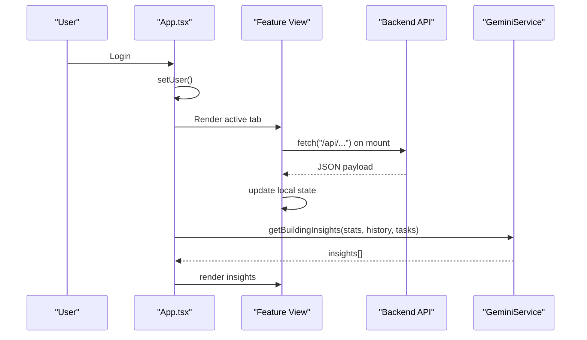

**Diagram sources**
- [App.tsx:125-293](file://src/App.tsx#L125-L293)
- [geminiService.ts:11-48](file://src/services/geminiService.ts#L11-L48)

## Detailed Component Analysis

### Dashboard Analytics
- Purpose: Provide a centralized overview of building health, recent activity, and AI-driven predictions.
- User workflows:
  - Operators navigate to the dashboard to review metrics and alerts.
  - Clicking “Ver Todos os Moradores” navigates to the Residents view.
  - Clicking “Ver todos os tickets de manutenção” navigates to the Maintenance view.
- Data models: Uses mock statistics and debt history for charts; integrates real-time insights from Gemini.
- Integration patterns:
  - Fetches insights via getBuildingInsights when user logs in.
  - Renders charts with Recharts and currency formatting from constants.
- Permissions: Accessible to all roles; no explicit role gating in the dashboard view.

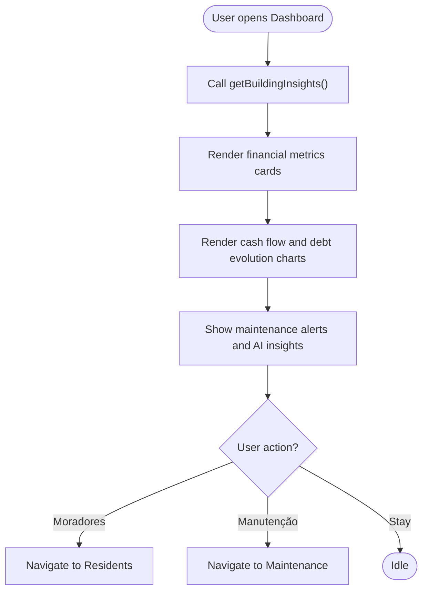

**Diagram sources**
- [DashboardView.tsx:64-376](file://src/components/views/DashboardView.tsx#L64-L376)
- [geminiService.ts:11-48](file://src/services/geminiService.ts#L11-L48)

**Section sources**
- [DashboardView.tsx:64-376](file://src/components/views/DashboardView.tsx#L64-L376)
- [constants.ts:11-36](file://src/constants.ts#L11-L36)
- [App.tsx:141-150](file://src/App.tsx#L141-L150)

### Resident Management
- Purpose: Manage residents, track balances, and facilitate payments and notifications.
- User workflows:
  - Add/edit/delete residents.
  - View resident profiles and account status.
  - Initiate payments and send balance reminders.
  - Export resident lists as PDF.
- Data models: Resident interface defines identity, contact info, delinquency flag, and balance.
- Integration patterns:
  - Fetch residents via GET /api/residents.
  - Delete resident via DELETE /api/residents/{id}.
  - Send notification via POST /api/notifications/send.
  - Generate PDF via lib/pdf.

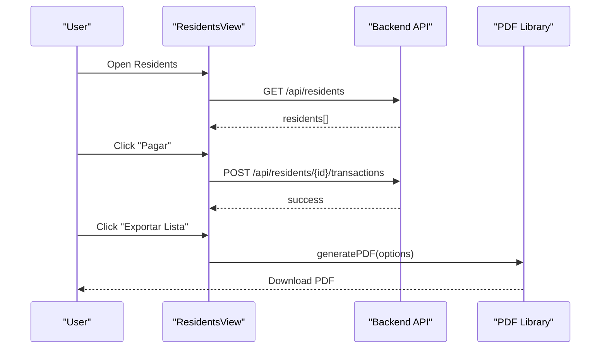

**Diagram sources**
- [ResidentsView.tsx:32-200](file://src/components/views/ResidentsView.tsx#L32-L200)
- [App.tsx:176-186](file://src/App.tsx#L176-L186)

**Section sources**
- [ResidentsView.tsx:32-200](file://src/components/views/ResidentsView.tsx#L32-L200)
- [types.ts:59-67](file://src/types.ts#L59-L67)
- [App.tsx:176-186](file://src/App.tsx#L176-L186)

### Financial Tracking
- Purpose: Track income/expenses, manage fixed costs and extra fees, and generate financial reports.
- User workflows:
  - Create income or expense entries.
  - Manage fixed expenses and extra fees.
  - View recent transactions and export as PDF.
  - Visualize cash flow and expense distribution.
- Data models: FinancialRecord and TransactionType define transaction categories.
- Integration patterns:
  - Fetch fixed expenses via GET /api/finance/fixed-expenses.
  - Fetch extra fees via GET /api/finance/extra-fees.
  - Fetch all transactions via GET /api/finance/all-transactions.
  - Generate PDF via lib/pdf.

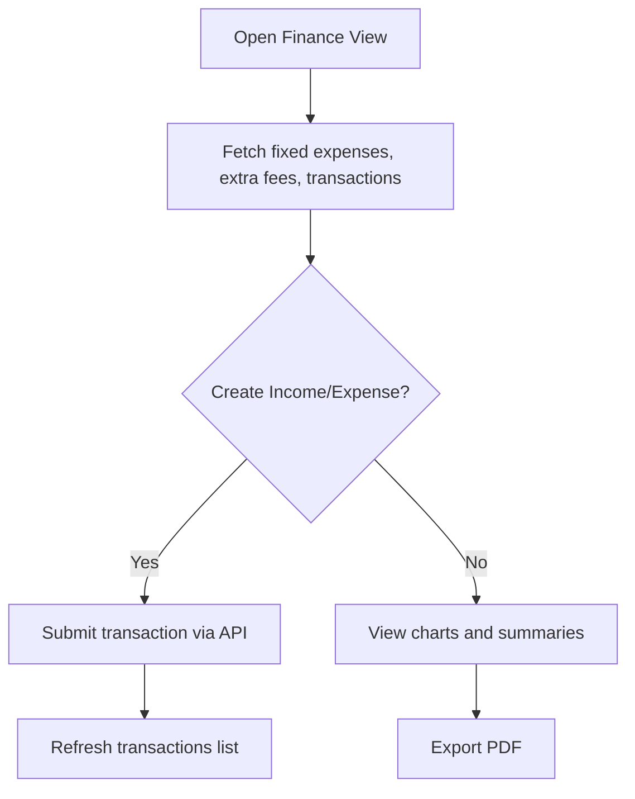

**Diagram sources**
- [FinanceView.tsx:43-273](file://src/components/views/FinanceView.tsx#L43-L273)
- [App.tsx:152-174](file://src/App.tsx#L152-L174)

**Section sources**
- [FinanceView.tsx:43-273](file://src/components/views/FinanceView.tsx#L43-L273)
- [types.ts:41-48](file://src/types.ts#L41-L48)
- [App.tsx:152-174](file://src/App.tsx#L152-L174)

### Maintenance Operations
- Purpose: Track work orders, prioritize tasks, and monitor completion status.
- User workflows:
  - Filter tickets by status (All, Pending, In Progress, Completed).
  - Open a new ticket modal.
  - Export tickets as PDF.
- Data models: MaintenanceTask and MaintenanceStatus define lifecycle and priority.
- Integration patterns:
  - Fetch tickets via GET /api/maintenance/tickets.
  - Generate PDF via lib/pdf.

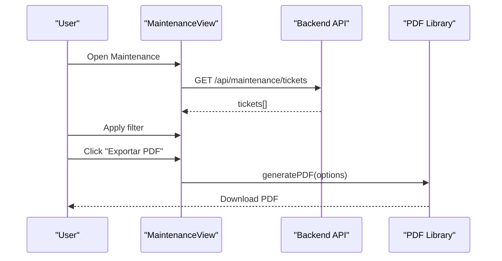

**Diagram sources**
- [MaintenanceView.tsx:25-130](file://src/components/views/MaintenanceView.tsx#L25-L130)
- [App.tsx:188-198](file://src/App.tsx#L188-L198)

**Section sources**
- [MaintenanceView.tsx:25-130](file://src/components/views/MaintenanceView.tsx#L25-L130)
- [types.ts:50-57](file://src/types.ts#L50-L57)
- [App.tsx:188-198](file://src/App.tsx#L188-L198)

### Staff Coordination (HR)
- Purpose: Manage employees, track vacations, and process payroll.
- User workflows:
  - View employee list and status.
  - Add/edit/remove employees.
  - Schedule and track vacations.
  - Generate payroll and download payslips as PDF.
- Data models: Employee interface and related metrics.
- Integration patterns:
  - Fetch employees via GET /api/employees.
  - Fetch vacations via GET /api/vacations.
  - Fetch payroll via GET /api/payroll.
  - Generate PDF via lib/pdf.

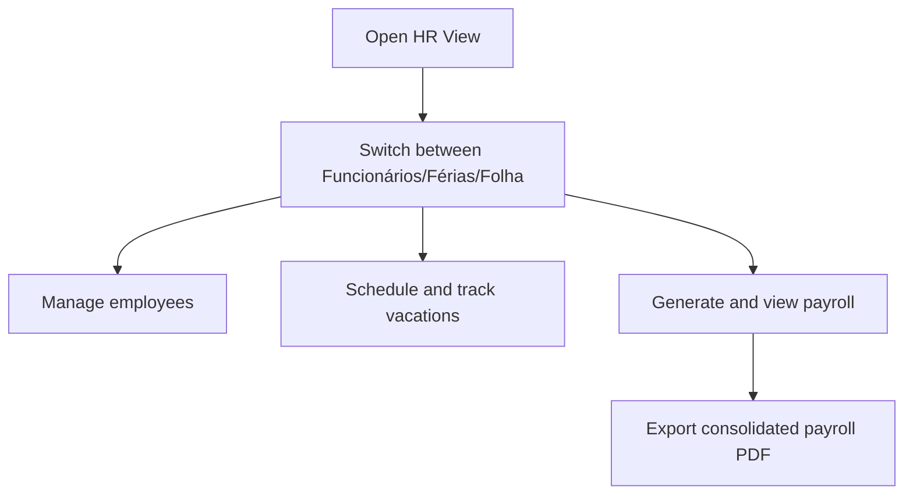

**Diagram sources**
- [StaffView.tsx:60-316](file://src/components/views/StaffView.tsx#L60-L316)
- [App.tsx:200-222](file://src/App.tsx#L200-L222)

**Section sources**
- [StaffView.tsx:60-316](file://src/components/views/StaffView.tsx#L60-L316)
- [types.ts:32-39](file://src/types.ts#L32-L39)
- [App.tsx:200-222](file://src/App.tsx#L200-L222)

### Project Management
- Purpose: Visualize ongoing construction and improvement projects with budgets and deadlines.
- User workflows:
  - Browse project cards with progress bars and deliverables.
  - Select a project to view details.
- Data models: Mock project data for demonstration.
- Integration patterns: Static project cards; no API calls in this view.

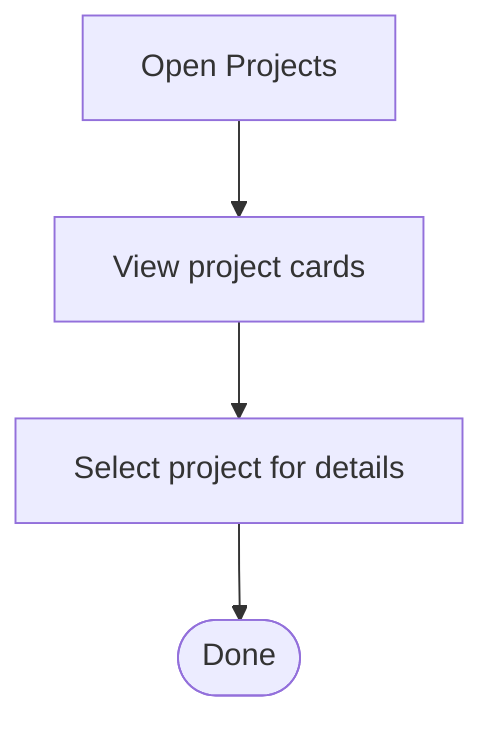

**Diagram sources**
- [ProjectsView.tsx:10-64](file://src/components/views/ProjectsView.tsx#L10-L64)

**Section sources**
- [ProjectsView.tsx:10-64](file://src/components/views/ProjectsView.tsx#L10-L64)

### Communications
- Purpose: Publish announcements and broadcast messages to residents.
- User workflows:
  - Create broadcasts and announcements.
  - Share announcements via WhatsApp.
- Integration patterns: Static communication cards; share action opens WhatsApp web.

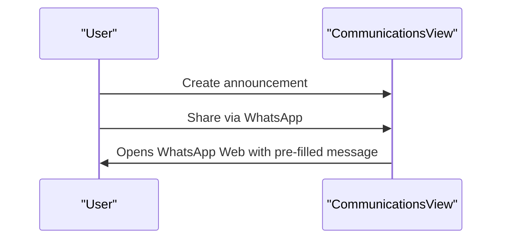

**Diagram sources**
- [CommunicationsView.tsx:15-72](file://src/components/views/CommunicationsView.tsx#L15-L72)

**Section sources**
- [CommunicationsView.tsx:15-72](file://src/components/views/CommunicationsView.tsx#L15-L72)

### Reporting
- Purpose: Generate financial statements, payment histories, and delinquency reports.
- User workflows:
  - Choose report type (Cash Flow, Expenses, Payments, Delinquency).
  - Apply filters for payments report (unit, date range).
  - Export selected reports as PDF.
- Data models: Financial records and resident balances.
- Integration patterns:
  - Generate PDF via lib/pdf with dynamic column sets.
  - Payments report filters resident transactions by unit and dates.

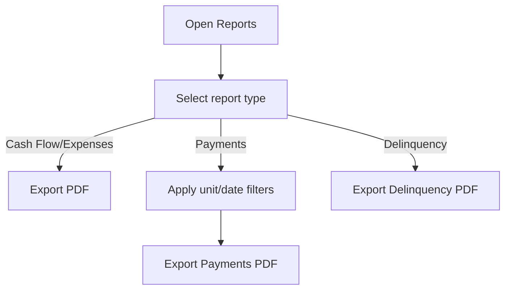

**Diagram sources**
- [ReportsView.tsx:59-444](file://src/components/views/ReportsView.tsx#L59-L444)

**Section sources**
- [ReportsView.tsx:59-444](file://src/components/views/ReportsView.tsx#L59-L444)
- [types.ts:41-67](file://src/types.ts#L41-L67)

### System Settings
- Purpose: Configure building name, admin email, currency, and reset database.
- User workflows:
  - Update general settings via form submission.
  - Reset system data (demo-restricted).
- Integration patterns:
  - PUT /api/settings to save changes.
  - GET /api/settings to load current settings.

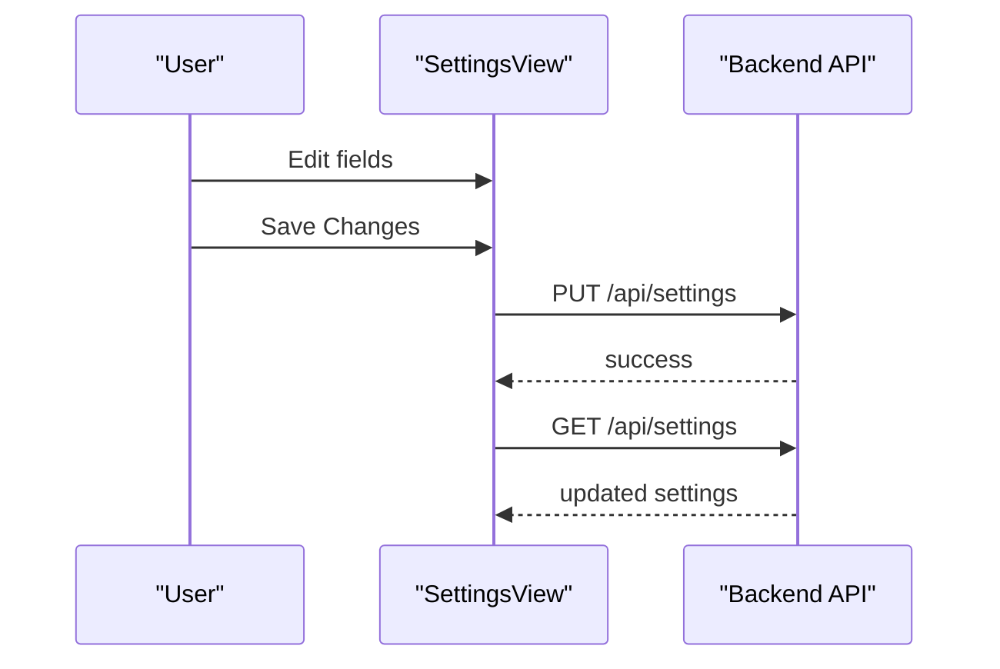

**Diagram sources**
- [SettingsView.tsx:9-111](file://src/components/views/SettingsView.tsx#L9-L111)
- [App.tsx:251-261](file://src/App.tsx#L251-L261)

**Section sources**
- [SettingsView.tsx:9-111](file://src/components/views/SettingsView.tsx#L9-L111)
- [App.tsx:251-261](file://src/App.tsx#L251-L261)

## Dependency Analysis
- Component coupling:
  - App.tsx orchestrates state and passes props to views.
  - Views depend on shared types and constants.
  - PDF generation is centralized in lib/pdf.ts.
- External dependencies:
  - Recharts for data visualization.
  - Gemini AI service for insights.
  - Tauri backend shell (configuration present).
- API surface:
  - Residents: GET /api/residents, DELETE /api/residents/{id}, POST seed endpoint for transactions.
  - Finance: GET /api/finance/fixed-expenses, GET /api/finance/extra-fees, GET /api/finance/all-transactions.
  - Maintenance: GET /api/maintenance/tickets.
  - HR: GET /api/employees, GET /api/vacations, GET /api/payroll.
  - Settings: GET/PUT /api/settings.
  - Notifications: POST /api/notifications/send.
- Potential circular dependencies: None observed among views; App.tsx acts as a central coordinator.

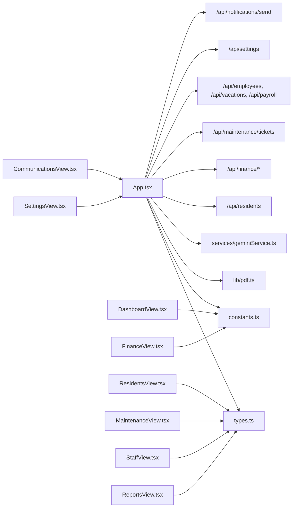

**Diagram sources**
- [App.tsx:152-277](file://src/App.tsx#L152-L277)
- [types.ts:1-88](file://src/types.ts#L1-L88)
- [constants.ts:1-36](file://src/constants.ts#L1-L36)
- [pdf.ts](file://src/lib/pdf.ts)
- [geminiService.ts:1-49](file://src/services/geminiService.ts#L1-L49)

**Section sources**
- [App.tsx:152-277](file://src/App.tsx#L152-L277)

## Performance Considerations
- Rendering:
  - Use of lazy loading for views reduces initial bundle size.
  - Recharts renders efficiently for small to medium datasets.
- Network:
  - Batch API calls on tab change to avoid redundant requests.
  - Debounce or limit frequent polling for live updates.
- State:
  - Keep transaction lists paginated or capped to improve responsiveness.
- PDF generation:
  - Generate on demand to avoid heavy computations during navigation.

## Troubleshooting Guide
- Authentication:
  - If the login page appears continuously, verify the login callback and user state handling.
- Data loading:
  - If views show empty lists, confirm API endpoints are reachable and return success payloads.
- PDF export:
  - If PDF fails, check the generatePDF function invocation and ensure options are correctly formed.
- AI insights:
  - If insights fail to load, verify the GEMINI_API_KEY environment variable and network connectivity.

**Section sources**
- [App.tsx:295-297](file://src/App.tsx#L295-L297)
- [App.tsx:141-150](file://src/App.tsx#L141-L150)
- [README.md:16-21](file://README.md#L16-L21)

## Conclusion
EdiIA provides a comprehensive, modular frontend for building management with strong integrations for finance, residents, maintenance, HR, projects, communications, reporting, and settings. The system leverages typed models, centralized constants, and a shared PDF library to deliver a cohesive user experience. AI-powered insights enhance operational decision-making, while robust API patterns support scalability and maintainability.

## Appendices

### User Personas
- Administrator: Full access to settings, users, and financial controls.
- Manager: Views and approves reports, coordinates maintenance and HR.
- Operator: Handles daily tasks like payments, resident notifications, and basic reporting.
- Viewer: Limited read-only access to dashboards and public communications.

### Typical Use Cases
- Monthly cash flow reconciliation and expense categorization.
- Onboarding new residents and setting up recurring fees.
- Scheduling maintenance tasks and tracking completion.
- Generating delinquency reports and sending reminders.
- Publishing announcements and broadcasting to residents.

### Screenshots
- Dashboard overview with metrics and AI insights.
- Finance view with charts and transaction list.
- Residents list with payment actions and notifications.
- Maintenance tickets with status filtering and export.
- HR tabs for employees, vacations, and payroll.
- Project cards with progress indicators.
- Communication announcements with WhatsApp sharing.
- Reports selection and filtered payment history.
- Settings form for building configuration.