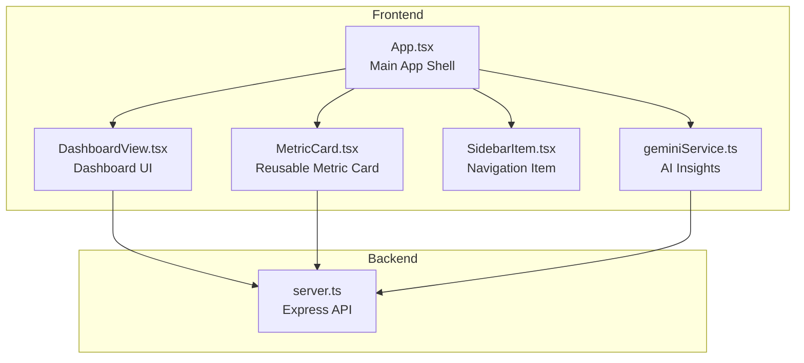
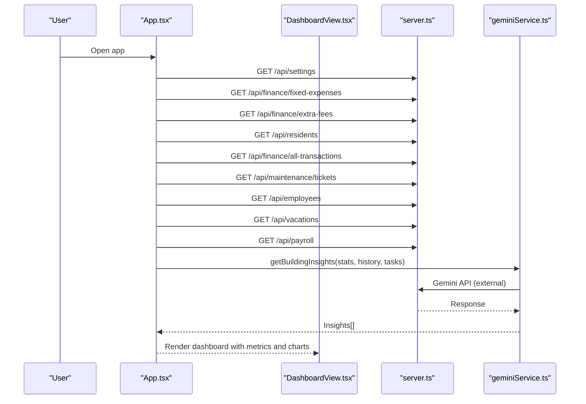
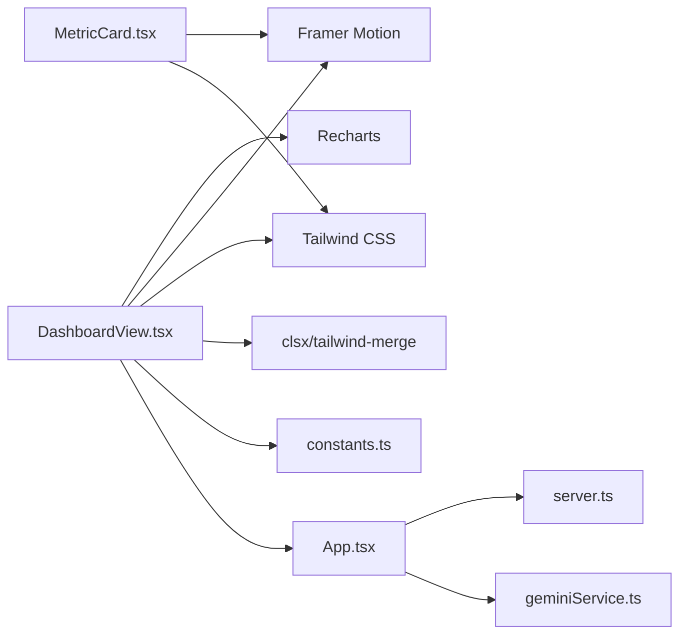

# Dashboard & Analytics

<cite>
**Referenced Files in This Document**
- [DashboardView.tsx](file://src/components/views/DashboardView.tsx)
- [MetricCard.tsx](file://src/components/ui/MetricCard.tsx)
- [App.tsx](file://src/App.tsx)
- [constants.ts](file://src/constants.ts)
- [types.ts](file://src/types.ts)
- [geminiService.ts](file://src/services/geminiService.ts)
- [server.ts](file://server.ts)
- [README.md](file://README.md)
</cite>

## Table of Contents
1. [Introduction](#introduction)
2. [Project Structure](#project-structure)
3. [Core Components](#core-components)
4. [Architecture Overview](#architecture-overview)
5. [Detailed Component Analysis](#detailed-component-analysis)
6. [Dependency Analysis](#dependency-analysis)
7. [Performance Considerations](#performance-considerations)
8. [Troubleshooting Guide](#troubleshooting-guide)
9. [Conclusion](#conclusion)

## Introduction
This document describes the Dashboard & Analytics feature of the building management application. It covers the main dashboard interface, metric cards, KPI displays, and real-time data visualization components. It explains the dashboard layout, widget configuration, data aggregation patterns, performance metrics, user roles and permissions, customization options, and integration with other system modules. It also provides examples of dashboard widgets, metric calculations, and data refresh mechanisms.

## Project Structure
The Dashboard & Analytics feature is implemented primarily in the frontend under src/components/views and src/components/ui, with backend APIs provided by server.ts. The frontend uses React with Framer Motion for animations and Recharts for visualizations. The backend is an Express server with SQLite persistence.

**Diagram sources**
- [App.tsx:75-386](file://src/App.tsx#L75-L386)
- [DashboardView.tsx:64-376](file://src/components/views/DashboardView.tsx#L64-L376)
- [MetricCard.tsx:10-36](file://src/components/ui/MetricCard.tsx#L10-L36)
- [geminiService.ts:11-48](file://src/services/geminiService.ts#L11-L48)
- [server.ts:45-656](file://server.ts#L45-L656)

**Section sources**
- [App.tsx:75-386](file://src/App.tsx#L75-L386)
- [DashboardView.tsx:64-376](file://src/components/views/DashboardView.tsx#L64-L376)
- [MetricCard.tsx:10-36](file://src/components/ui/MetricCard.tsx#L10-L36)
- [server.ts:45-656](file://server.ts#L45-L656)

## Core Components
- DashboardView: Renders the main dashboard with metric cards, charts, and widgets.
- MetricCard: Reusable card component for displaying KPIs with icons and trends.
- App shell: Orchestrates navigation, data fetching, and AI insights.
- Backend APIs: Provide financial, resident, maintenance, HR, and user data.

Key responsibilities:
- DashboardView constructs the layout and renders:
  - Four metric cards (cash, staff expenses, delinquency rate, active employees).
  - Financial cycle chart (area chart).
  - Resident control panel (resident list with balances).
  - Average debt evolution chart (bar chart).
  - AI predictions and maintenance alerts panel.
- MetricCard provides a consistent presentation for KPIs.
- App manages state, fetches data from backend, and triggers AI insights.

**Section sources**
- [DashboardView.tsx:64-376](file://src/components/views/DashboardView.tsx#L64-L376)
- [MetricCard.tsx:10-36](file://src/components/ui/MetricCard.tsx#L10-L36)
- [App.tsx:75-386](file://src/App.tsx#L75-L386)

## Architecture Overview
The dashboard integrates frontend components with backend APIs. The App shell initializes state, loads settings, and fetches data for various tabs. On the dashboard tab, it also triggers AI insights generation.

**Diagram sources**
- [App.tsx:125-293](file://src/App.tsx#L125-L293)
- [geminiService.ts:11-48](file://src/services/geminiService.ts#L11-L48)
- [server.ts:189-520](file://server.ts#L189-L520)

## Detailed Component Analysis

### DashboardView: Main Dashboard Interface
DashboardView organizes the dashboard into distinct sections:
- Metrics grid: Four metric cards for cash, staff expenses, delinquency rate, and active employees.
- Financial cycle chart: Area chart comparing revenue and expenses over months.
- Resident control panel: List of residents with balances and status indicators.
- Average debt evolution chart: Bar chart showing average debt per resident over six months.
- AI predictions and maintenance alerts: Predictive cash flow area chart and maintenance alerts list.

Widget configuration:
- Metrics grid uses responsive grid classes to adapt to screen sizes.
- Charts use Recharts components with ResponsiveContainer for adaptive sizing.
- Interactive elements trigger navigation to other views (residents, maintenance).

Data aggregation patterns:
- Uses MOCK_STATS and MOCK_HISTORY constants for demonstration.
- Integrates with backend endpoints for live data (when deployed).

Real-time data visualization:
- The dashboard currently uses mock data. In a production environment, live data would be fetched from backend endpoints and rendered in charts.

**Section sources**
- [DashboardView.tsx:64-376](file://src/components/views/DashboardView.tsx#L64-L376)
- [constants.ts:11-35](file://src/constants.ts#L11-L35)

### MetricCard: KPI Display Component
MetricCard is a reusable component that:
- Accepts label, value, optional trend, and an icon.
- Applies conditional styling for positive/negative trends.
- Provides subtle hover effects and animated entrance.

Usage in dashboard:
- Used within the metrics grid to present KPIs consistently.

**Section sources**
- [MetricCard.tsx:10-36](file://src/components/ui/MetricCard.tsx#L10-L36)
- [DashboardView.tsx:34-58](file://src/components/views/DashboardView.tsx#L34-L58)

### App Shell: Navigation, State, and AI Insights
The App shell manages:
- Active tab state and navigation.
- Data loading for the dashboard and other views.
- Real-time clock display.
- AI insights generation via getBuildingInsights.

Data fetching:
- On dashboard tab activation, multiple endpoints are fetched to populate charts and lists.
- Settings are loaded on startup.

AI integration:
- getBuildingInsights is invoked when a user logs in, using MOCK_STATS, empty histories, and empty tasks to generate insights.

**Section sources**
- [App.tsx:75-386](file://src/App.tsx#L75-L386)
- [geminiService.ts:11-48](file://src/services/geminiService.ts#L11-L48)

### Backend Integration: APIs and Data Model
The backend exposes REST endpoints for:
- Settings: GET/PUT settings.
- Residents: CRUD operations and transaction history.
- Finance: Fixed expenses, extra fees, and global transactions.
- Maintenance: Tickets CRUD.
- HR: Employees, vacations, payroll.
- Users: CRUD operations for system users.

Data model:
- Users with roles (administrator, gestor, operador, visualizador).
- Residents with balances and contact info.
- Transactions linked to residents.
- Maintenance tickets with status and priority.
- HR entities for employees, vacations, and payroll.

**Section sources**
- [server.ts:189-633](file://server.ts#L189-L633)
- [types.ts:69-87](file://src/types.ts#L69-L87)

### Real-Time Data Visualization and Refresh Mechanisms
Current state:
- Dashboard uses mock data for metrics and charts.
- No automatic refresh mechanism is implemented in the dashboard view.

Proposed refresh mechanisms (conceptual):
- Polling: Periodically refetch data from backend endpoints.
- WebSocket: Subscribe to live updates for metrics and charts.
- Manual refresh: Provide a refresh button to reload data.

[No sources needed since this section provides general guidance]

### User Roles and Permissions
Roles and labels:
- administrator: Full access.
- gestor: Manager role.
- operador: Operator role.
- visualizador: Viewer role.

Role labels are mapped for display. The backend enforces role-based access during authentication and user management operations.

**Section sources**
- [types.ts:69-87](file://src/types.ts#L69-L87)

### Widget Configuration and Customization
Dashboard widgets:
- Metrics grid: Configurable via props passed to MetricCard.
- Charts: Configured with data arrays and Recharts components.
- Resident control panel: Configurable list rendering and status indicators.
- AI panel: Configurable insights display and action buttons.

Customization options:
- Currency formatting via constants.
- Responsive layouts for different screen sizes.
- Hover and animation effects for interactive elements.

**Section sources**
- [DashboardView.tsx:64-376](file://src/components/views/DashboardView.tsx#L64-L376)
- [constants.ts:6-9](file://src/constants.ts#L6-L9)

### Integration with Other System Modules
The dashboard integrates with:
- Finance: Fixed expenses, extra fees, and global transactions.
- Residents: Resident list and balances.
- Maintenance: Maintenance tickets and alerts.
- HR: Employee data for staffing metrics.
- Users: Settings and user management.

**Section sources**
- [App.tsx:275-293](file://src/App.tsx#L275-L293)
- [server.ts:189-520](file://server.ts#L189-L520)

## Dependency Analysis
The dashboard depends on:
- Frontend libraries: React, Framer Motion, Tailwind CSS, clsx/tailwind-merge, Recharts.
- Backend APIs: Defined in server.ts.
- Services: geminiService.ts for AI insights.

**Diagram sources**
- [DashboardView.tsx:15-28](file://src/components/views/DashboardView.tsx#L15-L28)
- [MetricCard.tsx:2-8](file://src/components/ui/MetricCard.tsx#L2-L8)
- [App.tsx:44-46](file://src/App.tsx#L44-L46)
- [constants.ts:6-9](file://src/constants.ts#L6-L9)
- [geminiService.ts:6-7](file://src/services/geminiService.ts#L6-L7)
- [server.ts:6-12](file://server.ts#L6-L12)

**Section sources**
- [DashboardView.tsx:15-28](file://src/components/views/DashboardView.tsx#L15-L28)
- [MetricCard.tsx:2-8](file://src/components/ui/MetricCard.tsx#L2-L8)
- [App.tsx:44-46](file://src/App.tsx#L44-L46)
- [constants.ts:6-9](file://src/constants.ts#L6-L9)
- [geminiService.ts:6-7](file://src/services/geminiService.ts#L6-L7)
- [server.ts:6-12](file://server.ts#L6-L12)

## Performance Considerations
- Use responsive charts to optimize rendering on different devices.
- Debounce or throttle data refresh to avoid excessive network requests.
- Virtualize long lists (resident control panel) to improve scroll performance.
- Cache frequently accessed data to reduce redundant API calls.
- Lazy load heavy components and charts to improve initial load time.

[No sources needed since this section provides general guidance]

## Troubleshooting Guide
Common issues and resolutions:
- Missing GEMINI_API_KEY: Set the key in .env.local as described in README to enable AI insights.
- CORS errors: Ensure the backend is running and serving the API endpoints.
- Authentication failures: Verify PIN and role configuration in the database.
- Data not loading: Confirm that the backend server is reachable and endpoints are functioning.

**Section sources**
- [README.md:16-20](file://README.md#L16-L20)
- [server.ts:522-558](file://server.ts#L522-L558)

## Conclusion
The Dashboard & Analytics feature provides a comprehensive overview of building operations through metric cards, financial charts, resident controls, and AI-driven insights. While the current implementation uses mock data, the architecture supports seamless integration with backend APIs for live data. The modular design allows for easy customization and extension of widgets, charts, and data refresh mechanisms.