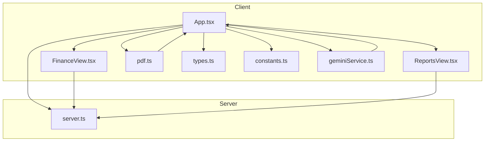
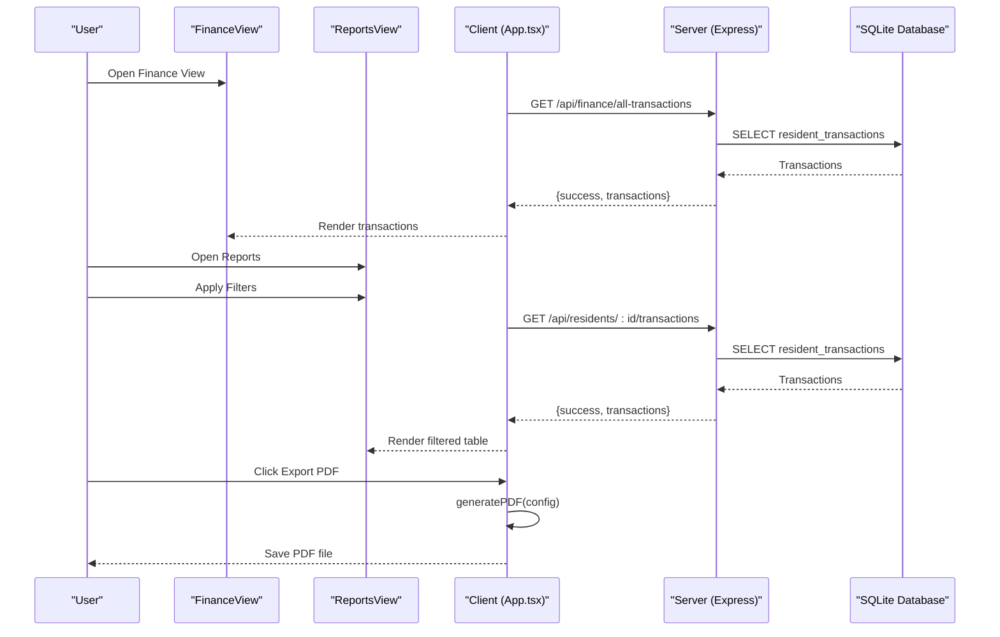
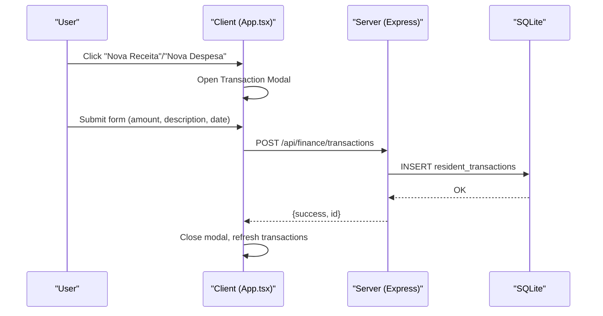
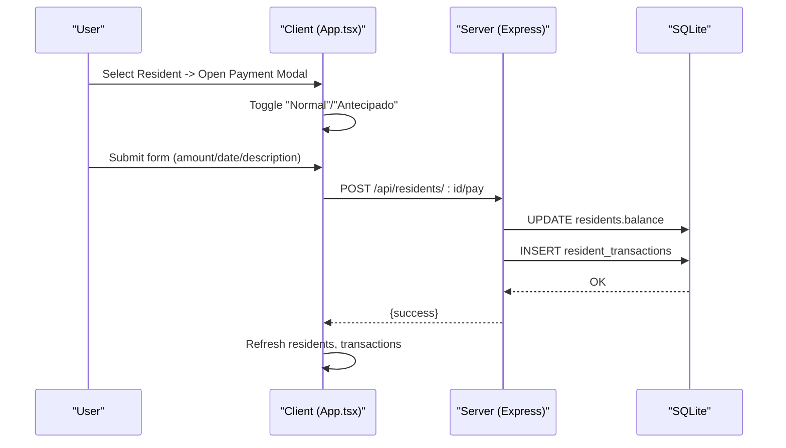
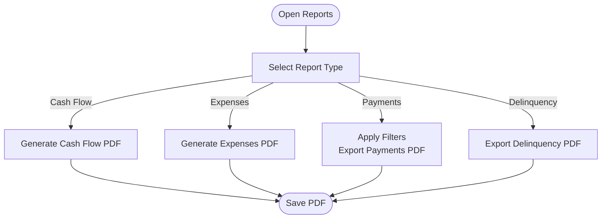
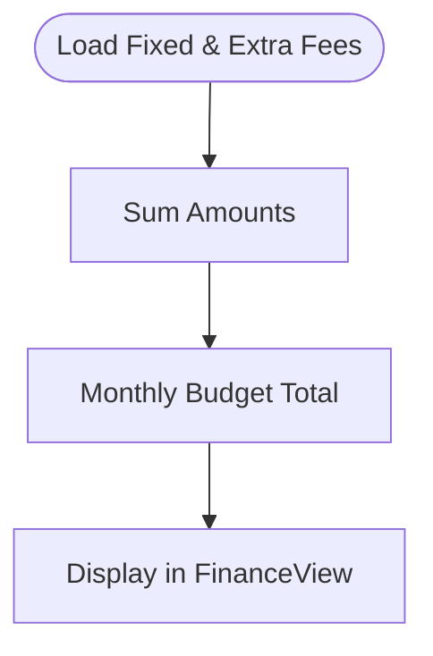
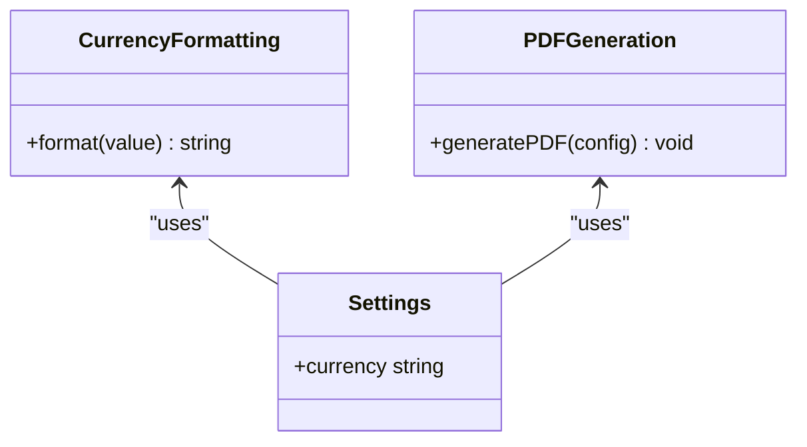
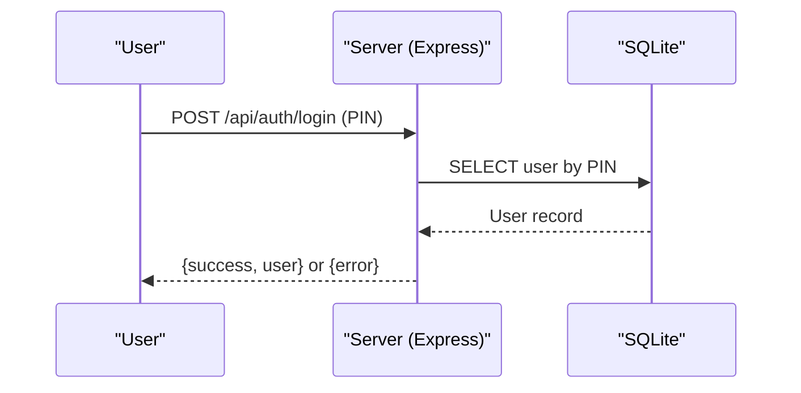
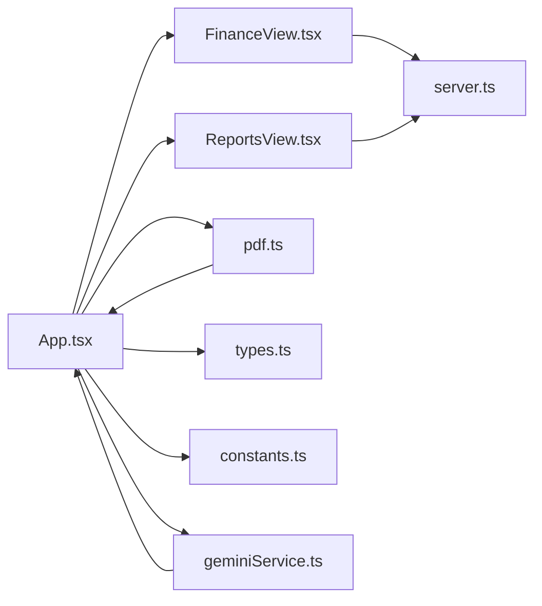

# Financial Tracking

<cite>
**Referenced Files in This Document**
- [App.tsx](file://src/App.tsx)
- [FinanceView.tsx](file://src/components/views/FinanceView.tsx)
- [ReportsView.tsx](file://src/components/views/ReportsView.tsx)
- [pdf.ts](file://src/lib/pdf.ts)
- [types.ts](file://src/types.ts)
- [constants.ts](file://src/constants.ts)
- [geminiService.ts](file://src/services/geminiService.ts)
- [server.ts](file://server.ts)
</cite>

## Table of Contents
1. [Introduction](#introduction)
2. [Project Structure](#project-structure)
3. [Core Components](#core-components)
4. [Architecture Overview](#architecture-overview)
5. [Detailed Component Analysis](#detailed-component-analysis)
6. [Dependency Analysis](#dependency-analysis)
7. [Performance Considerations](#performance-considerations)
8. [Troubleshooting Guide](#troubleshooting-guide)
9. [Conclusion](#conclusion)
10. [Appendices](#appendices)

## Introduction
This document describes the Financial Tracking feature of the building management application. It covers income and expense management, billing automation, payment processing, financial reporting, and accounting integrations. The system supports invoice generation, payment tracking, financial reconciliation, budget management, PDF generation, financial document handling, tax calculations, revenue analytics, multi-currency support, payment gateway integrations, and financial compliance requirements.

## Project Structure
The Financial Tracking feature spans client-side React components, a PDF generation library, shared types, constants, and a backend Express server with SQLite persistence.

**Diagram sources**
- [App.tsx:1-2375](file://src/App.tsx#L1-L2375)
- [FinanceView.tsx:1-273](file://src/components/views/FinanceView.tsx#L1-L273)
- [ReportsView.tsx:1-444](file://src/components/views/ReportsView.tsx#L1-L444)
- [pdf.ts:1-58](file://src/lib/pdf.ts#L1-L58)
- [types.ts:1-88](file://src/types.ts#L1-L88)
- [constants.ts:1-36](file://src/constants.ts#L1-L36)
- [geminiService.ts:1-49](file://src/services/geminiService.ts#L1-L49)
- [server.ts:1-656](file://server.ts#L1-L656)

**Section sources**
- [App.tsx:1-2375](file://src/App.tsx#L1-L2375)
- [server.ts:1-656](file://server.ts#L1-L656)

## Core Components
- FinanceView: Displays financial charts, treasury management, and fixed/extra fee lists.
- ReportsView: Provides financial reports, filters, and export to PDF.
- pdf.ts: Generates PDFs for financial statements and reports.
- server.ts: Implements financial APIs for transactions, residents, and settings.
- types.ts/constants.ts: Define financial data models and currency formatting.
- geminiService.ts: AI-powered insights for building finances.

**Section sources**
- [FinanceView.tsx:1-273](file://src/components/views/FinanceView.tsx#L1-L273)
- [ReportsView.tsx:1-444](file://src/components/views/ReportsView.tsx#L1-L444)
- [pdf.ts:1-58](file://src/lib/pdf.ts#L1-L58)
- [server.ts:1-656](file://server.ts#L1-L656)
- [types.ts:1-88](file://src/types.ts#L1-L88)
- [constants.ts:1-36](file://src/constants.ts#L1-L36)
- [geminiService.ts:1-49](file://src/services/geminiService.ts#L1-L49)

## Architecture Overview
The Financial Tracking feature follows a layered architecture:
- Presentation Layer: React components render financial data and collect user input.
- Business Logic: Client-side state manages forms, filters, and modal interactions.
- Data Access: Client fetches and posts data to server endpoints.
- Persistence: Server stores financial records in SQLite database.
- Reporting: PDF generation uses jsPDF and autoTable.

**Diagram sources**
- [FinanceView.tsx:130-191](file://src/components/views/FinanceView.tsx#L130-L191)
- [ReportsView.tsx:120-198](file://src/components/views/ReportsView.tsx#L120-L198)
- [App.tsx:224-249](file://src/App.tsx#L224-L249)
- [server.ts:342-355](file://server.ts#L342-L355)
- [pdf.ts:12-57](file://src/lib/pdf.ts#L12-L57)

## Detailed Component Analysis

### Income and Expense Management
- Treasury Management: FinanceView displays recent transactions and allows registering new income or expense entries.
- Transaction Registration: A modal captures amount, description, and date, then posts to the server endpoint for general treasury transactions.
- Fixed and Extra Fees: FinanceView lists fixed expenses and extra fees, enabling creation and editing via modals.

**Diagram sources**
- [FinanceView.tsx:134-166](file://src/components/views/FinanceView.tsx#L134-L166)
- [App.tsx:1852-1985](file://src/App.tsx#L1852-L1985)
- [server.ts:357-366](file://server.ts#L357-L366)

**Section sources**
- [FinanceView.tsx:130-267](file://src/components/views/FinanceView.tsx#L130-L267)
- [App.tsx:1852-1985](file://src/App.tsx#L1852-L1985)
- [server.ts:357-366](file://server.ts#L357-L366)

### Billing Automation and Payment Processing
- Payment Registration: A dedicated modal handles normal and advance payments for residents, updating balances and recording transactions.
- Advance Payments: Calculates total based on monthly fee and months selected.
- Payment Validation: Ensures amount, description, and date are valid before submission.

**Diagram sources**
- [App.tsx:1665-1850](file://src/App.tsx#L1665-L1850)
- [server.ts:368-386](file://server.ts#L368-L386)

**Section sources**
- [App.tsx:1665-1850](file://src/App.tsx#L1665-L1850)
- [server.ts:368-386](file://server.ts#L368-L386)

### Financial Reporting and PDF Generation
- ReportsView: Provides selection cards for Cash Flow, Expenses, Payments, and Delinquency reports.
- Export to PDF: Uses generatePDF to produce standardized financial documents with branding and tables.
- Filters: Payments report supports filtering by unit and date range.

**Diagram sources**
- [ReportsView.tsx:74-118](file://src/components/views/ReportsView.tsx#L74-L118)
- [ReportsView.tsx:199-315](file://src/components/views/ReportsView.tsx#L199-L315)
- [ReportsView.tsx:316-438](file://src/components/views/ReportsView.tsx#L316-L438)
- [pdf.ts:12-57](file://src/lib/pdf.ts#L12-L57)

**Section sources**
- [ReportsView.tsx:1-444](file://src/components/views/ReportsView.tsx#L1-L444)
- [pdf.ts:1-58](file://src/lib/pdf.ts#L1-L58)

### Financial Reconciliation and Budget Management
- Reconciliation: FinanceView aggregates fixed and extra fees to compute monthly budget totals.
- Budget Management: Lists fixed and extra fees with due dates, enabling budget planning and tracking.

**Diagram sources**
- [FinanceView.tsx:218-267](file://src/components/views/FinanceView.tsx#L218-L267)

**Section sources**
- [FinanceView.tsx:194-267](file://src/components/views/FinanceView.tsx#L194-L267)

### Multi-Currency Support and Tax Calculations
- Currency Formatting: Constants define currency formatting for the local currency.
- Multi-Currency: Settings endpoint supports currency selection; PDFs display amounts in selected currency.

**Diagram sources**
- [constants.ts:6-9](file://src/constants.ts#L6-L9)
- [server.ts:191-217](file://server.ts#L191-L217)
- [pdf.ts:12-57](file://src/lib/pdf.ts#L12-L57)

**Section sources**
- [constants.ts:1-36](file://src/constants.ts#L1-L36)
- [server.ts:191-217](file://server.ts#L191-L217)
- [pdf.ts:12-57](file://src/lib/pdf.ts#L12-L57)

### Payment Gateway Integrations and Compliance
- Payment Gateways: Not implemented in the current codebase.
- Compliance: PIN-based authentication, rate limiting, and secure storage of credentials via PBKDF2 hashing.

**Diagram sources**
- [server.ts:522-558](file://server.ts#L522-L558)

**Section sources**
- [server.ts:22-43](file://server.ts#L22-L43)
- [server.ts:522-558](file://server.ts#L522-L558)

## Dependency Analysis
- Client depends on server endpoints for all financial operations.
- PDF generation is decoupled and reusable across views.
- Types and constants provide shared data contracts and formatting.

**Diagram sources**
- [App.tsx:1-2375](file://src/App.tsx#L1-L2375)
- [FinanceView.tsx:1-273](file://src/components/views/FinanceView.tsx#L1-L273)
- [ReportsView.tsx:1-444](file://src/components/views/ReportsView.tsx#L1-L444)
- [pdf.ts:1-58](file://src/lib/pdf.ts#L1-L58)
- [types.ts:1-88](file://src/types.ts#L1-L88)
- [constants.ts:1-36](file://src/constants.ts#L1-L36)
- [geminiService.ts:1-49](file://src/services/geminiService.ts#L1-L49)
- [server.ts:1-656](file://server.ts#L1-L656)

**Section sources**
- [App.tsx:1-2375](file://src/App.tsx#L1-L2375)
- [server.ts:1-656](file://server.ts#L1-L656)

## Performance Considerations
- Client-side rendering: Charts and tables are rendered client-side; consider pagination for large datasets.
- Database queries: JOINs in server endpoints are straightforward; ensure indexes on frequently queried columns.
- PDF generation: Large tables may impact performance; consider chunking or server-side generation.

## Troubleshooting Guide
- Transaction Registration Failures: Verify amount > 0, description present, and date valid.
- Payment Processing Errors: Ensure resident balance update and transaction insert succeed atomically.
- PDF Export Issues: Confirm generatePDF receives valid columns and rows arrays.

**Section sources**
- [App.tsx:1884-1912](file://src/App.tsx#L1884-L1912)
- [App.tsx:1721-1747](file://src/App.tsx#L1721-L1747)
- [pdf.ts:12-57](file://src/lib/pdf.ts#L12-L57)

## Conclusion
The Financial Tracking feature provides a robust foundation for managing income, expenses, billing, and reporting. It integrates PDF generation, multi-currency support, and basic compliance measures. Future enhancements could include payment gateway integrations, advanced tax calculations, and expanded accounting integrations.

## Appendices

### API Endpoints Summary
- GET /api/finance/all-transactions: Retrieve all financial transactions.
- POST /api/finance/transactions: Register a general treasury income/expense.
- POST /api/residents/:id/pay: Record a resident payment and update balance.
- GET /api/residents/:id/transactions: Get a resident’s transaction history.
- POST /api/residents/:id/seed-transactions: Seed sample transactions for a resident.
- GET /api/finance/fixed-expenses: List fixed expenses.
- POST /api/finance/fixed-expenses: Create a fixed expense.
- PUT /api/finance/fixed-expenses/:id: Update a fixed expense.
- GET /api/finance/extra-fees: List extra fees.
- POST /api/finance/extra-fees: Create an extra fee.
- GET /api/settings: Retrieve building settings.
- PUT /api/settings: Update building settings.

**Section sources**
- [server.ts:342-386](file://server.ts#L342-L386)
- [server.ts:262-312](file://server.ts#L262-L312)
- [server.ts:191-217](file://server.ts#L191-L217)