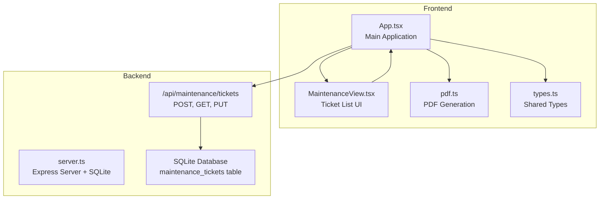
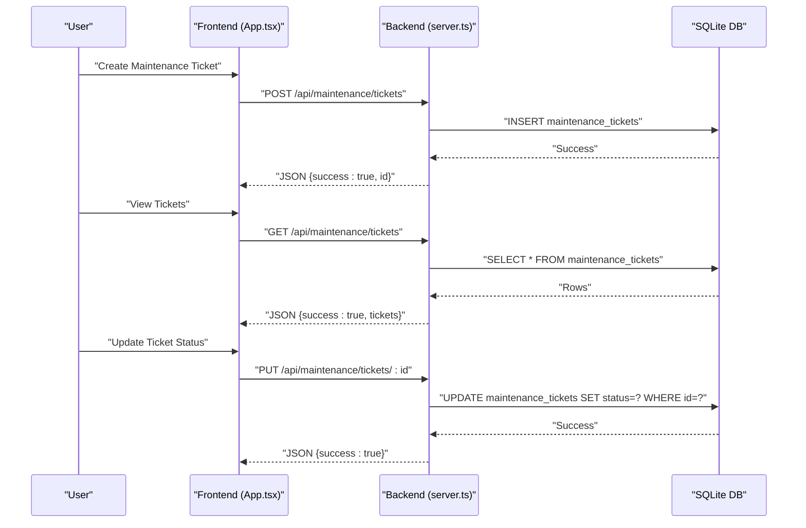
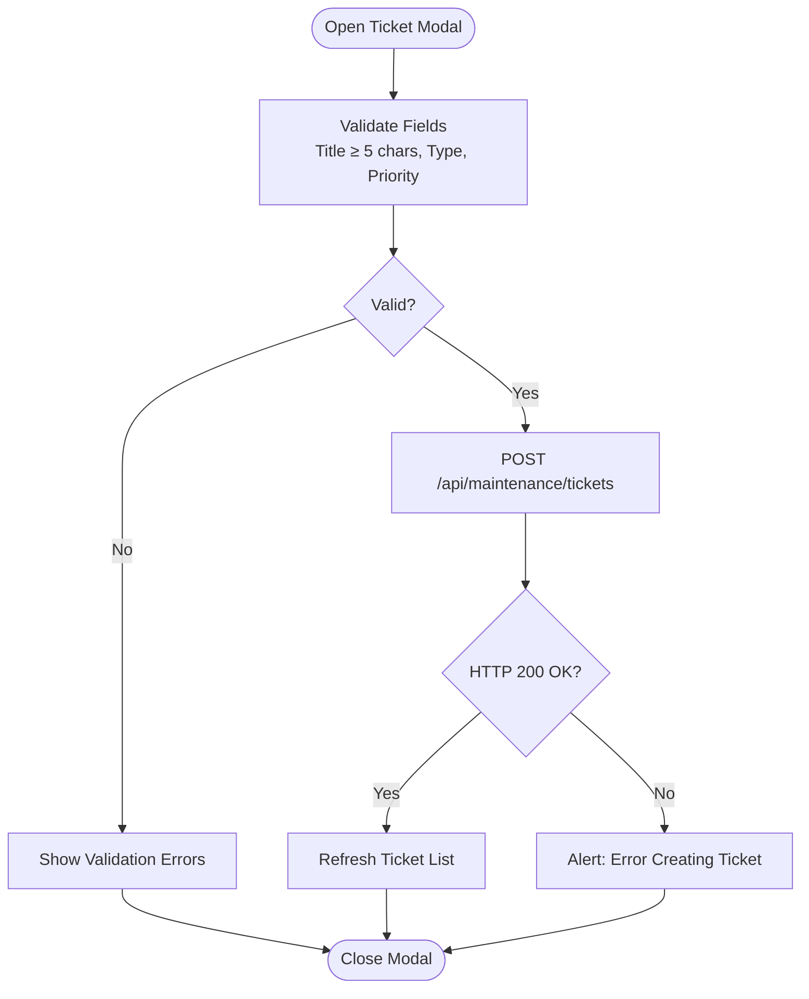
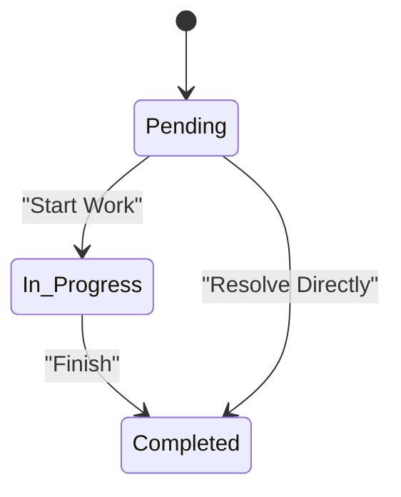
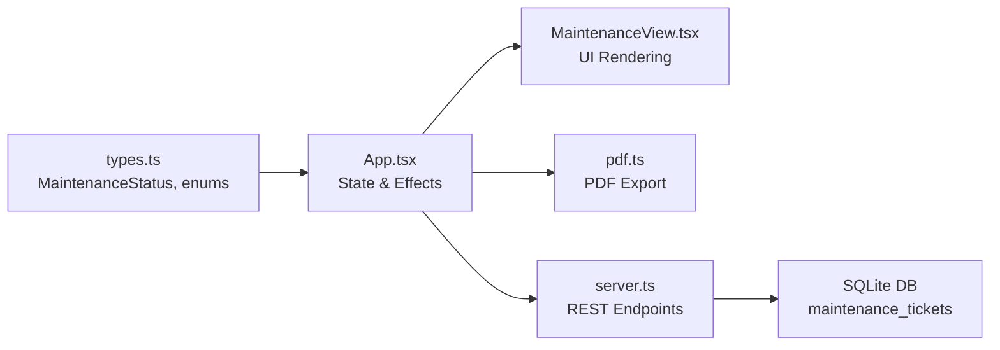

# Maintenance Operations

<cite>
**Referenced Files in This Document**
- [App.tsx](file://src/App.tsx)
- [MaintenanceView.tsx](file://src/components/views/MaintenanceView.tsx)
- [types.ts](file://src/types.ts)
- [pdf.ts](file://src/lib/pdf.ts)
- [server.ts](file://server.ts)
- [geminiService.ts](file://src/services/geminiService.ts)
</cite>

## Table of Contents
1. [Introduction](#introduction)
2. [Project Structure](#project-structure)
3. [Core Components](#core-components)
4. [Architecture Overview](#architecture-overview)
5. [Detailed Component Analysis](#detailed-component-analysis)
6. [Dependency Analysis](#dependency-analysis)
7. [Performance Considerations](#performance-considerations)
8. [Troubleshooting Guide](#troubleshooting-guide)
9. [Conclusion](#conclusion)

## Introduction
This document describes the Maintenance Operations feature of the building management application. It covers maintenance request management, work order creation, technician assignment, equipment tracking, and preventive maintenance scheduling. It also explains maintenance workflows, priority systems, vendor management, maintenance history tracking, asset lifecycle management, maintenance cost tracking, performance monitoring, maintenance planning, resource allocation, and integration with building management systems.

## Project Structure
The Maintenance Operations feature spans frontend React components, backend API routes, and shared TypeScript types. The frontend provides a user interface for creating and managing maintenance tickets, filtering by status, exporting reports, and updating ticket states. The backend exposes REST endpoints for ticket CRUD operations and persists data in a local SQLite database.

**Diagram sources**
- [App.tsx:188-198](file://src/App.tsx#L188-L198)
- [MaintenanceView.tsx:35-125](file://src/components/views/MaintenanceView.tsx#L35-L125)
- [pdf.ts:12-57](file://src/lib/pdf.ts#L12-L57)
- [server.ts:395-424](file://server.ts#L395-L424)

**Section sources**
- [App.tsx:188-198](file://src/App.tsx#L188-L198)
- [MaintenanceView.tsx:35-125](file://src/components/views/MaintenanceView.tsx#L35-L125)
- [pdf.ts:12-57](file://src/lib/pdf.ts#L12-L57)
- [server.ts:395-424](file://server.ts#L395-L424)

## Core Components
- Maintenance ticket management: Creation, filtering, viewing details, and state updates.
- Priority and status system: Tickets are categorized by priority and tracked through statuses.
- Reporting: Export tickets to PDF with configurable columns and rows.
- Backend persistence: SQLite-backed maintenance tickets with REST endpoints.

Key implementation references:
- Ticket creation form and validation in the main application.
- Ticket list rendering and filtering in the Maintenance View component.
- PDF export functionality.
- Backend API routes for tickets.

**Section sources**
- [App.tsx:1474-1580](file://src/App.tsx#L1474-L1580)
- [App.tsx:1582-1663](file://src/App.tsx#L1582-L1663)
- [MaintenanceView.tsx:35-125](file://src/components/views/MaintenanceView.tsx#L35-L125)
- [pdf.ts:12-57](file://src/lib/pdf.ts#L12-L57)
- [server.ts:395-424](file://server.ts#L395-L424)

## Architecture Overview
The Maintenance feature follows a client-server architecture:
- Frontend (React) handles UI, user interactions, and state.
- Backend (Express + better-sqlite3) serves REST endpoints and manages data persistence.
- Shared types define the data contract between frontend and backend.

**Diagram sources**
- [server.ts:395-424](file://server.ts#L395-L424)
- [App.tsx:188-198](file://src/App.tsx#L188-L198)
- [App.tsx:1636-1658](file://src/App.tsx#L1636-L1658)

## Detailed Component Analysis

### Maintenance Request Management
- Creation: The ticket modal collects title, type, priority, and description, validates inputs, and posts to the backend endpoint. On success, the ticket list refreshes.
- Filtering: The Maintenance View supports filtering by status (All, Pending, In Progress, Completed).
- Details: Clicking a ticket opens a modal displaying description, type, opening date, and allows updating status via buttons.

**Diagram sources**
- [App.tsx:1490-1531](file://src/App.tsx#L1490-L1531)
- [server.ts:395-404](file://server.ts#L395-L404)

**Section sources**
- [App.tsx:1474-1580](file://src/App.tsx#L1474-L1580)
- [MaintenanceView.tsx:35-125](file://src/components/views/MaintenanceView.tsx#L35-L125)

### Work Order Creation and Technician Assignment
- Current capability: Tickets can be created with type and priority. Technician assignment is not implemented in the current codebase.
- Recommended extension: Add a technician field to the ticket schema and UI, and expose endpoints to assign technicians and update assignments.

[No sources needed since this section proposes future enhancements not present in the codebase]

### Equipment Tracking
- Current capability: No equipment tracking is implemented in the current codebase.
- Recommended extension: Add equipment entities, associate tickets with equipment, and track equipment lifecycle and maintenance history.

[No sources needed since this section proposes future enhancements not present in the codebase]

### Preventive Maintenance Scheduling
- Current capability: Ticket types include "Preventive". No scheduler or recurring tasks are implemented.
- Recommended extension: Add a scheduler service to generate periodic tickets based on equipment schedules and priorities.

[No sources needed since this section proposes future enhancements not present in the codebase]

### Maintenance Workflows and Priority Systems
- Status workflow: Pending → In Progress → Completed.
- Priority levels: Low, Medium, High, Critical.
- UI feedback: Priority affects visual indicators and color coding.

**Diagram sources**
- [types.ts:17-21](file://src/types.ts#L17-L21)
- [MaintenanceView.tsx:78-107](file://src/components/views/MaintenanceView.tsx#L78-L107)

**Section sources**
- [types.ts:17-21](file://src/types.ts#L17-L21)
- [MaintenanceView.tsx:78-107](file://src/components/views/MaintenanceView.tsx#L78-L107)

### Vendor Management
- Current capability: No vendor management is implemented in the current codebase.
- Recommended extension: Add vendor entities, link vendors to tickets, track vendor performance, and manage contracts.

[No sources needed since this section proposes future enhancements not present in the codebase]

### Maintenance History Tracking
- Current capability: Tickets include creation date and status history per record.
- Recommended extension: Add detailed logs for status changes, technician actions, and materials used.

[No sources needed since this section proposes future enhancements not present in the codebase]

### Asset Lifecycle Management
- Current capability: No asset lifecycle tracking is implemented.
- Recommended extension: Track assets, maintenance history, depreciation, and replacement planning.

[No sources needed since this section proposes future enhancements not present in the codebase]

### Maintenance Cost Tracking and Performance Monitoring
- Current capability: No cost tracking or performance metrics are implemented.
- Recommended extension: Integrate costs into tickets, calculate KPIs (MTTR, MTBF), and visualize performance.

[No sources needed since this section proposes future enhancements not present in the codebase]

### Maintenance Planning and Resource Allocation
- Current capability: Basic ticket creation and status updates.
- Recommended extension: Add planning views, capacity planning, and resource scheduling.

[No sources needed since this section proposes future enhancements not present in the codebase]

### Integration with Building Management Systems
- Current capability: No external system integrations are implemented.
- Recommended extension: Expose APIs for integration with IoT sensors, HVAC systems, and other building systems.

[No sources needed since this section proposes future enhancements not present in the codebase]

## Dependency Analysis
The Maintenance feature depends on shared types and integrates with backend services and the database.

**Diagram sources**
- [types.ts:17-21](file://src/types.ts#L17-L21)
- [App.tsx:188-198](file://src/App.tsx#L188-L198)
- [MaintenanceView.tsx:35-125](file://src/components/views/MaintenanceView.tsx#L35-L125)
- [pdf.ts:12-57](file://src/lib/pdf.ts#L12-L57)
- [server.ts:395-424](file://server.ts#L395-L424)

**Section sources**
- [types.ts:17-21](file://src/types.ts#L17-L21)
- [App.tsx:188-198](file://src/App.tsx#L188-L198)
- [MaintenanceView.tsx:35-125](file://src/components/views/MaintenanceView.tsx#L35-L125)
- [pdf.ts:12-57](file://src/lib/pdf.ts#L12-L57)
- [server.ts:395-424](file://server.ts#L395-L424)

## Performance Considerations
- Database queries: The ticket listing performs a single SELECT with ORDER BY id DESC. Consider adding indexes on frequently filtered columns (status, priority) if the dataset grows.
- Network requests: Debounce filters and avoid unnecessary re-renders by memoizing derived data.
- UI responsiveness: Loading states during submissions and updates improve perceived performance.

[No sources needed since this section provides general guidance]

## Troubleshooting Guide
Common issues and resolutions:
- Ticket creation fails: Verify required fields, network connectivity, and backend availability. The frontend displays an alert on submission errors.
- Status update fails: Confirm the selected ticket ID and network connectivity; the UI shows an alert on update errors.
- Empty ticket list: Ensure the backend database contains records and the GET endpoint is reachable.

**Section sources**
- [App.tsx:1526-1528](file://src/App.tsx#L1526-L1528)
- [App.tsx:1646-1648](file://src/App.tsx#L1646-L1648)
- [server.ts:395-424](file://server.ts#L395-L424)

## Conclusion
The Maintenance Operations feature currently provides a solid foundation for managing maintenance tickets with creation, filtering, status updates, and reporting. To achieve comprehensive maintenance lifecycle management, the system should be extended with preventive scheduling, equipment tracking, vendor management, cost tracking, performance monitoring, planning, resource allocation, and integration with building systems. These enhancements would enable full asset lifecycle management and robust operational oversight.