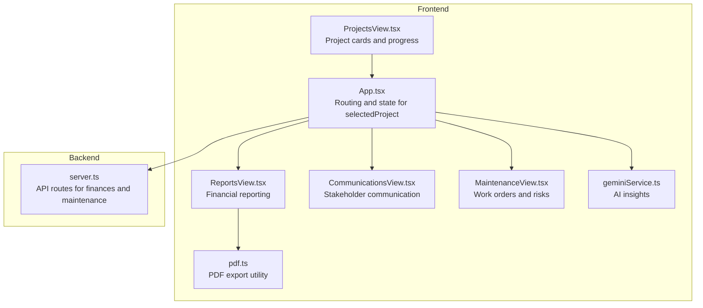
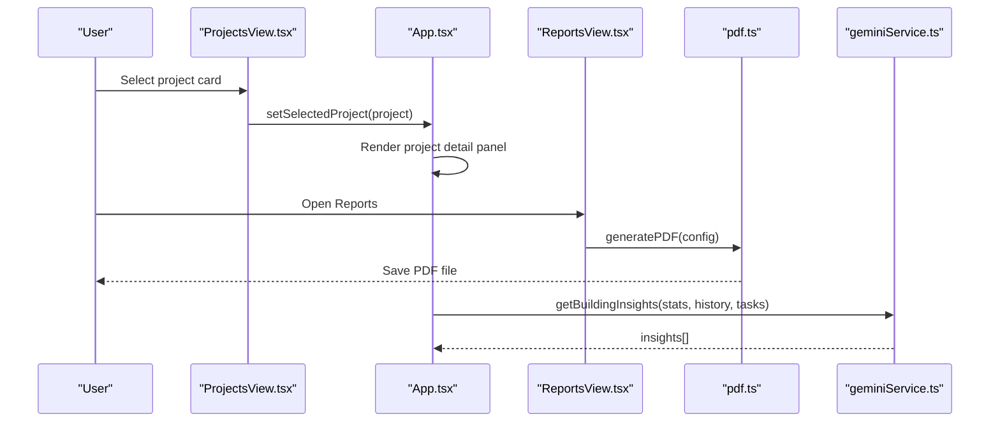
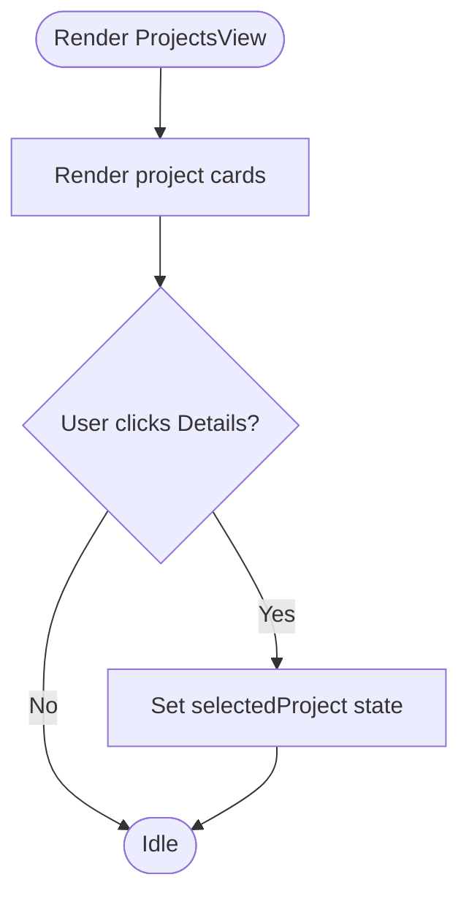
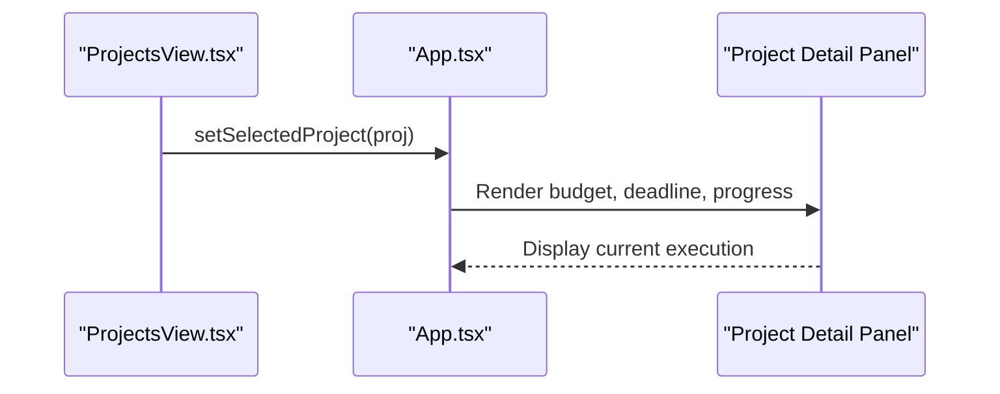
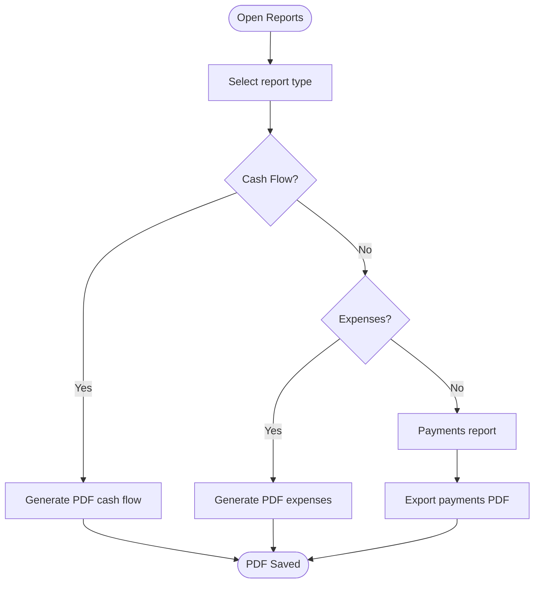
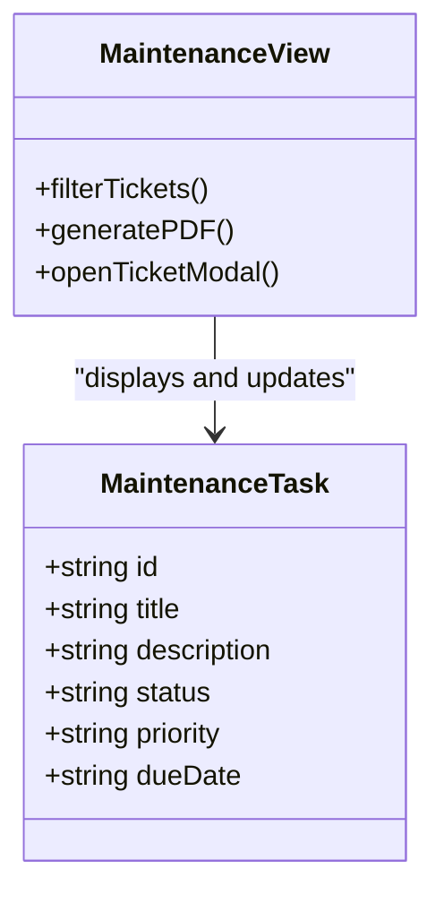
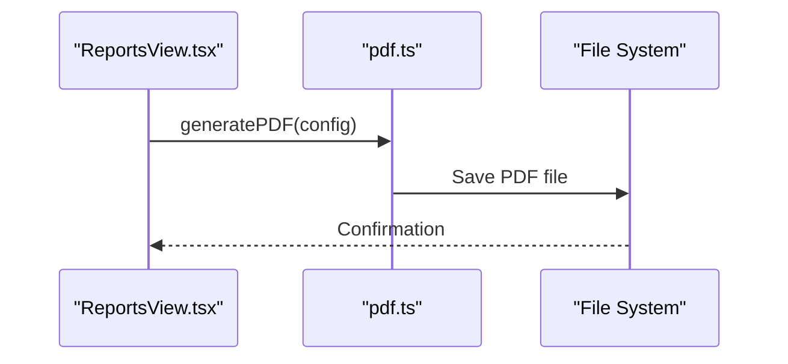
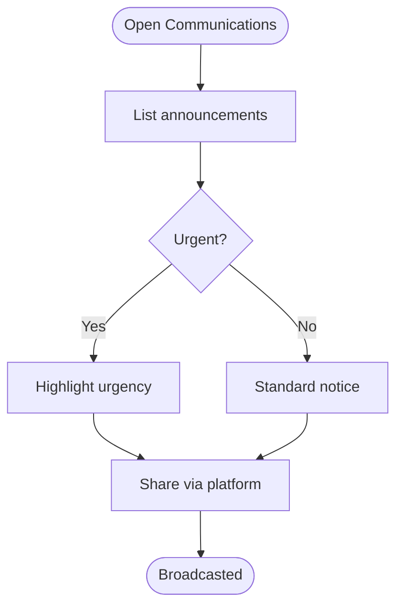
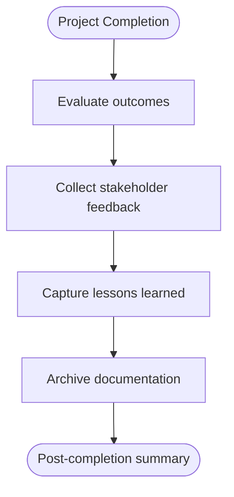
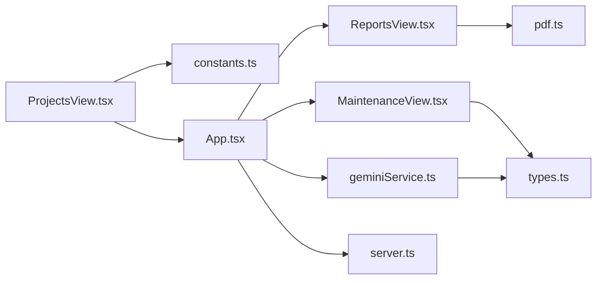

# Project Management

<cite>
**Referenced Files in This Document**
- [ProjectsView.tsx](file://src/components/views/ProjectsView.tsx)
- [App.tsx](file://src/App.tsx)
- [types.ts](file://src/types.ts)
- [constants.ts](file://src/constants.ts)
- [communicationsView.tsx](file://src/components/views/CommunicationsView.tsx)
- [reportsView.tsx](file://src/components/views/ReportsView.tsx)
- [maintenanceView.tsx](file://src/components/views/MaintenanceView.tsx)
- [pdf.ts](file://src/lib/pdf.ts)
- [geminiService.ts](file://src/services/geminiService.ts)
- [server.ts](file://server.ts)
</cite>

## Table of Contents
1. [Introduction](#introduction)
2. [Project Structure](#project-structure)
3. [Core Components](#core-components)
4. [Architecture Overview](#architecture-overview)
5. [Detailed Component Analysis](#detailed-component-analysis)
6. [Dependency Analysis](#dependency-analysis)
7. [Performance Considerations](#performance-considerations)
8. [Troubleshooting Guide](#troubleshooting-guide)
9. [Conclusion](#conclusion)
10. [Appendices](#appendices)

## Introduction
This document explains the Project Management feature as implemented in the application. It focuses on construction project tracking, timeline management, budget control, contractor coordination, and project documentation. It also covers project phases, milestone tracking, risk assessment, and quality control processes, along with project portfolio management, resource allocation, stakeholder communication, project reporting, change management, and post-completion evaluation processes. The current implementation provides a project dashboard and basic project detail display, with supporting infrastructure for financial reporting, maintenance tracking, and AI-powered insights.

## Project Structure
The Project Management feature is primarily composed of:
- A project listing view that displays active projects with progress, budget, and deadlines
- A project detail view that shows budget, deadline, and current execution progress
- Supporting views for communications, reporting, and maintenance that integrate with project workflows
- Backend APIs for financial records and maintenance tickets that support project-related financial tracking and work orders
- Utilities for exporting reports to PDF and generating AI insights

**Diagram sources**
- [ProjectsView.tsx:10-61](file://src/components/views/ProjectsView.tsx#L10-L61)
- [App.tsx:92-92](file://src/App.tsx#L92-L92)
- [reportsView.tsx:1-444](file://src/components/views/ReportsView.tsx#L1-L444)
- [communicationsView.tsx:1-72](file://src/components/views/CommunicationsView.tsx#L1-L72)
- [maintenanceView.tsx:1-130](file://src/components/views/MaintenanceView.tsx#L1-L130)
- [pdf.ts:12-57](file://src/lib/pdf.ts#L12-L57)
- [geminiService.ts:11-48](file://src/services/geminiService.ts#L11-L48)
- [server.ts:250-449](file://server.ts#L250-L449)

**Section sources**
- [ProjectsView.tsx:10-61](file://src/components/views/ProjectsView.tsx#L10-L61)
- [App.tsx:92-92](file://src/App.tsx#L92-L92)
- [reportsView.tsx:1-444](file://src/components/views/ReportsView.tsx#L1-L444)
- [communicationsView.tsx:1-72](file://src/components/views/CommunicationsView.tsx#L1-L72)
- [maintenanceView.tsx:1-130](file://src/components/views/MaintenanceView.tsx#L1-L130)
- [pdf.ts:12-57](file://src/lib/pdf.ts#L12-L57)
- [geminiService.ts:11-48](file://src/services/geminiService.ts#L11-L48)
- [server.ts:250-449](file://server.ts#L250-L449)

## Core Components
- Project Listing View: Displays project cards with title, budget, deadline, progress percentage, and associated items. Clicking a card selects the project for detailed view.
- Project Detail View: Shows budget, deadline, and current progress bar for the selected project.
- Financial Reporting: Provides cash flow and expense summaries, with export to PDF.
- Maintenance Tracking: Manages work orders with status, priority, and filters, enabling risk and quality control monitoring.
- Stakeholder Communication: Mural-style announcements with quick broadcast actions.
- AI Insights: Generates actionable insights based on building statistics and maintenance tasks.

**Section sources**
- [ProjectsView.tsx:10-61](file://src/components/views/ProjectsView.tsx#L10-L61)
- [App.tsx:2015-2035](file://src/App.tsx#L2015-L2035)
- [reportsView.tsx:74-118](file://src/components/views/ReportsView.tsx#L74-L118)
- [maintenanceView.tsx:34-125](file://src/components/views/MaintenanceView.tsx#L34-L125)
- [communicationsView.tsx:15-68](file://src/components/views/CommunicationsView.tsx#L15-L68)
- [geminiService.ts:11-48](file://src/services/geminiService.ts#L11-L48)

## Architecture Overview
The Project Management feature integrates frontend views with backend APIs and utilities:
- Frontend state manages the selected project and navigates between views
- Financial reporting leverages mock data and exports via PDF utility
- Maintenance tickets support risk and quality control
- AI service provides insights for proactive management
- Backend routes support financial records and maintenance workflows

**Diagram sources**
- [ProjectsView.tsx:50-54](file://src/components/views/ProjectsView.tsx#L50-L54)
- [App.tsx:92-92](file://src/App.tsx#L92-L92)
- [reportsView.tsx:89-104](file://src/components/views/ReportsView.tsx#L89-L104)
- [pdf.ts:12-57](file://src/lib/pdf.ts#L12-L57)
- [geminiService.ts:11-48](file://src/services/geminiService.ts#L11-L48)

## Detailed Component Analysis

### Project Portfolio Management
- Purpose: Provide a snapshot of active projects with progress, budget, and deadlines.
- Data Model: Projects are represented as structured objects with title, progress, budget, deadline, and items.
- UI Behavior: Project cards display progress bars and clickable detail actions.

**Diagram sources**
- [ProjectsView.tsx:13-58](file://src/components/views/ProjectsView.tsx#L13-L58)
- [App.tsx:92-92](file://src/App.tsx#L92-L92)

**Section sources**
- [ProjectsView.tsx:10-61](file://src/components/views/ProjectsView.tsx#L10-L61)
- [App.tsx:92-92](file://src/App.tsx#L92-L92)

### Timeline Management and Milestone Tracking
- Progress Visualization: Each project card shows a progress percentage with an animated progress bar.
- Deadline Tracking: Each project card displays a deadline for completion.
- Execution View: Selected project detail shows current execution percentage and budget.

**Diagram sources**
- [ProjectsView.tsx:50-54](file://src/components/views/ProjectsView.tsx#L50-L54)
- [App.tsx:2015-2035](file://src/App.tsx#L2015-L2035)

**Section sources**
- [ProjectsView.tsx:28-41](file://src/components/views/ProjectsView.tsx#L28-L41)
- [App.tsx:2015-2035](file://src/App.tsx#L2015-L2035)

### Budget Control
- Budget Display: Budgets are formatted using locale-specific currency formatting.
- Financial Reporting: Cash flow and expense summaries are available with export to PDF.
- Data Sources: Mock data and backend financial endpoints support budget tracking.

**Diagram sources**
- [reportsView.tsx:89-104](file://src/components/views/ReportsView.tsx#L89-L104)
- [reportsView.tsx:140-147](file://src/components/views/ReportsView.tsx#L140-L147)
- [reportsView.tsx:263-281](file://src/components/views/ReportsView.tsx#L263-L281)
- [pdf.ts:12-57](file://src/lib/pdf.ts#L12-L57)

**Section sources**
- [ProjectsView.tsx:21-22](file://src/components/views/ProjectsView.tsx#L21-L22)
- [constants.ts:6-9](file://src/constants.ts#L6-L9)
- [reportsView.tsx:74-118](file://src/components/views/ReportsView.tsx#L74-L118)
- [reportsView.tsx:140-147](file://src/components/views/ReportsView.tsx#L140-L147)
- [reportsView.tsx:263-281](file://src/components/views/ReportsView.tsx#L263-L281)

### Contractor Coordination and Quality Control
- Work Orders: Maintenance tickets track status and priority, enabling contractor oversight and quality control.
- Risk Assessment: Priority levels indicate risk severity; filters support focused monitoring.
- Quality Control: Status tracking supports verification and closure of work orders.

**Diagram sources**
- [types.ts:50-57](file://src/types.ts#L50-L57)
- [maintenanceView.tsx:34-125](file://src/components/views/MaintenanceView.tsx#L34-L125)

**Section sources**
- [types.ts:50-57](file://src/types.ts#L50-L57)
- [maintenanceView.tsx:34-125](file://src/components/views/MaintenanceView.tsx#L34-L125)

### Project Documentation and Reporting
- PDF Export: Reports and maintenance lists can be exported to PDF using a shared utility.
- Communication: Announcements support stakeholder updates and distribution via external channels.

**Diagram sources**
- [reportsView.tsx:89-104](file://src/components/views/ReportsView.tsx#L89-L104)
- [reportsView.tsx:140-147](file://src/components/views/ReportsView.tsx#L140-L147)
- [pdf.ts:12-57](file://src/lib/pdf.ts#L12-L57)

**Section sources**
- [reportsView.tsx:89-104](file://src/components/views/ReportsView.tsx#L89-L104)
- [reportsView.tsx:140-147](file://src/components/views/ReportsView.tsx#L140-L147)
- [pdf.ts:12-57](file://src/lib/pdf.ts#L12-L57)

### Stakeholder Communication
- Announcement Mural: Displays urgent and routine notices with quick sharing actions.
- Distribution: One-click sharing to external platforms for broad reach.

**Diagram sources**
- [communicationsView.tsx:15-68](file://src/components/views/CommunicationsView.tsx#L15-L68)

**Section sources**
- [communicationsView.tsx:15-68](file://src/components/views/CommunicationsView.tsx#L15-L68)

### Post-Completion Evaluation
- Current State: The project detail view shows current execution progress and budget.
- Suggested Enhancement: Integrate completion metrics, feedback collection, and lessons learned capture.

[No sources needed since this diagram shows conceptual workflow, not actual code structure]

## Dependency Analysis
- Frontend Dependencies:
  - ProjectsView depends on constants for currency formatting and App state for project selection.
  - ReportsView depends on constants and PDF utility for export.
  - MaintenanceView depends on types for status and priority enums.
- Backend Dependencies:
  - Financial and maintenance endpoints support reporting and project-related workflows.
- AI Integration:
  - Gemini service consumes building statistics and maintenance tasks to produce insights.

**Diagram sources**
- [ProjectsView.tsx:3-4](file://src/components/views/ProjectsView.tsx#L3-L4)
- [App.tsx:92-92](file://src/App.tsx#L92-L92)
- [reportsView.tsx:15-17](file://src/components/views/ReportsView.tsx#L15-L17)
- [pdf.ts:1-2](file://src/lib/pdf.ts#L1-L2)
- [maintenanceView.tsx:16-23](file://src/components/views/MaintenanceView.tsx#L16-L23)
- [types.ts:50-57](file://src/types.ts#L50-L57)
- [geminiService.ts:6-7](file://src/services/geminiService.ts#L6-L7)
- [server.ts:250-449](file://server.ts#L250-L449)

**Section sources**
- [ProjectsView.tsx:3-4](file://src/components/views/ProjectsView.tsx#L3-L4)
- [App.tsx:92-92](file://src/App.tsx#L92-L92)
- [reportsView.tsx:15-17](file://src/components/views/ReportsView.tsx#L15-L17)
- [pdf.ts:1-2](file://src/lib/pdf.ts#L1-L2)
- [maintenanceView.tsx:16-23](file://src/components/views/MaintenanceView.tsx#L16-L23)
- [types.ts:50-57](file://src/types.ts#L50-L57)
- [geminiService.ts:6-7](file://src/services/geminiService.ts#L6-L7)
- [server.ts:250-449](file://server.ts#L250-L449)

## Performance Considerations
- Rendering Efficiency: Project cards and reports use lightweight rendering; animations are minimal and controlled.
- Data Fetching: Financial and maintenance data are fetched on tab activation to keep the UI responsive.
- Export Performance: PDF generation occurs client-side; large datasets may benefit from pagination or server-side generation.

[No sources needed since this section provides general guidance]

## Troubleshooting Guide
- Project Detail Not Showing: Ensure a project is selected via the project listing view.
- Reports Export Issues: Verify PDF utility configuration and browser permissions for saving files.
- Maintenance Filters: Confirm filter values align with existing statuses and priorities.
- AI Insights Errors: Check API key configuration and network connectivity for the AI service.

**Section sources**
- [App.tsx:92-92](file://src/App.tsx#L92-L92)
- [pdf.ts:12-57](file://src/lib/pdf.ts#L12-L57)
- [maintenanceView.tsx:34-125](file://src/components/views/MaintenanceView.tsx#L34-L125)
- [geminiService.ts:34-47](file://src/services/geminiService.ts#L34-L47)

## Conclusion
The Project Management feature currently provides a robust project dashboard with progress tracking, budget display, and integration with financial reporting, maintenance workflows, and stakeholder communication. Enhancements could include formal project phases, milestone gates, contractor management modules, risk registers, quality control checklists, change management workflows, and post-completion evaluation dashboards. These additions would strengthen governance and enable comprehensive lifecycle management of construction projects.

[No sources needed since this section summarizes without analyzing specific files]

## Appendices
- Data Models: Project objects, financial records, maintenance tasks, and user roles define the core domain entities.
- Backend API Coverage: Financial endpoints and maintenance routes underpin project-related workflows.

**Section sources**
- [types.ts:23-87](file://src/types.ts#L23-L87)
- [server.ts:250-449](file://server.ts#L250-L449)