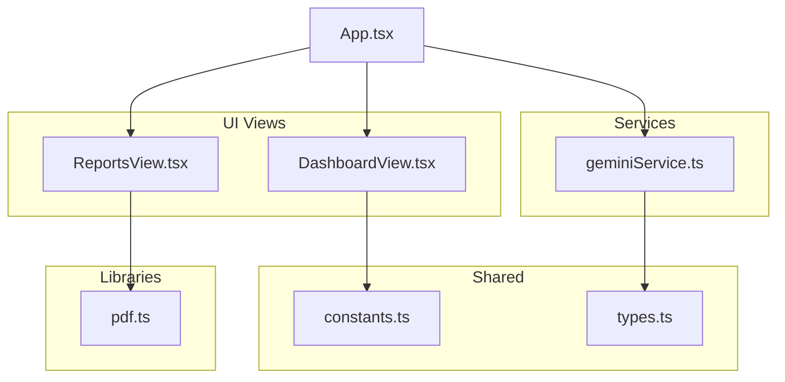
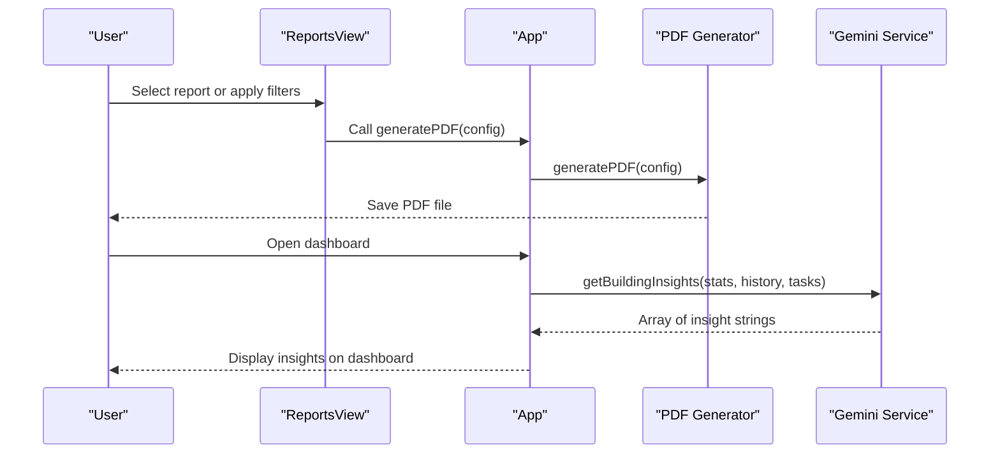
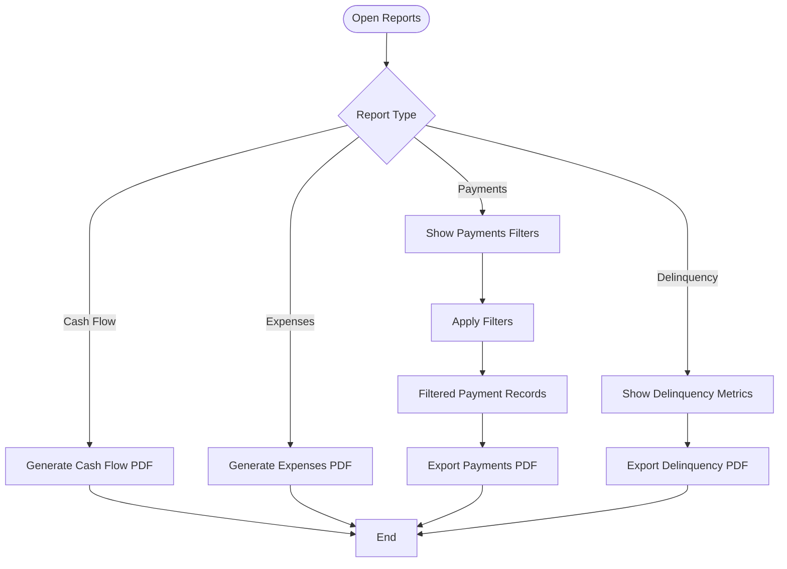
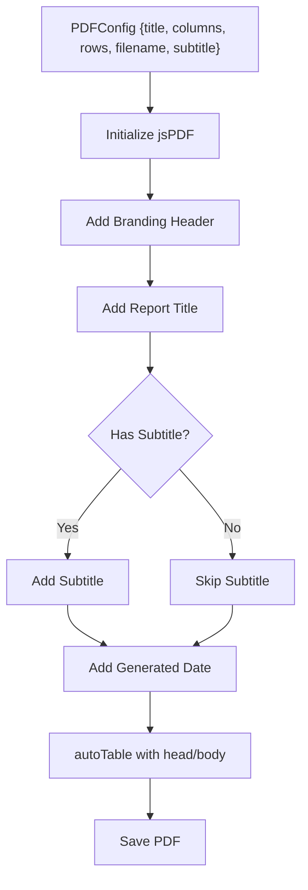
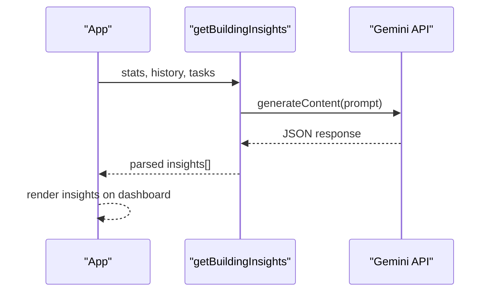
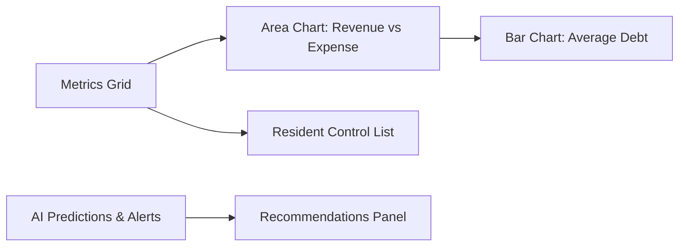
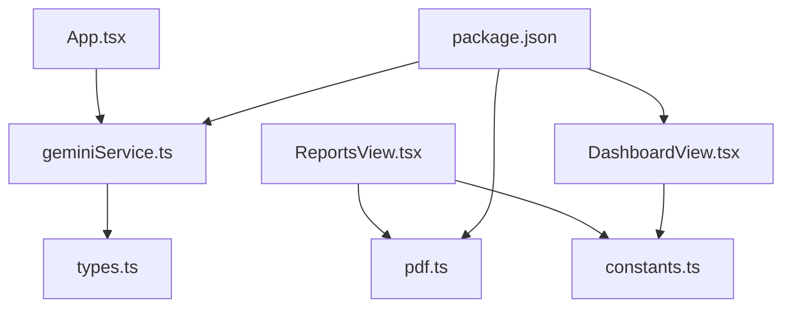

# Reporting & Analytics

<cite>
**Referenced Files in This Document**
- [ReportsView.tsx](file://src/components/views/ReportsView.tsx)
- [geminiService.ts](file://src/services/geminiService.ts)
- [pdf.ts](file://src/lib/pdf.ts)
- [App.tsx](file://src/App.tsx)
- [DashboardView.tsx](file://src/components/views/DashboardView.tsx)
- [constants.ts](file://src/constants.ts)
- [types.ts](file://src/types.ts)
- [package.json](file://package.json)
- [README.md](file://README.md)
</cite>

## Table of Contents
1. [Introduction](#introduction)
2. [Project Structure](#project-structure)
3. [Core Components](#core-components)
4. [Architecture Overview](#architecture-overview)
5. [Detailed Component Analysis](#detailed-component-analysis)
6. [Dependency Analysis](#dependency-analysis)
7. [Performance Considerations](#performance-considerations)
8. [Troubleshooting Guide](#troubleshooting-guide)
9. [Conclusion](#conclusion)

## Introduction
This document explains the Reporting & Analytics feature of the building management application. It covers report generation, data visualization, executive dashboards, and AI-powered insights. It also documents custom report creation, export capabilities, and how analytics integrate with the system. The feature supports financial reports, payment histories, delinquency analysis, and export to PDF for compliance and stakeholder needs.

## Project Structure
The reporting feature is primarily implemented in the Reports view and supported by a PDF generation library and an AI service for insights. The dashboard integrates charts and AI predictions to complement reporting.

**Diagram sources**
- [ReportsView.tsx:74-118](file://src/components/views/ReportsView.tsx#L74-L118)
- [DashboardView.tsx:68-91](file://src/components/views/DashboardView.tsx#L68-L91)
- [geminiService.ts:11-48](file://src/services/geminiService.ts#L11-L48)
- [pdf.ts:12-57](file://src/lib/pdf.ts#L12-L57)
- [App.tsx:388-398](file://src/App.tsx#L388-L398)
- [constants.ts:6-36](file://src/constants.ts#L6-L36)
- [types.ts:23-57](file://src/types.ts#L23-L57)

**Section sources**
- [ReportsView.tsx:74-118](file://src/components/views/ReportsView.tsx#L74-L118)
- [App.tsx:388-398](file://src/App.tsx#L388-L398)
- [DashboardView.tsx:68-91](file://src/components/views/DashboardView.tsx#L68-L91)

## Core Components
- Reports View: Provides report selection cards, detailed transaction tables, filters, and export actions.
- PDF Generator: Creates standardized PDF reports with branding, headers, and auto-table rendering.
- AI Insights Service: Uses Gemini to produce actionable insights from building statistics and maintenance tasks.
- Dashboard: Visualizes metrics and trends, complementing reporting with charts and AI predictions.

**Section sources**
- [ReportsView.tsx:49-67](file://src/components/views/ReportsView.tsx#L49-L67)
- [pdf.ts:12-57](file://src/lib/pdf.ts#L12-L57)
- [geminiService.ts:11-48](file://src/services/geminiService.ts#L11-L48)
- [DashboardView.tsx:68-91](file://src/components/views/DashboardView.tsx#L68-L91)

## Architecture Overview
The reporting workflow connects UI interactions to data filtering and export. The AI service augments the dashboard with predictive insights and recommendations.

**Diagram sources**
- [ReportsView.tsx:89-104](file://src/components/views/ReportsView.tsx#L89-L104)
- [ReportsView.tsx:263-282](file://src/components/views/ReportsView.tsx#L263-L282)
- [ReportsView.tsx:369-375](file://src/components/views/ReportsView.tsx#L369-L375)
- [App.tsx:143-150](file://src/App.tsx#L143-L150)
- [geminiService.ts:11-48](file://src/services/geminiService.ts#L11-L48)
- [pdf.ts:12-57](file://src/lib/pdf.ts#L12-L57)

## Detailed Component Analysis

### Reports View
The Reports view offers:
- Report selection cards for Cash Flow, Expenses, Payment History, and Delinquency.
- A recent transactions table with search and filter controls.
- Unit, date range filters for payment history.
- Export to PDF for multiple report types.

**Diagram sources**
- [ReportsView.tsx:77-118](file://src/components/views/ReportsView.tsx#L77-L118)
- [ReportsView.tsx:220-256](file://src/components/views/ReportsView.tsx#L220-L256)
- [ReportsView.tsx:263-282](file://src/components/views/ReportsView.tsx#L263-L282)
- [ReportsView.tsx:369-375](file://src/components/views/ReportsView.tsx#L369-L375)

**Section sources**
- [ReportsView.tsx:74-198](file://src/components/views/ReportsView.tsx#L74-L198)
- [ReportsView.tsx:200-315](file://src/components/views/ReportsView.tsx#L200-L315)
- [ReportsView.tsx:316-438](file://src/components/views/ReportsView.tsx#L316-L438)

### PDF Generation Library
The PDF generator creates branded reports with standardized headers, dates, and auto-table formatting. It accepts a configuration object with title, columns, rows, filename, and optional subtitle.

**Diagram sources**
- [pdf.ts:12-57](file://src/lib/pdf.ts#L12-L57)

**Section sources**
- [pdf.ts:4-10](file://src/lib/pdf.ts#L4-L10)
- [pdf.ts:12-57](file://src/lib/pdf.ts#L12-L57)

### AI-Powered Insights Service
The Gemini service produces quick, actionable insights from building statistics and maintenance tasks. It formats the response as a JSON array of strings and falls back to default recommendations on error.

**Diagram sources**
- [geminiService.ts:11-48](file://src/services/geminiService.ts#L11-L48)
- [App.tsx:143-150](file://src/App.tsx#L143-L150)

**Section sources**
- [geminiService.ts:11-48](file://src/services/geminiService.ts#L11-L48)
- [App.tsx:143-150](file://src/App.tsx#L143-L150)

### Dashboard Analytics
The dashboard displays key metrics and charts, including financial cycles, resident balances, and debt evolution. It also shows AI predictions and maintenance alerts, enhancing executive visibility.

**Diagram sources**
- [DashboardView.tsx:68-91](file://src/components/views/DashboardView.tsx#L68-L91)
- [DashboardView.tsx:94-147](file://src/components/views/DashboardView.tsx#L94-L147)
- [DashboardView.tsx:191-236](file://src/components/views/DashboardView.tsx#L191-L236)
- [DashboardView.tsx:240-370](file://src/components/views/DashboardView.tsx#L240-L370)

**Section sources**
- [DashboardView.tsx:64-237](file://src/components/views/DashboardView.tsx#L64-L237)
- [constants.ts:11-36](file://src/constants.ts#L11-L36)

## Dependency Analysis
The reporting feature relies on external libraries for PDF generation and charting, and on the Gemini API for AI insights.

**Diagram sources**
- [ReportsView.tsx:44-48](file://src/components/views/ReportsView.tsx#L44-L48)
- [pdf.ts:1-2](file://src/lib/pdf.ts#L1-L2)
- [geminiService.ts:6-7](file://src/services/geminiService.ts#L6-L7)
- [types.ts:23-57](file://src/types.ts#L23-L57)
- [DashboardView.tsx](file://src/components/views/DashboardView.tsx#L26)
- [package.json:14-32](file://package.json#L14-L32)

**Section sources**
- [package.json:14-32](file://package.json#L14-L32)
- [ReportsView.tsx:44-48](file://src/components/views/ReportsView.tsx#L44-L48)
- [geminiService.ts:6-7](file://src/services/geminiService.ts#L6-L7)
- [DashboardView.tsx](file://src/components/views/DashboardView.tsx#L26)

## Performance Considerations
- Filtering large datasets client-side: For extensive transaction lists, consider pagination or server-side filtering to reduce render overhead.
- PDF generation: Batch large exports during off-peak hours to avoid UI blocking.
- AI requests: Debounce or throttle insight refreshes to limit API calls and improve responsiveness.
- Chart rendering: Use responsive containers and limit data points to maintain smooth interactions.

## Troubleshooting Guide
- PDF export does not download:
  - Verify the configuration object passed to the PDF generator includes required fields.
  - Confirm browser permissions for downloads and ad blockers are not interfering.
- AI insights not loading:
  - Ensure the Gemini API key is configured in the environment.
  - Check network connectivity and API quotas.
- Reports show empty data:
  - Confirm data is loaded via API hooks before generating reports.
  - Validate filters that may exclude all records.

**Section sources**
- [pdf.ts:12-57](file://src/lib/pdf.ts#L12-L57)
- [geminiService.ts:44-47](file://src/services/geminiService.ts#L44-L47)
- [README.md](file://README.md#L18)

## Conclusion
The Reporting & Analytics feature delivers practical financial reporting, customizable filters, and export capabilities, backed by AI-driven insights and executive dashboards. The modular design allows for future enhancements such as scheduled reporting, advanced analytics, and compliance templates while maintaining clean separation of concerns.