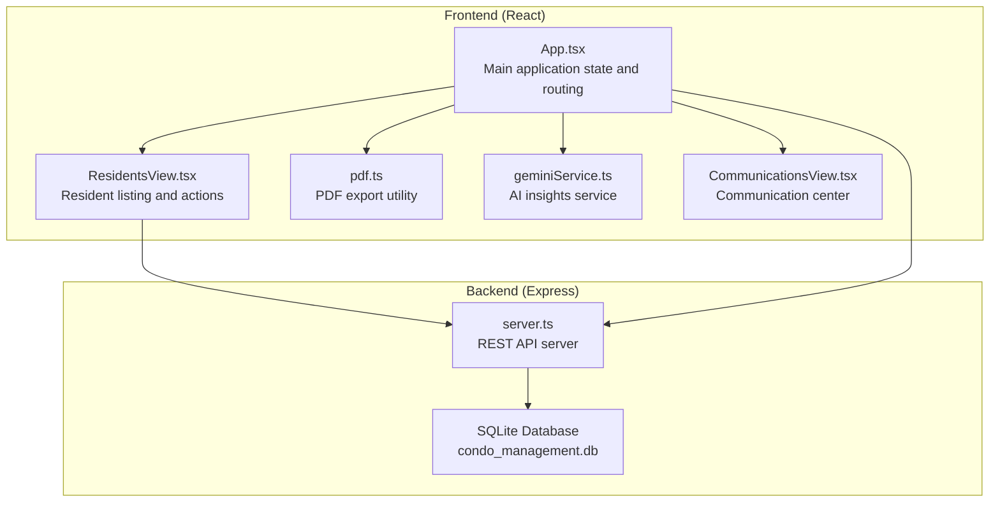
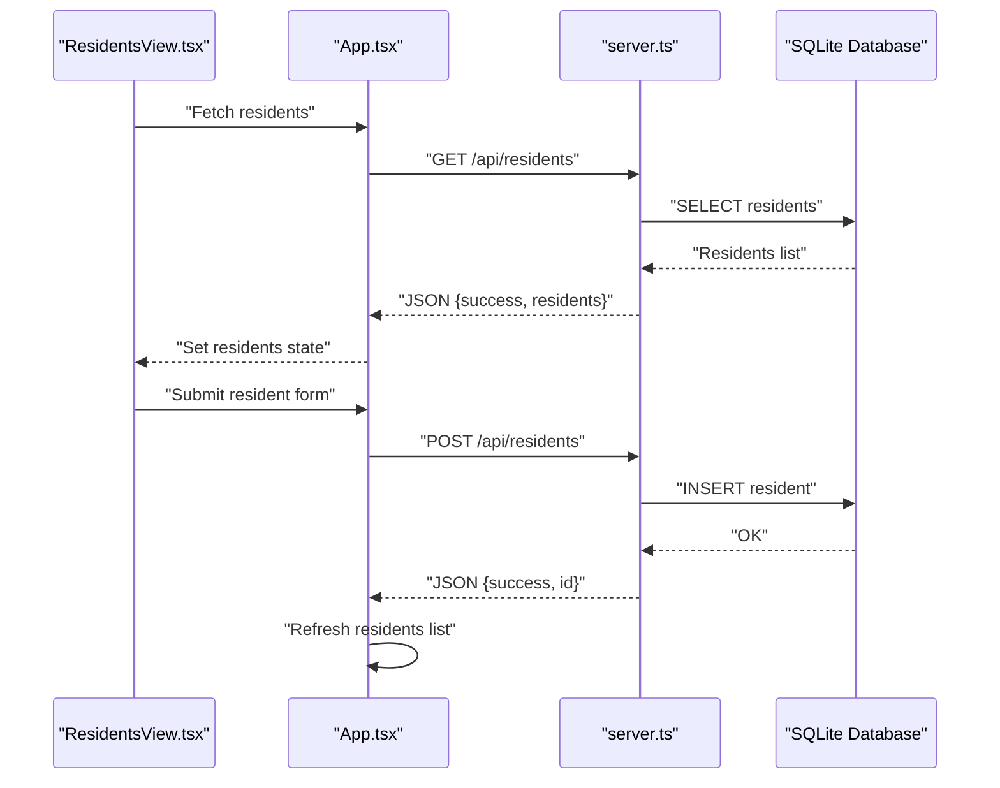
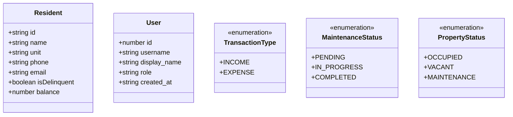
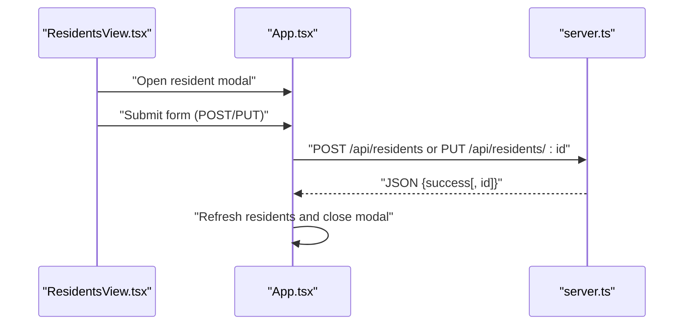
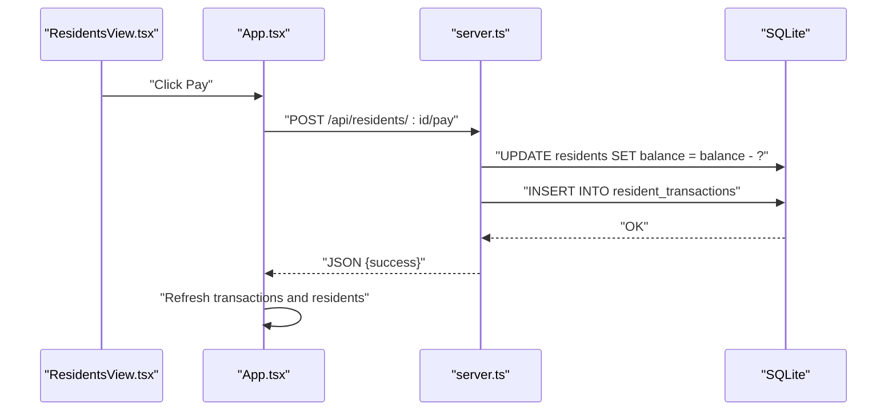
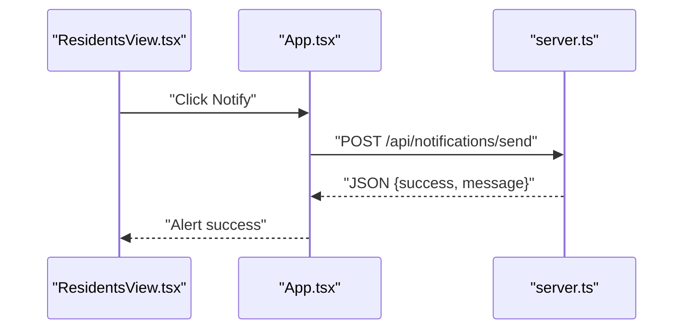
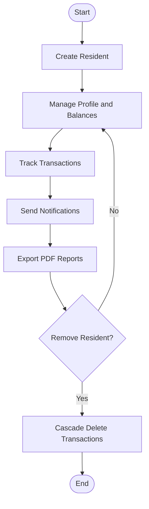
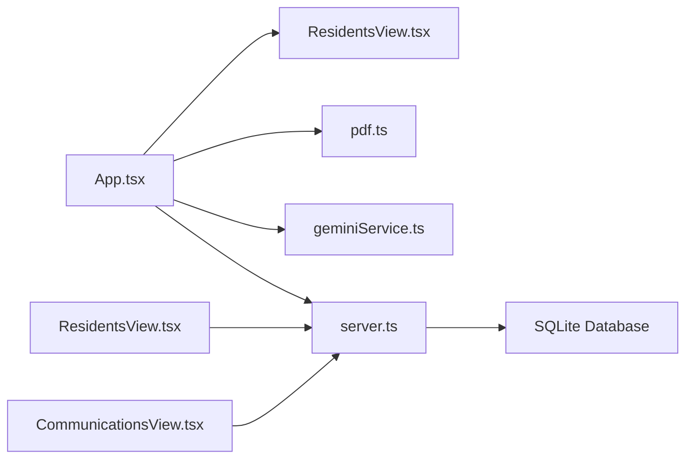

# Resident Management

<cite>
**Referenced Files in This Document**
- [App.tsx](file://src/App.tsx)
- [ResidentsView.tsx](file://src/components/views/ResidentsView.tsx)
- [types.ts](file://src/types.ts)
- [constants.ts](file://src/constants.ts)
- [server.ts](file://server.ts)
- [pdf.ts](file://src/lib/pdf.ts)
- [geminiService.ts](file://src/services/geminiService.ts)
- [CommunicationsView.tsx](file://src/components/views/CommunicationsView.tsx)
- [README.md](file://README.md)
- [package.json](file://package.json)
</cite>

## Table of Contents
1. [Introduction](#introduction)
2. [Project Structure](#project-structure)
3. [Core Components](#core-components)
4. [Architecture Overview](#architecture-overview)
5. [Detailed Component Analysis](#detailed-component-analysis)
6. [Dependency Analysis](#dependency-analysis)
7. [Performance Considerations](#performance-considerations)
8. [Troubleshooting Guide](#troubleshooting-guide)
9. [Conclusion](#conclusion)
10. [Appendices](#appendices)

## Introduction
This document provides comprehensive documentation for the Resident Management feature of the building management application. It covers resident registration, profile management, lease tracking, communication logs, and lifecycle management. It also explains resident data models, contact information management, emergency contacts, and tenant screening processes. Additionally, it documents resident portal integration, notification systems, automated workflows, and data privacy, consent management, and compliance requirements for resident information handling.

## Project Structure
The Resident Management feature spans both the frontend React application and the backend Express server with SQLite persistence. The frontend provides views and modals for managing residents, while the backend exposes REST endpoints for CRUD operations, financial transactions, and notifications.

**Diagram sources**
- [App.tsx:1-2375](file://src/App.tsx#L1-L2375)
- [ResidentsView.tsx:1-200](file://src/components/views/ResidentsView.tsx#L1-L200)
- [pdf.ts:1-58](file://src/lib/pdf.ts#L1-L58)
- [geminiService.ts:1-49](file://src/services/geminiService.ts#L1-L49)
- [CommunicationsView.tsx:1-72](file://src/components/views/CommunicationsView.tsx#L1-L72)
- [server.ts:1-656](file://server.ts#L1-L656)

**Section sources**
- [App.tsx:1-2375](file://src/App.tsx#L1-L2375)
- [server.ts:1-656](file://server.ts#L1-L656)

## Core Components
- Resident data model and enums: Defines the resident entity and related enumerations used across the application.
- Frontend state and actions: Manages resident lists, modal states, and API interactions for CRUD operations and financial transactions.
- Backend API endpoints: Provides endpoints for residents, resident transactions, notifications, and related financial operations.
- PDF export utility: Generates resident lists and reports in PDF format.
- Communication center: Handles broadcast and sharing of announcements.

Key responsibilities:
- Resident registration and profile management
- Lease tracking via balances and transaction records
- Communication logs and notifications
- Automated workflows for reminders and reporting
- Data privacy and compliance considerations

**Section sources**
- [types.ts:59-87](file://src/types.ts#L59-L87)
- [App.tsx:95-1472](file://src/App.tsx#L95-L1472)
- [server.ts:219-393](file://server.ts#L219-L393)
- [pdf.ts:12-57](file://src/lib/pdf.ts#L12-L57)
- [CommunicationsView.tsx:15-71](file://src/components/views/CommunicationsView.tsx#L15-L71)

## Architecture Overview
The system follows a client-server architecture with a React SPA frontend and an Express server backed by SQLite. Resident data is persisted in the database, and financial transactions are tracked separately. Notifications are handled via a mock endpoint, and PDF exports leverage a third-party library.

**Diagram sources**
- [ResidentsView.tsx:176-186](file://src/components/views/ResidentsView.tsx#L176-L186)
- [App.tsx:176-186](file://src/App.tsx#L176-L186)
- [server.ts:219-228](file://server.ts#L219-L228)

**Section sources**
- [App.tsx:176-186](file://src/App.tsx#L176-L186)
- [server.ts:219-228](file://server.ts#L219-L228)

## Detailed Component Analysis

### Data Models and Types
The application defines a compact set of data models and enums that underpin resident management.

- Resident model includes identifiers, contact information, and financial status.
- User model supports role-based access control.
- Enumerations standardize transaction types, maintenance statuses, and property statuses.

**Diagram sources**
- [types.ts:59-87](file://src/types.ts#L59-L87)

**Section sources**
- [types.ts:59-87](file://src/types.ts#L59-L87)

### Resident Registration and Profile Management
The frontend provides a modal form for registering and editing residents. Validation ensures required fields and formats, and submission persists data via API endpoints.

Key behaviors:
- Validation for name length, unit presence, and contact format.
- Support for primary and alternative phone numbers.
- Type selection (Owner, Tenant, Other).
- Submission states and error handling.

**Diagram sources**
- [ResidentsView.tsx:66-73](file://src/components/views/ResidentsView.tsx#L66-L73)
- [App.tsx:1328-1472](file://src/App.tsx#L1328-L1472)
- [server.ts:219-249](file://server.ts#L219-L249)

**Section sources**
- [ResidentsView.tsx:66-73](file://src/components/views/ResidentsView.tsx#L66-L73)
- [App.tsx:1328-1472](file://src/App.tsx#L1328-L1472)
- [server.ts:219-249](file://server.ts#L219-L249)

### Lease Tracking and Financial Transactions
Lease tracking is implemented through resident balances and a dedicated transaction table. Payments reduce balances and create transaction records.

Additional features:
- Seeding of initial transactions for new residents.
- Global transaction listing combining resident transactions with other financial records.

**Diagram sources**
- [ResidentsView.tsx:158-167](file://src/components/views/ResidentsView.tsx#L158-L167)
- [App.tsx:224-237](file://src/App.tsx#L224-L237)
- [server.ts:368-386](file://server.ts#L368-L386)
- [server.ts:324-340](file://server.ts#L324-L340)
- [server.ts:342-355](file://server.ts#L342-L355)

**Section sources**
- [App.tsx:224-237](file://src/App.tsx#L224-L237)
- [server.ts:368-386](file://server.ts#L368-L386)
- [server.ts:324-340](file://server.ts#L324-L340)
- [server.ts:342-355](file://server.ts#L342-L355)

### Communication Logs and Notifications
The system integrates with a communication center and supports sending notifications to residents. Notifications are currently mocked in the backend.

- Notification types include reminders for outstanding balances.
- The communication center supports broadcasting and sharing announcements via external channels.

**Diagram sources**
- [ResidentsView.tsx:169-190](file://src/components/views/ResidentsView.tsx#L169-L190)
- [server.ts:388-393](file://server.ts#L388-L393)
- [CommunicationsView.tsx:15-71](file://src/components/views/CommunicationsView.tsx#L15-L71)

**Section sources**
- [ResidentsView.tsx:169-190](file://src/components/views/ResidentsView.tsx#L169-L190)
- [server.ts:388-393](file://server.ts#L388-L393)
- [CommunicationsView.tsx:15-71](file://src/components/views/CommunicationsView.tsx#L15-L71)

### Resident Lifecycle Management
Lifecycle stages include registration, active management, and removal. The system supports:
- Creating residents with contact details and types.
- Updating profiles and balances.
- Removing residents with cascading effects on related transactions.
- Generating historical transaction records for each resident.

**Diagram sources**
- [server.ts:219-260](file://server.ts#L219-L260)
- [server.ts:314-340](file://server.ts#L314-L340)
- [pdf.ts:12-57](file://src/lib/pdf.ts#L12-L57)

**Section sources**
- [server.ts:219-260](file://server.ts#L219-L260)
- [server.ts:314-340](file://server.ts#L314-L340)
- [pdf.ts:12-57](file://src/lib/pdf.ts#L12-L57)

### Contact Information Management
Contact information is managed through the resident form, supporting:
- Primary contact (required)
- Alternative phone number
- Email (optional)
- Unit identification

Validation ensures required fields and formats, and the UI displays formatted currency for balances.

**Section sources**
- [App.tsx:1385-1422](file://src/App.tsx#L1385-L1422)
- [constants.ts:6-9](file://src/constants.ts#L6-L9)

### Emergency Contacts
Emergency contact management is not explicitly implemented in the current codebase. The existing form captures primary and alternative phone numbers, which can serve as emergency contacts. Future enhancements could include:
- Dedicated emergency contact fields
- Consent management for emergency contact sharing
- Compliance with local privacy regulations

[No sources needed since this section provides conceptual guidance]

### Tenant Screening Processes
Tenant screening is not implemented in the current codebase. The system includes a resident type field that can differentiate between owners and tenants. Future enhancements could include:
- Background check integration
- Credit history verification
- Reference validation
- Consent forms and data retention policies

[No sources needed since this section provides conceptual guidance]

### Resident Portal Integration
The application does not include a dedicated resident portal. However, the communication center supports sharing announcements via external channels, and notifications can be sent to residents. Integration possibilities include:
- Web-based portal for residents to view statements and submit requests
- Mobile app for push notifications and self-service
- Secure login with role-based access

[No sources needed since this section provides conceptual guidance]

### Automated Workflows
Automated workflows present in the current implementation:
- Seeding of initial transactions for new residents
- Notification dispatch for balance reminders
- Currency formatting for financial displays

Potential enhancements:
- Automated payment reminders based on due dates
- Delinquency alerts and escalation workflows
- Batch processing for recurring fees and penalties

**Section sources**
- [server.ts:324-340](file://server.ts#L324-L340)
- [server.ts:388-393](file://server.ts#L388-L393)
- [constants.ts:6-9](file://src/constants.ts#L6-L9)

## Dependency Analysis
The Resident Management feature depends on several libraries and services:

External dependencies include:
- PDF generation via jsPDF and jspdf-autotable
- AI insights via Google Generics AI
- Authentication and rate limiting
- CORS for cross-origin requests

**Diagram sources**
- [App.tsx:1-2375](file://src/App.tsx#L1-L2375)
- [ResidentsView.tsx:1-200](file://src/components/views/ResidentsView.tsx#L1-L200)
- [pdf.ts:1-58](file://src/lib/pdf.ts#L1-L58)
- [geminiService.ts:1-49](file://src/services/geminiService.ts#L1-L49)
- [server.ts:1-656](file://server.ts#L1-L656)
- [package.json:14-43](file://package.json#L14-L43)

**Section sources**
- [package.json:14-43](file://package.json#L14-L43)
- [server.ts:49-50](file://server.ts#L49-L50)

## Performance Considerations
- Database operations use transactions to ensure consistency during payment processing.
- Frontend state updates are batched to minimize re-renders.
- PDF generation occurs client-side, which may impact performance for large datasets.
- API calls are debounced where appropriate to avoid excessive network requests.

[No sources needed since this section provides general guidance]

## Troubleshooting Guide
Common issues and resolutions:
- Login failures: Verify PIN and rate limit thresholds.
- Resident creation/update errors: Check validation messages and required fields.
- Payment processing errors: Confirm resident exists and sufficient balance.
- Notification failures: Ensure backend endpoint is reachable and logging is enabled.
- PDF generation issues: Verify jsPDF and autotable versions and browser compatibility.

**Section sources**
- [server.ts:522-558](file://server.ts#L522-L558)
- [App.tsx:1328-1472](file://src/App.tsx#L1328-L1472)
- [server.ts:368-386](file://server.ts#L368-L386)
- [server.ts:388-393](file://server.ts#L388-L393)

## Conclusion
The Resident Management feature provides a solid foundation for managing residents, tracking leases, and facilitating communications. The modular design allows for future enhancements such as tenant screening, emergency contact management, and a dedicated resident portal. The current implementation emphasizes data integrity, user experience, and extensibility.

[No sources needed since this section summarizes without analyzing specific files]

## Appendices

### API Definitions
- GET /api/residents: Retrieve all residents
- POST /api/residents: Create a new resident
- PUT /api/residents/:id: Update an existing resident
- DELETE /api/residents/:id: Remove a resident
- POST /api/residents/:id/pay: Process a payment
- GET /api/residents/:id/transactions: Get resident transactions
- POST /api/residents/:id/seed-transactions: Seed initial transactions
- GET /api/finance/all-transactions: Get combined transaction list
- POST /api/notifications/send: Send a notification
- POST /api/auth/login: Authenticate user

**Section sources**
- [server.ts:219-393](file://server.ts#L219-L393)

### Data Privacy and Compliance
- PIN hashing with PBKDF2 for secure storage
- Rate limiting to prevent brute force attacks
- Role-based access control for sensitive operations
- GDPR-compliant data handling practices (conceptual)
- Consent management for personal data processing (conceptual)

**Section sources**
- [server.ts:22-43](file://server.ts#L22-L43)
- [server.ts:522-558](file://server.ts#L522-L558)