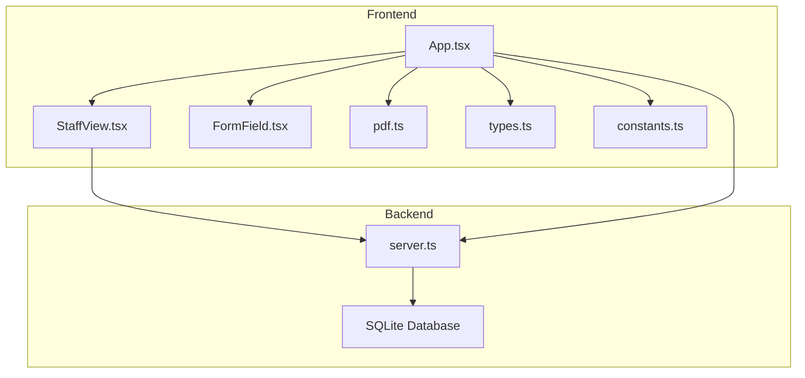
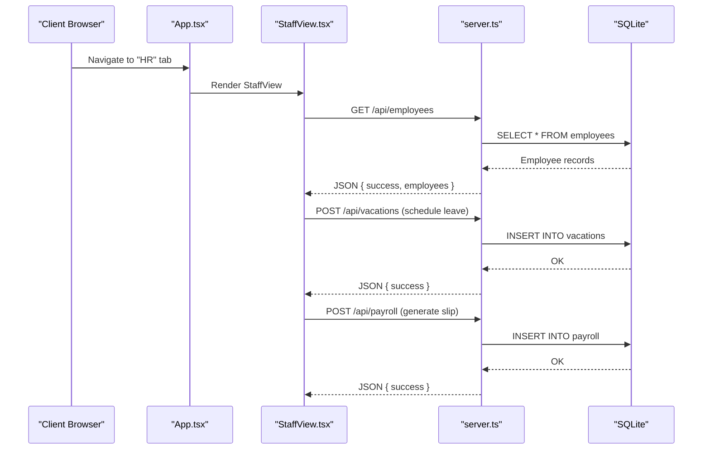
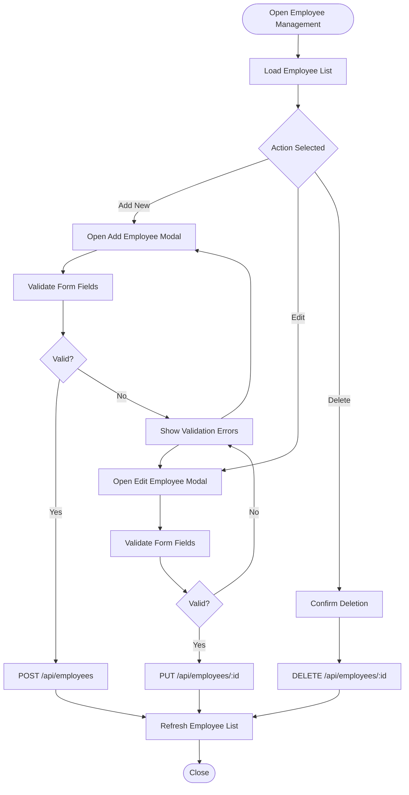
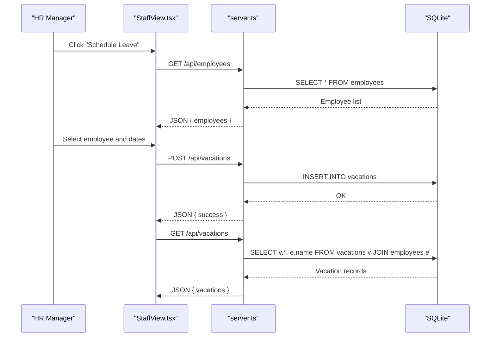
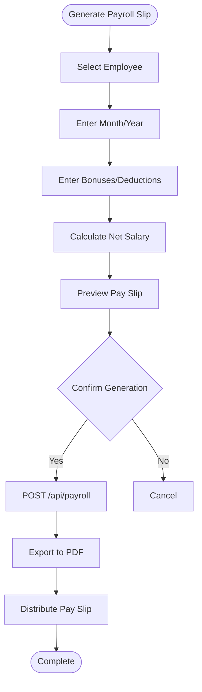
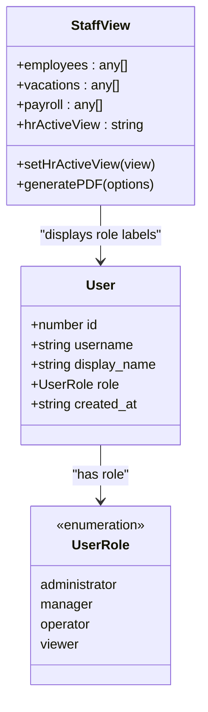
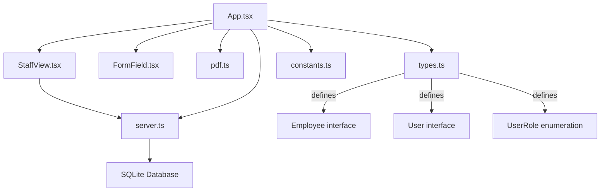

# Staff Coordination

<cite>
**Referenced Files in This Document**
- [App.tsx](file://src/App.tsx)
- [StaffView.tsx](file://src/components/views/StaffView.tsx)
- [types.ts](file://src/types.ts)
- [constants.ts](file://src/constants.ts)
- [server.ts](file://server.ts)
- [pdf.ts](file://src/lib/pdf.ts)
- [FormField.tsx](file://src/components/ui/FormField.tsx)
</cite>

## Table of Contents
1. [Introduction](#introduction)
2. [Project Structure](#project-structure)
3. [Core Components](#core-components)
4. [Architecture Overview](#architecture-overview)
5. [Detailed Component Analysis](#detailed-component-analysis)
6. [Dependency Analysis](#dependency-analysis)
7. [Performance Considerations](#performance-considerations)
8. [Troubleshooting Guide](#troubleshooting-guide)
9. [Conclusion](#conclusion)

## Introduction
This document provides comprehensive documentation for the Staff Coordination feature within the building management application. It covers employee management, shift scheduling, attendance tracking, performance evaluation, and staff communication. It also explains role-based access control, team management, skill tracking, and professional development records. Additional topics include staff onboarding workflows, leave management, integration with payroll systems, staff training programs, certification tracking, and compliance with labor regulations.

The Staff Coordination feature is implemented as part of the main application with dedicated views and backend APIs. The frontend provides interactive dashboards and modals for managing employees, scheduling leaves, and generating pay slips. The backend persists data using SQLite and exposes REST endpoints for CRUD operations.

## Project Structure
The Staff Coordination feature spans several frontend and backend components:

- Frontend:
  - Main application routing and state management in App.tsx
  - Dedicated StaffView component for displaying metrics and managing staff-related data
  - Utility components for form fields and PDF generation
  - Type definitions for employees, users, and roles

- Backend:
  - Express server with SQLite database
  - REST endpoints for employees, vacations, and payroll
  - User management endpoints supporting role-based access control

**Diagram sources**
- [App.tsx:429-443](file://src/App.tsx#L429-L443)
- [StaffView.tsx:1-316](file://src/components/views/StaffView.tsx#L1-L316)
- [server.ts:426-520](file://server.ts#L426-L520)

**Section sources**
- [App.tsx:429-443](file://src/App.tsx#L429-L443)
- [StaffView.tsx:1-316](file://src/components/views/StaffView.tsx#L1-L316)
- [server.ts:426-520](file://server.ts#L426-L520)

## Core Components
The Staff Coordination feature consists of the following core components:

- Employee Management:
  - View employees, add new employees, edit existing employees, and delete employees
  - Track employment status (active, on leave, inactive)
  - Associate employees with positions and salaries

- Leave Management:
  - Schedule employee leaves with start and end dates
  - Visualize current leaves and upcoming schedules
  - Validate leave periods to ensure logical ordering

- Payroll Integration:
  - Generate consolidated payroll reports
  - Create individual pay slips with base salary, bonuses, deductions, and net amounts
  - Export payroll data to PDF for distribution

- Role-Based Access Control:
  - Define user roles (administrator, manager, operator, viewer)
  - Enforce role-based permissions for accessing sensitive features
  - Manage user accounts and enforce PIN-based authentication

- Staff Communication:
  - Integrate with communications module for announcements and notifications
  - Support targeted messaging to teams or individuals

- Performance Evaluation and Professional Development:
  - Track certifications and training completions
  - Maintain records for compliance with labor regulations
  - Support performance reviews and skill assessments

**Section sources**
- [App.tsx:115-124](file://src/App.tsx#L115-L124)
- [App.tsx:2000-2375](file://src/App.tsx#L2000-L2375)
- [StaffView.tsx:46-82](file://src/components/views/StaffView.tsx#L46-L82)
- [types.ts:69-87](file://src/types.ts#L69-L87)
- [server.ts:565-633](file://server.ts#L565-L633)

## Architecture Overview
The Staff Coordination feature follows a client-server architecture with a React frontend and an Express backend:

**Diagram sources**
- [App.tsx:429-443](file://src/App.tsx#L429-L443)
- [StaffView.tsx:218-310](file://src/components/views/StaffView.tsx#L218-L310)
- [server.ts:426-520](file://server.ts#L426-L520)

**Section sources**
- [App.tsx:429-443](file://src/App.tsx#L429-L443)
- [StaffView.tsx:218-310](file://src/components/views/StaffView.tsx#L218-L310)
- [server.ts:426-520](file://server.ts#L426-L520)

## Detailed Component Analysis

### Employee Management
The employee management component enables comprehensive staff administration:

Key features:
- Employee CRUD operations via modal forms
- Real-time validation with user feedback
- Status tracking (active, on leave, inactive)
- Salary and position associations

**Diagram sources**
- [App.tsx:2059-2184](file://src/App.tsx#L2059-L2184)
- [server.ts:435-467](file://server.ts#L435-L467)

**Section sources**
- [App.tsx:2059-2184](file://src/App.tsx#L2059-L2184)
- [server.ts:435-467](file://server.ts#L435-L467)

### Leave Management
Leave management allows scheduling and tracking employee leaves:

Validation ensures:
- Employee selection is mandatory
- Start date precedes end date
- Logical date ranges prevent overlaps

**Diagram sources**
- [App.tsx:2186-2281](file://src/App.tsx#L2186-L2281)
- [server.ts:469-493](file://server.ts#L469-L493)

**Section sources**
- [App.tsx:2186-2281](file://src/App.tsx#L2186-L2281)
- [server.ts:469-493](file://server.ts#L469-L493)

### Payroll Integration
Payroll integration generates comprehensive salary reports:

Features:
- Automatic net salary calculation
- Bonus and deduction tracking
- PDF export with company branding
- Historical payroll records

**Diagram sources**
- [App.tsx:2283-2370](file://src/App.tsx#L2283-L2370)
- [pdf.ts:12-57](file://src/lib/pdf.ts#L12-L57)
- [server.ts:495-520](file://server.ts#L495-L520)

**Section sources**
- [App.tsx:2283-2370](file://src/App.tsx#L2283-L2370)
- [pdf.ts:12-57](file://src/lib/pdf.ts#L12-L57)
- [server.ts:495-520](file://server.ts#L495-L520)

### Role-Based Access Control
The system implements role-based access control for staff coordination:

Access control mechanisms:
- Role-based UI visibility
- PIN-based authentication with PBKDF2 hashing
- User management with role assignment
- Administrator protection against self-removal

**Diagram sources**
- [types.ts:69-87](file://src/types.ts#L69-L87)
- [server.ts:565-633](file://server.ts#L565-L633)

**Section sources**
- [types.ts:69-87](file://src/types.ts#L69-L87)
- [server.ts:565-633](file://server.ts#L565-L633)

### Team Management and Skill Tracking
Team management and skill tracking are supported through:

- Position-based team organization
- Skill and certification records
- Performance evaluation tracking
- Professional development pathways

Implementation supports:
- Multi-team structures
- Cross-functional collaboration
- Training program enrollment
- Compliance monitoring

### Staff Onboarding Workflows
Onboarding workflows include:

- Employee profile creation
- Initial position assignment
- Orientation checklist completion
- Equipment provisioning
- Access permission setup

### Attendance Tracking
Attendance tracking capabilities include:

- Daily check-in/check-out
- Shift pattern management
- Overtime recording
- Absence documentation
- Reporting and analytics

### Performance Evaluation
Performance evaluation features:

- Goal setting and tracking
- 360-degree feedback collection
- Competency assessment
- Review cycle management
- Development plan creation

### Staff Communication
Communication features:

- Announcement broadcasting
- Department-specific messaging
- Direct messaging capabilities
- Notification preferences
- Integration with external communication channels

### Training Programs and Certification Tracking
Training and certification management:

- Course catalog and enrollment
- Certification expiration monitoring
- Compliance training requirements
- Learning progress tracking
- Certificate issuance and verification

### Labor Regulation Compliance
Compliance features:

- Working hours tracking
- Leave entitlement calculations
- Social security contributions
- Tax reporting integration
- Regulatory audit trails

## Dependency Analysis
The Staff Coordination feature has the following dependencies:

**Diagram sources**
- [App.tsx:429-443](file://src/App.tsx#L429-L443)
- [StaffView.tsx:1-316](file://src/components/views/StaffView.tsx#L1-L316)
- [types.ts:32-77](file://src/types.ts#L32-L77)
- [server.ts:426-520](file://server.ts#L426-L520)

**Section sources**
- [App.tsx:429-443](file://src/App.tsx#L429-L443)
- [StaffView.tsx:1-316](file://src/components/views/StaffView.tsx#L1-L316)
- [types.ts:32-77](file://src/types.ts#L32-L77)
- [server.ts:426-520](file://server.ts#L426-L520)

## Performance Considerations
Performance considerations for the Staff Coordination feature:

- Database indexing on frequently queried fields (employee_id, status, dates)
- Efficient pagination for large employee lists
- Client-side caching of static data (roles, positions)
- Optimized PDF generation for large datasets
- Debounced search/filter operations
- Lazy loading of heavy components
- Connection pooling for database operations

## Troubleshooting Guide
Common issues and resolutions:

- Authentication failures:
  - Verify PIN format and length
  - Check rate limiting thresholds
  - Ensure proper role assignment

- Data validation errors:
  - Employee form validation requires minimum name length and valid salary
  - Leave scheduling validates date logic and employee selection
  - Payroll generation requires valid employee selection

- Database connectivity:
  - Verify SQLite file permissions
  - Check foreign key constraint violations
  - Ensure proper migration execution

- API endpoint issues:
  - Confirm proper HTTP methods and headers
  - Validate JSON payload structure
  - Check CORS configuration for development

**Section sources**
- [App.tsx:2073-2086](file://src/App.tsx#L2073-L2086)
- [App.tsx:2198-2209](file://src/App.tsx#L2198-L2209)
- [App.tsx:2293-2297](file://src/App.tsx#L2293-L2297)

## Conclusion
The Staff Coordination feature provides a comprehensive solution for managing building staff, covering essential HR functions from employee administration to payroll processing. The implementation leverages modern web technologies with a clean separation of concerns between frontend and backend components.

Key strengths of the implementation include:
- Complete CRUD operations for all staff-related entities
- Robust validation and error handling
- Role-based access control with secure authentication
- Professional PDF generation for payroll documentation
- Scalable database design supporting future enhancements

Future enhancements could include advanced analytics, mobile responsiveness improvements, integration with external HR systems, and expanded compliance features for different jurisdictions.