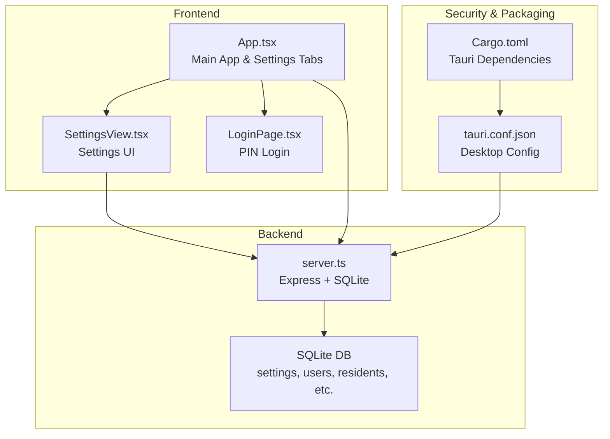
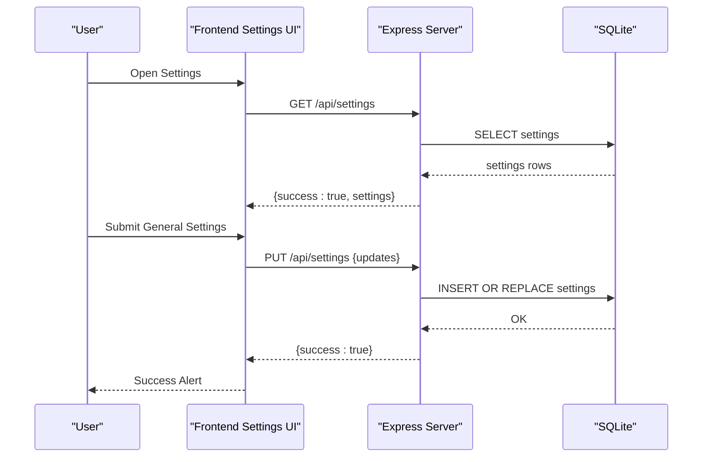
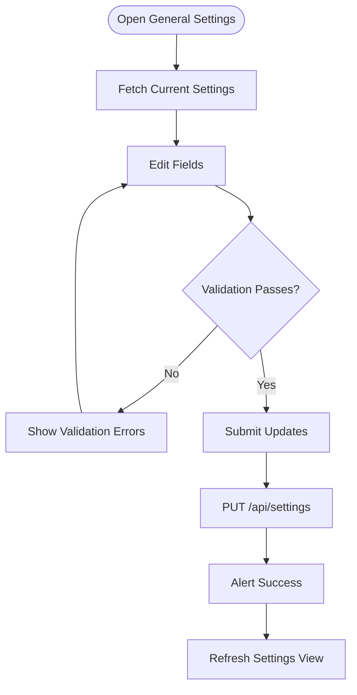
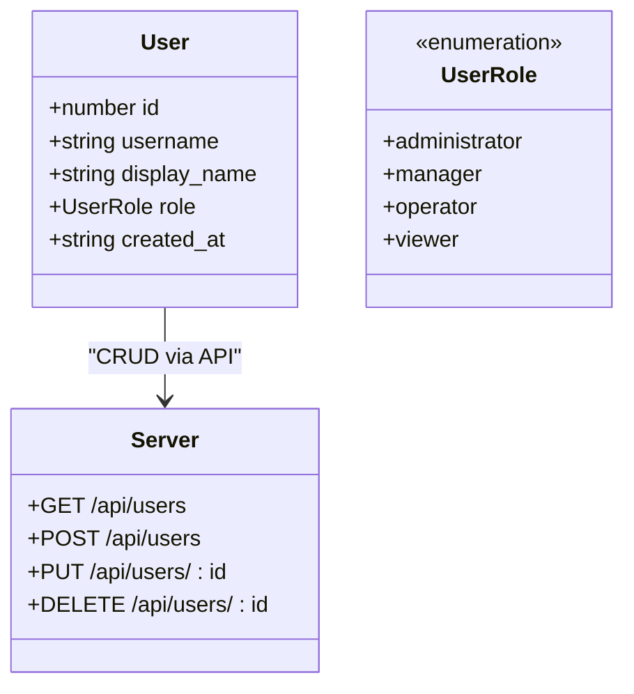
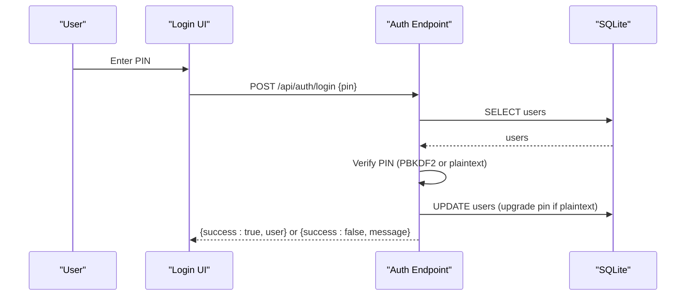
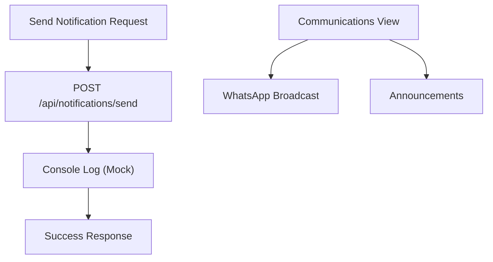
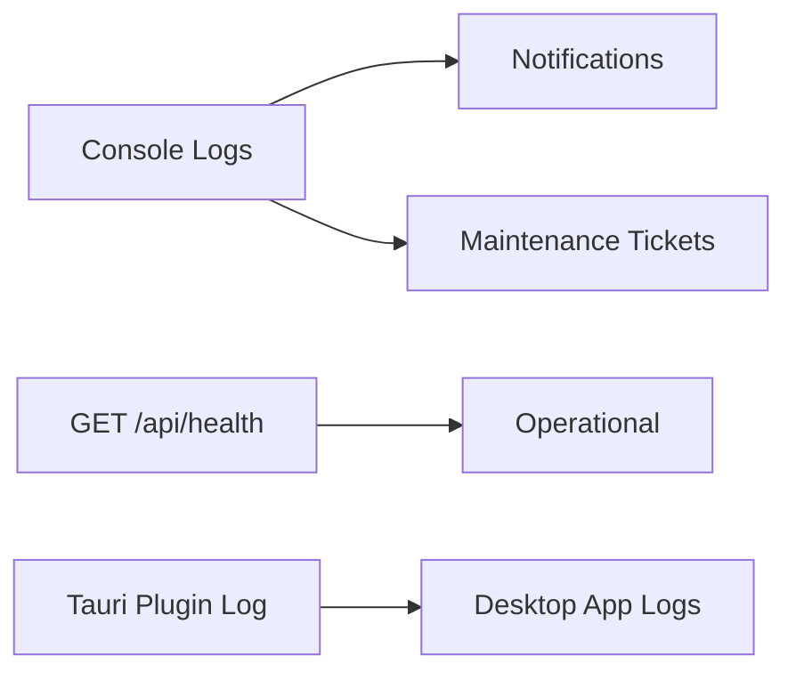
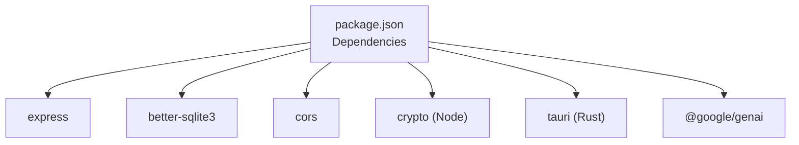

# System Settings

<cite>
**Referenced Files in This Document**
- [App.tsx](file://src/App.tsx)
- [SettingsView.tsx](file://src/components/views/SettingsView.tsx)
- [types.ts](file://src/types.ts)
- [constants.ts](file://src/constants.ts)
- [server.ts](file://server.ts)
- [tauri.conf.json](file://src-tauri/tauri.conf.json)
- [Cargo.toml](file://src-tauri/Cargo.toml)
- [package.json](file://package.json)
- [README.md](file://README.md)
- [LoginPage.tsx](file://src/components/LoginPage.tsx)
</cite>

## Table of Contents
1. [Introduction](#introduction)
2. [Project Structure](#project-structure)
3. [Core Components](#core-components)
4. [Architecture Overview](#architecture-overview)
5. [Detailed Component Analysis](#detailed-component-analysis)
6. [Dependency Analysis](#dependency-analysis)
7. [Performance Considerations](#performance-considerations)
8. [Troubleshooting Guide](#troubleshooting-guide)
9. [Conclusion](#conclusion)

## Introduction
This document provides comprehensive documentation for the System Settings feature of the building management application. It covers application configuration, user management, permission controls, and system administration. It also explains building configuration, tenant portal settings, notification preferences, integration management, backup and restore procedures, security settings, audit logging, system monitoring, multi-building support, branding customization, and administrative workflows.

## Project Structure
The System Settings feature spans both frontend and backend components:
- Frontend: React-based UI with tabs for General Settings and User Management
- Backend: Express server with SQLite persistence for settings and users
- Security: PIN-based authentication with PBKDF2 hashing and rate limiting
- Packaging: Tauri desktop bundling configuration

**Diagram sources**
- [App.tsx:496-613](file://src/App.tsx#L496-L613)
- [SettingsView.tsx:1-111](file://src/components/views/SettingsView.tsx#L1-L111)
- [LoginPage.tsx:50-78](file://src/components/LoginPage.tsx#L50-L78)
- [server.ts:45-656](file://server.ts#L45-L656)
- [tauri.conf.json:1-42](file://src-tauri/tauri.conf.json#L1-L42)
- [Cargo.toml:1-26](file://src-tauri/Cargo.toml#L1-L26)

**Section sources**
- [App.tsx:496-613](file://src/App.tsx#L496-L613)
- [SettingsView.tsx:1-111](file://src/components/views/SettingsView.tsx#L1-L111)
- [server.ts:45-656](file://server.ts#L45-L656)
- [tauri.conf.json:1-42](file://src-tauri/tauri.conf.json#L1-L42)
- [Cargo.toml:1-26](file://src-tauri/Cargo.toml#L1-L26)

## Core Components
- General Settings form: Allows updating building name, admin email, and currency
- User Management: CRUD operations for users with role-based access control
- Authentication: PIN-based login with PBKDF2 hashing and rate limiting
- Notification Preferences: Placeholder for future notification channels
- Integration Management: Placeholder for external integrations
- Backup and Restore: Placeholder for data export/import
- Security Settings: PIN hashing, rate limiting, and CSP configuration
- Audit Logging: Console logs for notifications and maintenance actions
- System Monitoring: Health endpoint and basic operational status
- Multi-building Support: Single building per installation with configurable branding
- Branding Customization: Building name and favicon/logo via configuration

**Section sources**
- [App.tsx:518-613](file://src/App.tsx#L518-L613)
- [server.ts:191-217](file://server.ts#L191-L217)
- [server.ts:566-633](file://server.ts#L566-L633)
- [server.ts:522-558](file://server.ts#L522-L558)
- [server.ts:388-393](file://server.ts#L388-L393)
- [server.ts:560-562](file://server.ts#L560-L562)
- [tauri.conf.json:23-25](file://src-tauri/tauri.conf.json#L23-L25)

## Architecture Overview
The System Settings feature follows a layered architecture:
- Presentation Layer: React components render forms and manage state
- Application Layer: Frontend fetches and persists settings and user data
- Domain Layer: Backend exposes REST endpoints for settings and users
- Persistence Layer: SQLite database stores configuration and user credentials
- Security Layer: PIN hashing, rate limiting, and CSP configuration

**Diagram sources**
- [App.tsx:251-261](file://src/App.tsx#L251-L261)
- [server.ts:191-217](file://server.ts#L191-L217)

**Section sources**
- [App.tsx:251-261](file://src/App.tsx#L251-L261)
- [server.ts:191-217](file://server.ts#L191-L217)

## Detailed Component Analysis

### General Settings
- Purpose: Configure building identity, administrative contact, and local currency
- Fields: Building Name, Admin Email, Currency
- Persistence: PUT /api/settings updates key-value pairs atomically
- UI: Responsive form with validation and success feedback

**Diagram sources**
- [App.tsx:518-613](file://src/App.tsx#L518-L613)
- [server.ts:204-217](file://server.ts#L204-L217)

**Section sources**
- [App.tsx:518-613](file://src/App.tsx#L518-L613)
- [server.ts:191-217](file://server.ts#L191-L217)

### User Management
- Roles: administrator, manager, operator, viewer
- Operations: List, Create, Update, Delete users
- Constraints: Prevent deletion of the last administrator
- Security: PIN hashing on create/update; upgrade legacy plaintext pins

**Diagram sources**
- [types.ts:69-77](file://src/types.ts#L69-L77)
- [server.ts:566-633](file://server.ts#L566-L633)

**Section sources**
- [types.ts:69-77](file://src/types.ts#L69-L77)
- [server.ts:566-633](file://server.ts#L566-L633)

### Authentication and Security
- PIN-based login with rate limiting per IP
- PBKDF2 hashing for secure credential storage
- Legacy plaintext PIN upgrade during login
- CSP configuration disabled for development

**Diagram sources**
- [server.ts:522-558](file://server.ts#L522-L558)
- [server.ts:22-43](file://server.ts#L22-L43)
- [tauri.conf.json:23-25](file://src-tauri/tauri.conf.json#L23-L25)

**Section sources**
- [server.ts:522-558](file://server.ts#L522-L558)
- [server.ts:22-43](file://server.ts#L22-L43)
- [tauri.conf.json:23-25](file://src-tauri/tauri.conf.json#L23-L25)

### Notifications and Integrations
- Notifications: Placeholder endpoint for sending notifications to residents
- Integrations: Placeholder for third-party service integrations
- Communication Portal: Separate communications view for announcements and broadcasts

**Diagram sources**
- [server.ts:388-393](file://server.ts#L388-L393)
- [App.tsx:967-982](file://src/App.tsx#L967-L982)

**Section sources**
- [server.ts:388-393](file://server.ts#L388-L393)
- [App.tsx:967-982](file://src/App.tsx#L967-L982)

### Backup and Restore Procedures
- Current state: No explicit backup/restore endpoints
- Recommended approach: Export data via existing GET endpoints and persist to external storage; implement import endpoints for restoration
- Data categories: settings, users, residents, transactions, maintenance tickets, employees, vacations, payroll

**Section sources**
- [server.ts:191-217](file://server.ts#L191-L217)
- [server.ts:230-260](file://server.ts#L230-L260)
- [server.ts:406-424](file://server.ts#L406-L424)
- [server.ts:427-467](file://server.ts#L427-L467)
- [server.ts:469-520](file://server.ts#L469-L520)

### Audit Logging and System Monitoring
- Audit logging: Console logs for notification sends and maintenance ticket updates
- System monitoring: Health endpoint returns operational status
- Desktop logging: Tauri plugin configured for desktop builds

**Diagram sources**
- [server.ts:388-393](file://server.ts#L388-L393)
- [server.ts:415-424](file://server.ts#L415-L424)
- [server.ts:560-562](file://server.ts#L560-L562)
- [Cargo.toml:25-26](file://src-tauri/Cargo.toml#L25-L26)

**Section sources**
- [server.ts:388-393](file://server.ts#L388-L393)
- [server.ts:415-424](file://server.ts#L415-L424)
- [server.ts:560-562](file://server.ts#L560-L562)
- [Cargo.toml:25-26](file://src-tauri/Cargo.toml#L25-L26)

### Multi-building Support and Branding
- Multi-building: Single building per installation; extend by adding building entities and tenant isolation
- Branding: Building name displayed in UI and login screen; customize via General Settings
- Desktop packaging: Tauri configuration defines product name and window properties

**Section sources**
- [App.tsx:295-309](file://src/App.tsx#L295-L309)
- [App.tsx:518-530](file://src/App.tsx#L518-L530)
- [tauri.conf.json:1-42](file://src-tauri/tauri.conf.json#L1-L42)

## Dependency Analysis
Key dependencies and their roles:
- Express: Web framework for REST APIs
- Better-SQLite3: Embedded database for configuration and user data
- CORS: Cross-origin support for development
- Crypto: PBKDF2 hashing for PIN security
- Tauri: Desktop application bundling and logging

**Diagram sources**
- [package.json:14-33](file://package.json#L14-L33)
- [server.ts:6-12](file://server.ts#L6-L12)
- [Cargo.toml:20-26](file://src-tauri/Cargo.toml#L20-L26)

**Section sources**
- [package.json:14-33](file://package.json#L14-L33)
- [server.ts:6-12](file://server.ts#L6-L12)
- [Cargo.toml:20-26](file://src-tauri/Cargo.toml#L20-L26)

## Performance Considerations
- Database operations: Use prepared statements and transactions for atomic updates
- Network requests: Debounce form submissions and avoid unnecessary reloads
- UI rendering: Memoize derived data and use efficient list rendering
- Security: Rate limiting prevents brute-force attacks; consider moving to persistent storage for production

## Troubleshooting Guide
- Settings not saving:
  - Verify backend is running and responding to /api/settings
  - Check browser network tab for 500 errors
- User creation fails:
  - Ensure username and PIN are provided
  - Check for unique constraint violations
- Login issues:
  - Confirm PIN matches stored hash
  - Review rate limit messages
- Desktop build problems:
  - Validate Tauri configuration and Rust dependencies

**Section sources**
- [server.ts:191-217](file://server.ts#L191-L217)
- [server.ts:575-591](file://server.ts#L575-L591)
- [server.ts:522-558](file://server.ts#L522-L558)
- [tauri.conf.json:1-42](file://src-tauri/tauri.conf.json#L1-L42)
- [Cargo.toml:1-26](file://src-tauri/Cargo.toml#L1-L26)

## Conclusion
The System Settings feature provides essential configuration and administration capabilities for the building management application. It offers secure user management, flexible building configuration, and a foundation for notifications, integrations, and future enhancements like multi-building support and comprehensive backup/restore procedures. The current implementation demonstrates a clean separation of concerns with robust security measures and extensible architecture.