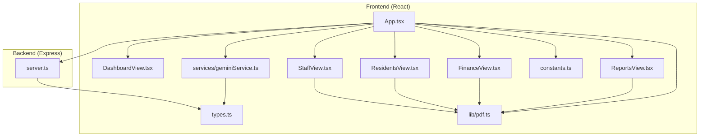
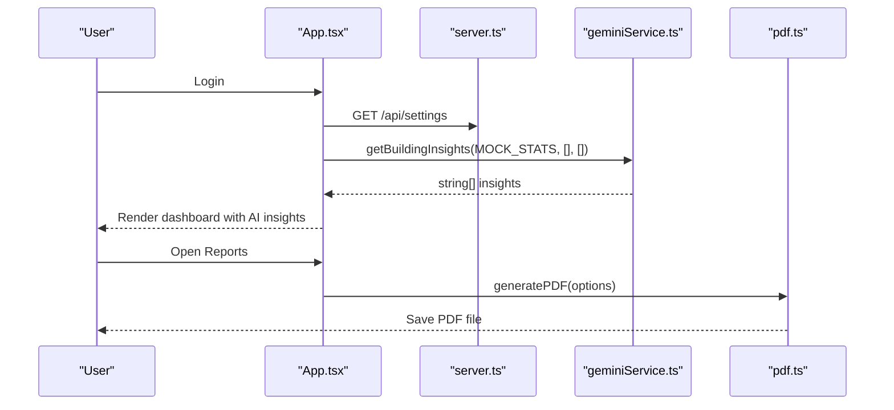
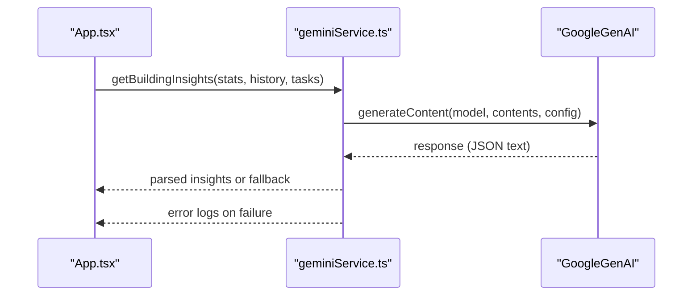
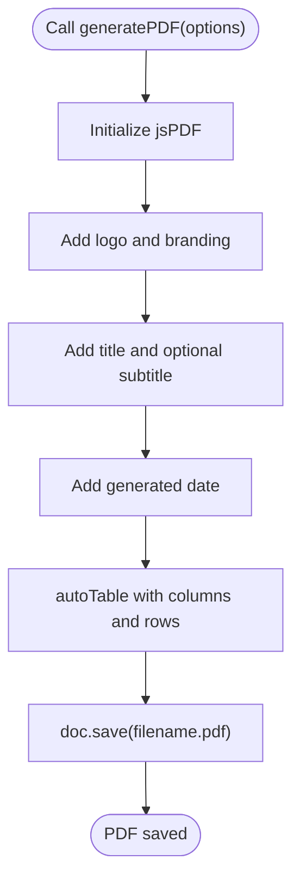
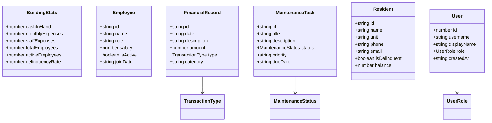
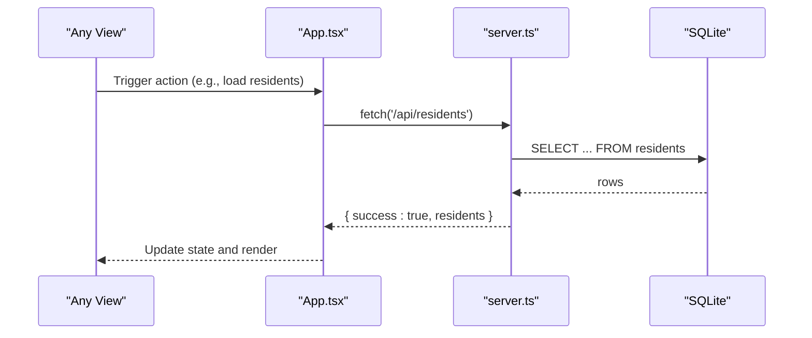
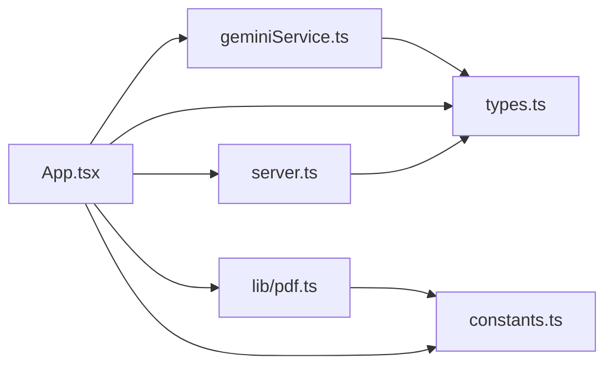

# Data Services

<cite>
**Referenced Files in This Document**
- [geminiService.ts](file://src/services/geminiService.ts)
- [pdf.ts](file://src/lib/pdf.ts)
- [types.ts](file://src/types.ts)
- [constants.ts](file://src/constants.ts)
- [App.tsx](file://src/App.tsx)
- [server.ts](file://server.ts)
- [README.md](file://README.md)
- [package.json](file://package.json)
- [DashboardView.tsx](file://src/components/views/DashboardView.tsx)
- [ReportsView.tsx](file://src/components/views/ReportsView.tsx)
- [FinanceView.tsx](file://src/components/views/FinanceView.tsx)
- [ResidentsView.tsx](file://src/components/views/ResidentsView.tsx)
- [StaffView.tsx](file://src/components/views/StaffView.tsx)
</cite>

## Table of Contents
1. [Introduction](#introduction)
2. [Project Structure](#project-structure)
3. [Core Components](#core-components)
4. [Architecture Overview](#architecture-overview)
5. [Detailed Component Analysis](#detailed-component-analysis)
6. [Dependency Analysis](#dependency-analysis)
7. [Performance Considerations](#performance-considerations)
8. [Troubleshooting Guide](#troubleshooting-guide)
9. [Conclusion](#conclusion)

## Introduction
This document explains the EdiIA data services and utilities that power intelligent building management. It covers:
- The Gemini AI service integration for generating actionable building insights
- The PDF generation library for report creation
- TypeScript type definitions and application constants
- Service interfaces, data transformation patterns, error handling strategies
- Integration with the Express-based backend API
- Usage examples, configuration options, and performance considerations

## Project Structure
The project is a React application bundled with Vite, backed by an Express server using SQLite for persistence. The data services live under src/services and src/lib, while shared types and constants reside in src/types.ts and src/constants.ts. The frontend integrates with a local API server that exposes endpoints for financial records, residents, maintenance, HR, and settings.

**Diagram sources**
- [App.tsx:1-2375](file://src/App.tsx#L1-L2375)
- [server.ts:1-656](file://server.ts#L1-L656)
- [types.ts:1-88](file://src/types.ts#L1-L88)
- [constants.ts:1-36](file://src/constants.ts#L1-L36)
- [pdf.ts:1-58](file://src/lib/pdf.ts#L1-L58)
- [geminiService.ts:1-49](file://src/services/geminiService.ts#L1-L49)

**Section sources**
- [App.tsx:1-2375](file://src/App.tsx#L1-L2375)
- [server.ts:1-656](file://server.ts#L1-L656)
- [types.ts:1-88](file://src/types.ts#L1-L88)
- [constants.ts:1-36](file://src/constants.ts#L1-L36)
- [pdf.ts:1-58](file://src/lib/pdf.ts#L1-L58)
- [geminiService.ts:1-49](file://src/services/geminiService.ts#L1-L49)

## Core Components
- Gemini AI Insights Service: Asynchronous generation of building insights using Google Generative AI, with fallback error handling.
- PDF Generation Library: Utility to produce branded PDF reports from tabular data.
- Type System: Strongly typed enums and interfaces for property, transactions, maintenance, residents, and users.
- Application Constants: Currency formatting and mock datasets for demos.

**Section sources**
- [geminiService.ts:1-49](file://src/services/geminiService.ts#L1-L49)
- [pdf.ts:1-58](file://src/lib/pdf.ts#L1-L58)
- [types.ts:1-88](file://src/types.ts#L1-L88)
- [constants.ts:1-36](file://src/constants.ts#L1-L36)

## Architecture Overview
The frontend initializes and orchestrates data fetching from the backend, then renders dashboards and reports. The Gemini service is invoked on user login to surface quick insights. PDF generation is triggered from report and list views.

**Diagram sources**
- [App.tsx:141-150](file://src/App.tsx#L141-L150)
- [server.ts:191-217](file://server.ts#L191-L217)
- [geminiService.ts:11-48](file://src/services/geminiService.ts#L11-L48)
- [pdf.ts:12-57](file://src/lib/pdf.ts#L12-L57)

## Detailed Component Analysis

### Gemini AI Service Integration
Purpose:
- Accept building statistics, financial history, and maintenance tasks
- Prompt a multilingual AI model to return concise, actionable insights
- Provide a resilient fallback when AI requests fail

Key behaviors:
- Environment-driven API key binding
- Structured prompt assembly with Portuguese Angolan locale and currency
- JSON parsing with robust error handling and fallback suggestions
- Integration via App.tsx on user login

Usage example:
- Call getBuildingInsights with BuildingStats, FinancialRecord[], and MaintenanceTask[] arrays
- Handle returned string[] for quick insights

Configuration:
- Requires GEMINI_API_KEY in environment
- Uses a specific model version and JSON response format

Error handling:
- Catches AI request failures and logs errors
- Returns curated fallback insights for continuity

**Diagram sources**
- [geminiService.ts:11-48](file://src/services/geminiService.ts#L11-L48)
- [App.tsx:141-150](file://src/App.tsx#L141-L150)

**Section sources**
- [geminiService.ts:1-49](file://src/services/geminiService.ts#L1-L49)
- [App.tsx:141-150](file://src/App.tsx#L141-L150)
- [README.md:16-20](file://README.md#L16-L20)

### PDF Generation Library
Purpose:
- Produce standardized PDF reports with branding, titles, subtitles, dates, and tables

Key behaviors:
- Accepts a typed configuration object with title, columns, rows, filename, optional subtitle
- Renders a branded header and footer
- Generates a striped table with alternating row styles
- Saves the generated PDF with the provided filename

Usage example:
- Pass options to generatePDF from ReportsView.tsx, FinanceView.tsx, ResidentsView.tsx, StaffView.tsx
- Rows are derived from application state and formatted with currency

**Diagram sources**
- [pdf.ts:12-57](file://src/lib/pdf.ts#L12-L57)

**Section sources**
- [pdf.ts:1-58](file://src/lib/pdf.ts#L1-L58)
- [ReportsView.tsx:89-104](file://src/components/views/ReportsView.tsx#L89-L104)
- [FinanceView.tsx:135-141](file://src/components/views/FinanceView.tsx#L135-L141)
- [ResidentsView.tsx:53-60](file://src/components/views/ResidentsView.tsx#L53-L60)
- [StaffView.tsx:1-200](file://src/components/views/StaffView.tsx#L1-L200)

### TypeScript Type Definitions
Purpose:
- Define consistent shapes for domain entities and enumerations
- Enable compile-time safety and IDE support

Enums:
- PropertyStatus: Occupied, Vacant, Maintenance
- TransactionType: Income, Expense
- MaintenanceStatus: Pending, In Progress, Completed

Interfaces:
- BuildingStats: Cash in hand, monthly and staff expenses, totals, active employees, delinquency rate
- Employee: Identity, role, salary, employment status, join date
- FinancialRecord: Transaction identity, date, description, amount, type, category
- MaintenanceTask: Ticket identity, title, description, status, priority, due date
- Resident: Identity, personal info, contact, delinquency flag, account balance
- User: Identity, credentials, role, creation timestamp

Utility:
- getRoleLabel: Translates role identifiers to readable labels

**Diagram sources**
- [types.ts:6-87](file://src/types.ts#L6-L87)

**Section sources**
- [types.ts:1-88](file://src/types.ts#L1-L88)

### Application Constants
Purpose:
- Provide consistent currency formatting and demo datasets

Constants:
- CURRENCY_FORMAT: Number formatter for Angolan Kwanza
- MOCK_STATS: Representative building metrics for demos
- MOCK_HISTORY: Revenue and expense series for charts
- MOCK_DEBT_HISTORY: Average debt evolution for demos

Usage:
- Used across views for rendering and charting
- Consumed by the AI service for insights generation

**Section sources**
- [constants.ts:1-36](file://src/constants.ts#L1-L36)
- [DashboardView.tsx:68-91](file://src/components/views/DashboardView.tsx#L68-L91)

### Backend API Integration
Purpose:
- Serve data to the frontend via REST endpoints
- Persist state using SQLite with migrations and defaults

Key routes:
- Settings: GET/PUT /api/settings
- Residents: CRUD at /api/residents and per-resident transactions
- Finance: Fixed expenses, extra fees, global transactions
- Maintenance: Tickets CRUD
- HR: Employees, vacations, payroll
- Authentication: Login with rate limiting and secure PIN storage
- Users: CRUD with role-based constraints

Data transformations:
- Frontend fetches JSON responses and updates local state
- Backend performs database transactions and returns structured payloads

**Diagram sources**
- [App.tsx:176-186](file://src/App.tsx#L176-L186)
- [server.ts:230-237](file://server.ts#L230-L237)

**Section sources**
- [server.ts:1-656](file://server.ts#L1-L656)
- [App.tsx:152-293](file://src/App.tsx#L152-L293)

## Dependency Analysis
External libraries:
- @google/genai: Gemini AI client
- jspdf + jspdf-autotable: PDF generation and autotable
- recharts: Charts for financial and operational dashboards
- lucide-react + framer-motion + tailwind-*: UI primitives and animations
- express + better-sqlite3: Backend server and database
- dotenv: Environment variable loading

Internal dependencies:
- Types and constants are consumed by views and services
- PDF utility is injected into views for export actions
- Gemini service depends on types for input validation and shape

**Diagram sources**
- [geminiService.ts:6-7](file://src/services/geminiService.ts#L6-L7)
- [pdf.ts:1-2](file://src/lib/pdf.ts#L1-L2)
- [types.ts:1-88](file://src/types.ts#L1-L88)
- [constants.ts:1-36](file://src/constants.ts#L1-L36)
- [App.tsx:44-48](file://src/App.tsx#L44-L48)
- [server.ts:9-11](file://server.ts#L9-L11)

**Section sources**
- [package.json:14-42](file://package.json#L14-L42)
- [geminiService.ts:6-7](file://src/services/geminiService.ts#L6-L7)
- [pdf.ts:1-2](file://src/lib/pdf.ts#L1-L2)
- [types.ts:1-88](file://src/types.ts#L1-L88)
- [constants.ts:1-36](file://src/constants.ts#L1-L36)
- [App.tsx:44-48](file://src/App.tsx#L44-L48)
- [server.ts:9-11](file://server.ts#L9-L11)

## Performance Considerations
- Gemini AI latency: The AI call runs on login and can block UI briefly; consider debouncing or background scheduling for frequent reloads.
- PDF generation: Large datasets increase rendering time; paginate or limit rows for export.
- Backend queries: Aggregate and filter data on the server; avoid loading excessive rows into memory.
- UI rendering: Memoize derived values and use virtualized lists for long tables.
- Network reliability: Implement retry and caching strategies for API calls.

## Troubleshooting Guide
Common issues and resolutions:
- Missing GEMINI_API_KEY: Ensure the environment variable is set before running the app. The README outlines the setup steps.
- AI request failures: The Gemini service logs errors and returns fallback insights; verify network connectivity and quota limits.
- PDF export fails: Confirm jspdf and jspdf-autotable are installed; verify column/row shapes match expectations.
- Backend errors: Check server logs for SQL constraint violations, rate-limiting on login, and CORS configuration.
- Currency formatting: Ensure the locale matches the target region; adjust CURRENCY_FORMAT accordingly.

**Section sources**
- [README.md:16-20](file://README.md#L16-L20)
- [geminiService.ts:44-47](file://src/services/geminiService.ts#L44-L47)
- [server.ts:522-558](file://server.ts#L522-L558)

## Conclusion
EdiIA’s data services combine a Gemini-powered insights engine, a reusable PDF generator, and a robust type system to deliver a cohesive building management experience. The frontend integrates seamlessly with a lightweight backend that persists state and exposes clean APIs. By following the configuration and usage patterns outlined here, teams can extend functionality, improve performance, and maintain reliability across environments.