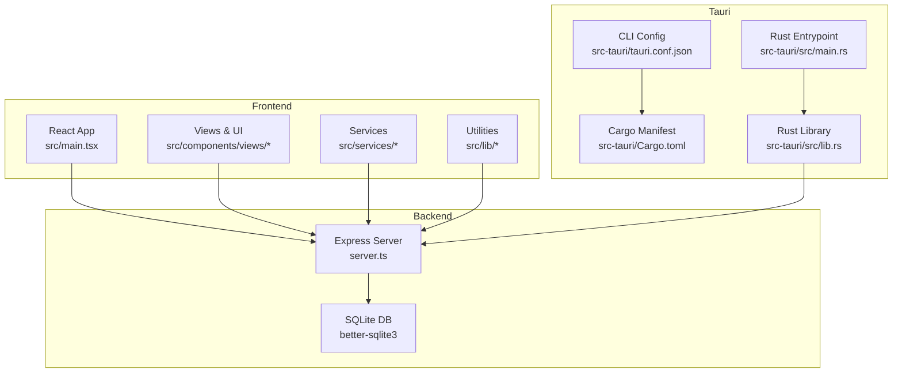
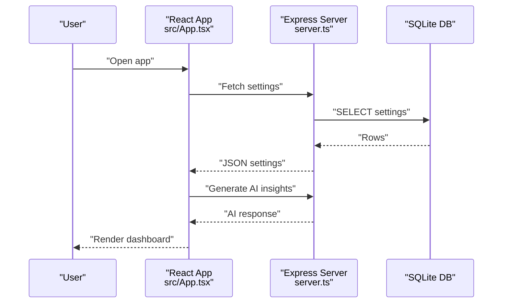
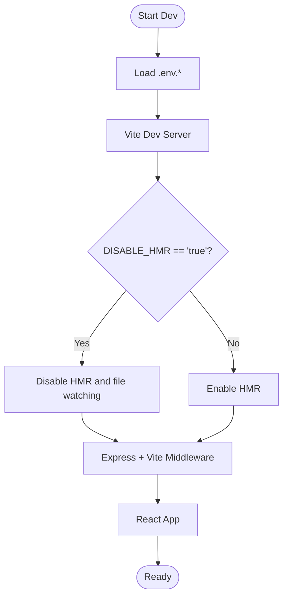
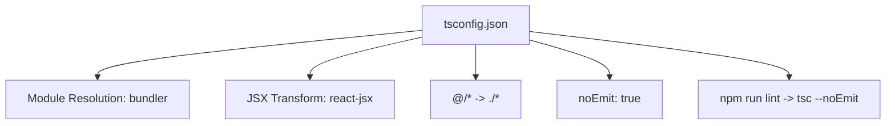
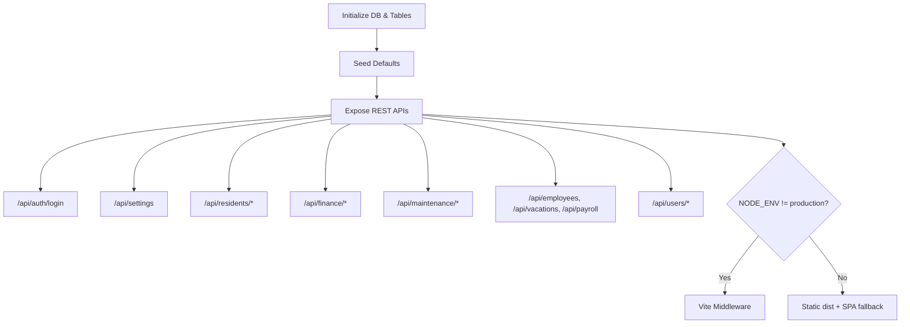
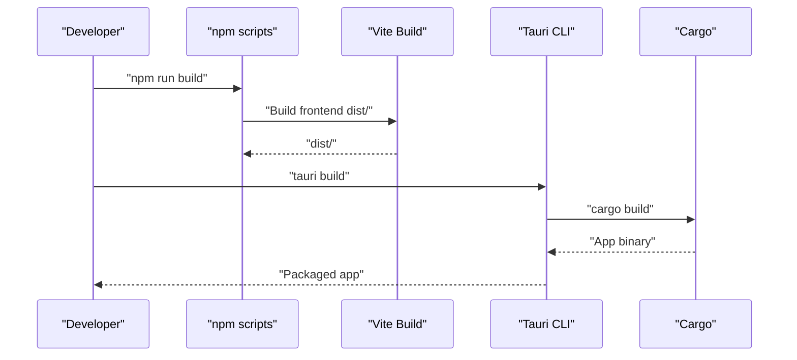
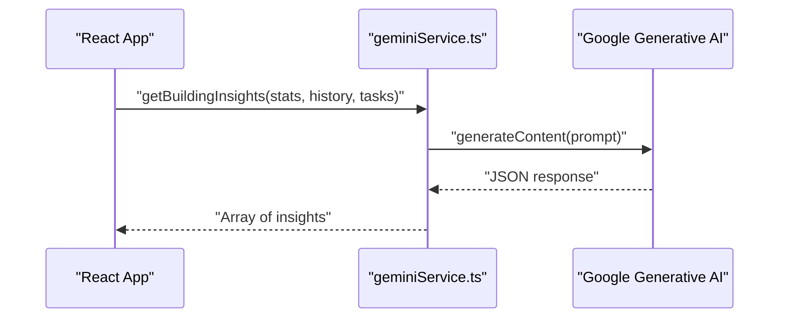
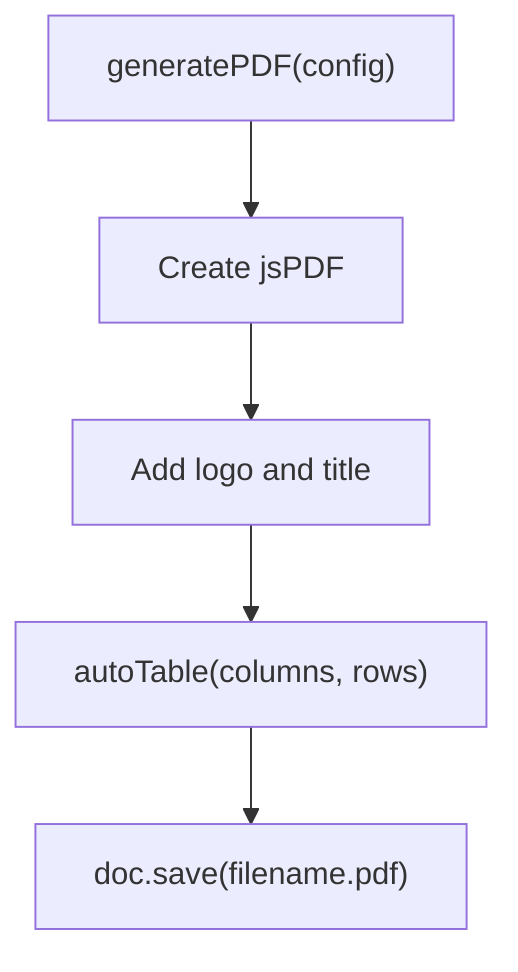
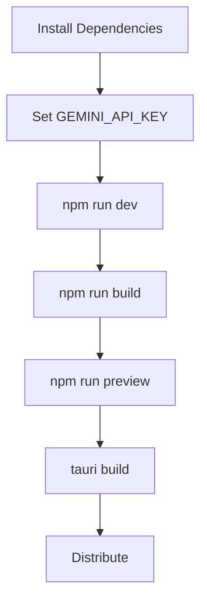
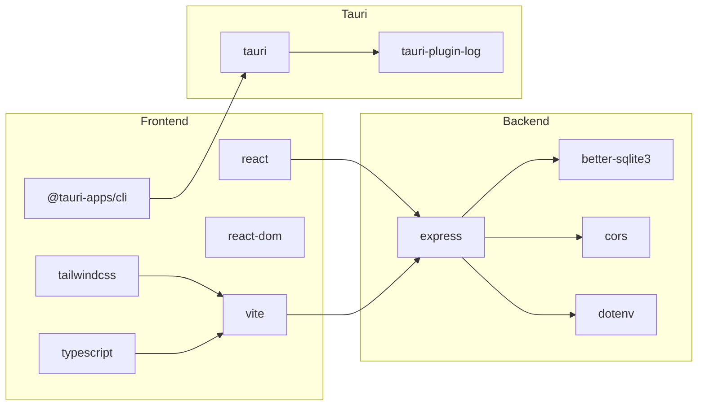

# Development Guide

<cite>
**Referenced Files in This Document**
- [package.json](file://package.json)
- [vite.config.ts](file://vite.config.ts)
- [tsconfig.json](file://tsconfig.json)
- [README.md](file://README.md)
- [server.ts](file://server.ts)
- [src-tauri/tauri.conf.json](file://src-tauri/tauri.conf.json)
- [src-tauri/Cargo.toml](file://src-tauri/Cargo.toml)
- [src-tauri/src/main.rs](file://src-tauri/src/main.rs)
- [src-tauri/src/lib.rs](file://src-tauri/src/lib.rs)
- [src/main.tsx](file://src/main.tsx)
- [src/App.tsx](file://src/App.tsx)
- [src/services/geminiService.ts](file://src/services/geminiService.ts)
- [src/constants.ts](file://src/constants.ts)
- [src/types.ts](file://src/types.ts)
- [src/lib/pdf.ts](file://src/lib/pdf.ts)
</cite>

## Table of Contents
1. [Introduction](#introduction)
2. [Project Structure](#project-structure)
3. [Core Components](#core-components)
4. [Architecture Overview](#architecture-overview)
5. [Detailed Component Analysis](#detailed-component-analysis)
6. [Dependency Analysis](#dependency-analysis)
7. [Performance Considerations](#performance-considerations)
8. [Troubleshooting Guide](#troubleshooting-guide)
9. [Conclusion](#conclusion)
10. [Appendices](#appendices)

## Introduction
This guide documents the EdiIA project development workflow, build configuration, TypeScript setup, and Tauri packaging process. It explains hot reload behavior, debugging techniques, testing strategies, code quality tools, contribution guidelines, coding standards, environment setup, dependency management, and release procedures. The application is a desktop-first React + Express + SQLite app wrapped with Tauri, featuring AI-powered insights via Google Generative AI.

## Project Structure
The project follows a hybrid frontend/backend structure with a Tauri wrapper:
- Frontend: React application built with Vite, TypeScript, Tailwind CSS, and React hooks
- Backend: Express server with Vite middleware for development and better-sqlite3 for persistence
- Tauri: Native shell that embeds the built frontend into a cross-platform desktop app
- AI Integration: Google Generative AI service for building insights

**Diagram sources**
- [src/main.tsx:1-11](file://src/main.tsx#L1-L11)
- [server.ts:45-656](file://server.ts#L45-L656)
- [src-tauri/tauri.conf.json:1-41](file://src-tauri/tauri.conf.json#L1-L41)
- [src-tauri/Cargo.toml:1-26](file://src-tauri/Cargo.toml#L1-L26)
- [src-tauri/src/main.rs:1-7](file://src-tauri/src/main.rs#L1-L7)
- [src-tauri/src/lib.rs:1-17](file://src-tauri/src/lib.rs#L1-L17)

**Section sources**
- [README.md:11-21](file://README.md#L11-L21)
- [package.json:6-13](file://package.json#L6-L13)
- [vite.config.ts:6-25](file://vite.config.ts#L6-L25)
- [tsconfig.json:1-27](file://tsconfig.json#L1-L27)

## Core Components
- Build and Dev Scripts: npm scripts orchestrate development, production builds, and preview
- Vite Configuration: React plugin, Tailwind integration, environment variable injection, path aliases, and HMR toggles
- TypeScript Configuration: ESNext module resolution, JSX transform, DOM libs, and path mapping
- Express Server: SPA routing, SQLite initialization, CORS, rate-limited authentication, and comprehensive API routes
- Tauri Configuration: Desktop window sizing, dev/build commands, frontend distribution path, and bundling icons
- Rust Entrypoint: Minimal Tauri runtime bootstrap
- AI Service: Google Generative AI client configured via environment variable
- Utilities: PDF generation with jsPDF and autoTable

**Section sources**
- [package.json:6-13](file://package.json#L6-L13)
- [vite.config.ts:6-25](file://vite.config.ts#L6-L25)
- [tsconfig.json:1-27](file://tsconfig.json#L1-L27)
- [server.ts:45-656](file://server.ts#L45-L656)
- [src-tauri/tauri.conf.json:6-11](file://src-tauri/tauri.conf.json#L6-L11)
- [src-tauri/src/main.rs:1-7](file://src-tauri/src/main.rs#L1-L7)
- [src-tauri/src/lib.rs:1-17](file://src-tauri/src/lib.rs#L1-L17)
- [src/services/geminiService.ts:9-49](file://src/services/geminiService.ts#L9-L49)
- [src/lib/pdf.ts:12-58](file://src/lib/pdf.ts#L12-L58)

## Architecture Overview
The application runs as a desktop app with a React frontend served by an Express server in development and packaged via Tauri. The backend persists data in a local SQLite database and exposes REST endpoints consumed by the frontend.

**Diagram sources**
- [src/App.tsx:251-277](file://src/App.tsx#L251-L277)
- [server.ts:191-217](file://server.ts#L191-L217)
- [server.ts:522-558](file://server.ts#L522-L558)

## Detailed Component Analysis

### Development Workflow and Hot Reload
- Development server: Runs the Express server with Vite middleware in non-production mode
- HMR behavior: Controlled by an environment variable; when disabled, file watching prevents flickering during agent edits
- Path aliases: '@' resolves to project root for concise imports
- Environment variables: API key injected at build time via Vite define

**Diagram sources**
- [vite.config.ts:6-25](file://vite.config.ts#L6-L25)
- [server.ts:635-648](file://server.ts#L635-L648)

**Section sources**
- [vite.config.ts:6-25](file://vite.config.ts#L6-L25)
- [server.ts:635-648](file://server.ts#L635-L648)

### TypeScript Setup and Code Quality
- Module resolution: Bundler with module detection
- JSX transform: React JSX with React 18+ compatibility
- Paths: '@/*' mapped to project root
- Emit: No emit for type checks only
- Linting: Script invokes TypeScript compiler in no-emit mode

**Diagram sources**
- [tsconfig.json:1-27](file://tsconfig.json#L1-L27)
- [package.json:12](file://package.json#L12)

**Section sources**
- [tsconfig.json:1-27](file://tsconfig.json#L1-L27)
- [package.json:12](file://package.json#L12)

### Express Server and Data Access
- Initialization: Creates SQLite database, sets foreign keys, initializes tables and default records
- Authentication: Login endpoint with rate limiting and PBKDF2 verification
- APIs: Comprehensive CRUD endpoints for settings, residents, transactions, maintenance, HR, and users
- Middleware: Vite middleware in development; static serving and SPA fallback in production

**Diagram sources**
- [server.ts:52-188](file://server.ts#L52-L188)
- [server.ts:189-633](file://server.ts#L189-L633)
- [server.ts:635-648](file://server.ts#L635-L648)

**Section sources**
- [server.ts:52-188](file://server.ts#L52-L188)
- [server.ts:189-633](file://server.ts#L189-L633)
- [server.ts:635-648](file://server.ts#L635-L648)

### Tauri Build and Packaging
- CLI: Uses Tauri CLI for desktop packaging
- Configuration: Dev URL, build commands, frontend distribution path, window properties, and icons
- Cargo: Rust crate dependencies including Tauri and logging plugin
- Entrypoint: Minimal main.rs delegates to Rust library run()

**Diagram sources**
- [package.json:8](file://package.json#L8)
- [src-tauri/tauri.conf.json:6-11](file://src-tauri/tauri.conf.json#L6-L11)
- [src-tauri/Cargo.toml:20-26](file://src-tauri/Cargo.toml#L20-L26)
- [src-tauri/src/main.rs:4-6](file://src-tauri/src/main.rs#L4-L6)

**Section sources**
- [package.json:8](file://package.json#L8)
- [src-tauri/tauri.conf.json:6-11](file://src-tauri/tauri.conf.json#L6-L11)
- [src-tauri/Cargo.toml:20-26](file://src-tauri/Cargo.toml#L20-L26)
- [src-tauri/src/main.rs:4-6](file://src-tauri/src/main.rs#L4-L6)

### AI Integration and Insights
- Service: Initializes Google Generative AI client with API key from environment
- Prompt: Builds a Portuguese-language prompt tailored to Angolan real (AOA) metrics
- Fallback: Returns curated suggestions on failure

**Diagram sources**
- [src/App.tsx:141-150](file://src/App.tsx#L141-L150)
- [src/services/geminiService.ts:9-49](file://src/services/geminiService.ts#L9-L49)

**Section sources**
- [src/services/geminiService.ts:9-49](file://src/services/geminiService.ts#L9-L49)
- [src/App.tsx:141-150](file://src/App.tsx#L141-L150)

### PDF Generation Utility
- Functionality: Generates branded PDF reports with autoTable
- Inputs: Title, columns, rows, filename, optional subtitle
- Output: Downloads PDF via jsPDF

**Diagram sources**
- [src/lib/pdf.ts:12-58](file://src/lib/pdf.ts#L12-L58)

**Section sources**
- [src/lib/pdf.ts:12-58](file://src/lib/pdf.ts#L12-L58)

### Conceptual Overview
This section provides general guidance without analyzing specific files.

[No sources needed since this diagram shows conceptual workflow, not actual code structure]

## Dependency Analysis
- Frontend dependencies: React, React DOM, Tailwind CSS, Framer Motion, Recharts, jsPDF, and others
- Dev dependencies: Vite, TypeScript, Tailwind plugins, Tauri CLI, and TSX
- Backend dependencies: Express, better-sqlite3, CORS, dotenv, and crypto
- Tauri dependencies: Tauri core, serde, log, and tauri-plugin-log

**Diagram sources**
- [package.json:14-43](file://package.json#L14-L43)
- [src-tauri/Cargo.toml:20-26](file://src-tauri/Cargo.toml#L20-L26)

**Section sources**
- [package.json:14-43](file://package.json#L14-L43)
- [src-tauri/Cargo.toml:20-26](file://src-tauri/Cargo.toml#L20-L26)

## Performance Considerations
- HMR toggle: Disable HMR to reduce flickering during frequent edits
- SQLite migrations: Idempotent schema additions avoid repeated overhead
- Rate limiting: Prevents brute-force login attempts and reduces server load
- Lazy loading: React.lazy for views reduces initial bundle size
- Tailwind: Purge unused styles in production builds to minimize CSS size

[No sources needed since this section provides general guidance]

## Troubleshooting Guide
- Missing API key: Ensure GEMINI_API_KEY is set in environment; otherwise AI insights will fall back
- Database initialization: On first run, tables and defaults are created automatically
- Login failures: Incorrect PIN triggers rate limit; wait for window to reset
- Static assets: In production, Express serves dist/ and returns index.html for SPA routes
- Tauri build: Verify frontend is built before running tauri build; confirm dev URL and build commands in configuration

**Section sources**
- [src/services/geminiService.ts:9](file://src/services/geminiService.ts#L9)
- [server.ts:52-188](file://server.ts#L52-L188)
- [server.ts:522-558](file://server.ts#L522-L558)
- [server.ts:643-648](file://server.ts#L643-L648)
- [src-tauri/tauri.conf.json:6-11](file://src-tauri/tauri.conf.json#L6-L11)

## Conclusion
EdiIA combines a modern React frontend with a robust Express backend and SQLite persistence, wrapped in a Tauri desktop application. The development workflow emphasizes hot reloading, type safety, and clean separation of concerns. AI insights, PDF reporting, and modular components enable efficient building management workflows.

[No sources needed since this section summarizes without analyzing specific files]

## Appendices

### Development Environment Setup
- Prerequisites: Node.js
- Steps:
  1) Install dependencies
  2) Set GEMINI_API_KEY in environment
  3) Run development server

**Section sources**
- [README.md:16-21](file://README.md#L16-L21)

### Build and Run Commands
- Development: Starts Express server with Vite middleware
- Production build: Generates optimized frontend assets
- Preview: Serves built assets locally
- Clean: Removes dist folder

**Section sources**
- [package.json:6-13](file://package.json#L6-L13)

### Testing Strategies
- Unit tests: Not present in the repository; recommended to add tests for services and utilities
- Integration tests: Validate API endpoints and database interactions
- Manual QA: Test login, navigation, forms, and PDF generation

[No sources needed since this section provides general guidance]

### Code Quality Tools
- Linting: TypeScript compiler in no-emit mode
- Formatting: Not included; consider adding Prettier and ESLint
- Type checking: Strict TypeScript configuration

**Section sources**
- [package.json:12](file://package.json#L12)
- [tsconfig.json:1-27](file://tsconfig.json#L1-27)

### Contribution Guidelines
- Branching: Feature branches merged via pull requests
- Commit messages: Descriptive and scoped
- Code review: Required for merging changes
- Types: Prefer TypeScript interfaces and enums
- Styling: Use Tailwind utilities and shared components

[No sources needed since this section provides general guidance]

### Coding Standards
- Imports: Use '@' alias for root-relative imports
- Components: Keep functional components with hooks
- State: Prefer React state and effects; keep local state minimal
- APIs: Use consistent REST conventions and error handling

**Section sources**
- [vite.config.ts:14-16](file://vite.config.ts#L14-L16)
- [src/App.tsx:56-66](file://src/App.tsx#L56-L66)

### Release Procedures
- Build frontend: Run production build
- Package app: Use Tauri CLI to build native binaries
- Distribution: Attach icons and platform-specific artifacts

**Section sources**
- [package.json:8](file://package.json#L8)
- [src-tauri/tauri.conf.json:26-39](file://src-tauri/tauri.conf.json#L26-L39)