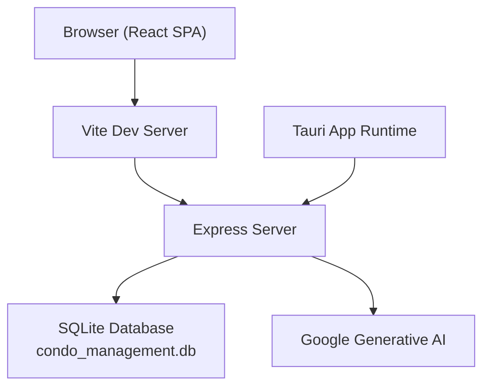
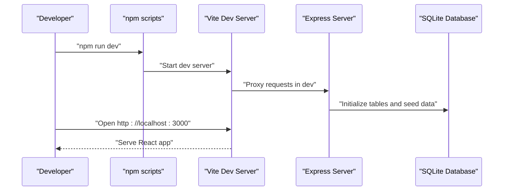
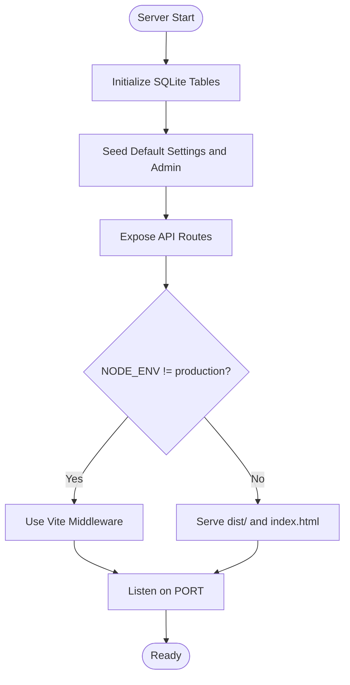
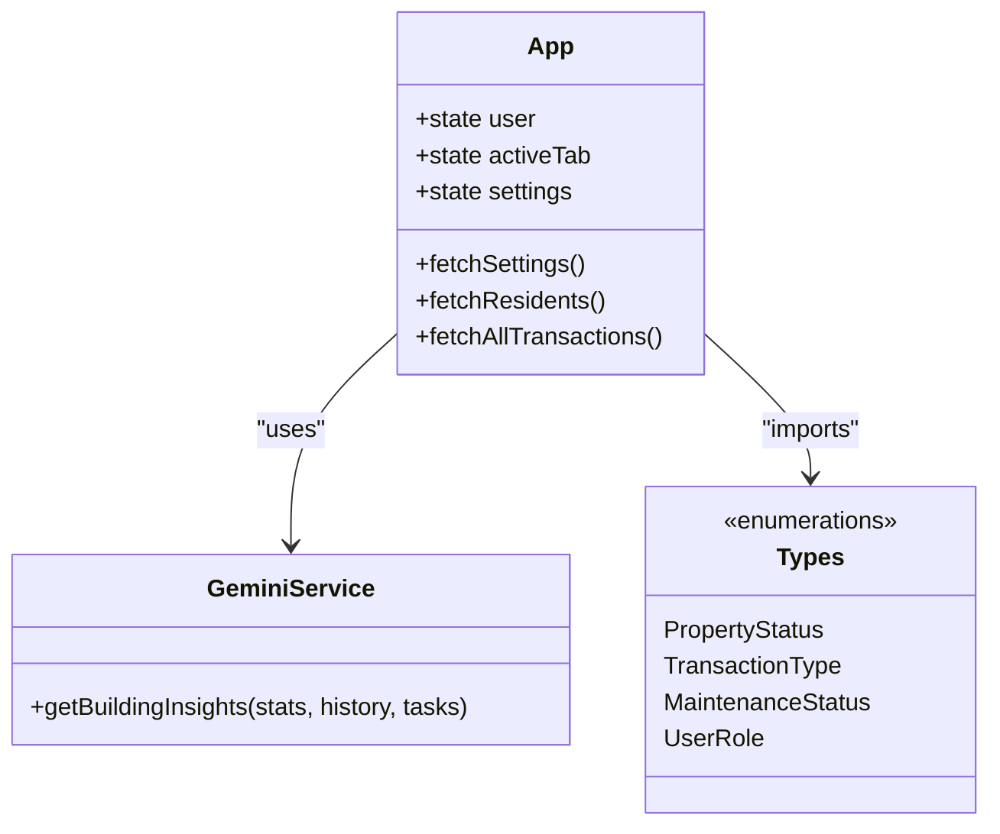
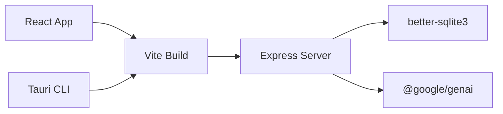

# Getting Started

<cite>
**Referenced Files in This Document**
- [README.md](file://README.md)
- [package.json](file://package.json)
- [vite.config.ts](file://vite.config.ts)
- [tsconfig.json](file://tsconfig.json)
- [index.html](file://index.html)
- [server.ts](file://server.ts)
- [src-tauri/tauri.conf.json](file://src-tauri/tauri.conf.json)
- [src/App.tsx](file://src/App.tsx)
- [src/constants.ts](file://src/constants.ts)
- [src/types.ts](file://src/types.ts)
- [src/services/geminiService.ts](file://src/services/geminiService.ts)
</cite>

## Table of Contents
1. [Introduction](#introduction)
2. [Project Structure](#project-structure)
3. [Core Components](#core-components)
4. [Architecture Overview](#architecture-overview)
5. [Detailed Component Analysis](#detailed-component-analysis)
6. [Dependency Analysis](#dependency-analysis)
7. [Performance Considerations](#performance-considerations)
8. [Troubleshooting Guide](#troubleshooting-guide)
9. [Conclusion](#conclusion)
10. [Appendices](#appendices)

## Introduction
This guide helps you quickly set up and run the EdiIA Building Management System locally. It covers prerequisites, installation, environment configuration, development and production workflows, and basic usage. The system combines a React frontend with a Node.js/Express backend, SQLite for persistence, and optional Tauri packaging for desktop distribution.

## Project Structure
At a high level, the project consists of:
- Frontend: React + Vite with TypeScript
- Backend: Express server with SQLite database
- Optional desktop packaging: Tauri configuration
- AI integration: Google Generative AI for insights

**Diagram sources**
- [index.html:1-14](file://index.html#L1-L14)
- [vite.config.ts:1-25](file://vite.config.ts#L1-L25)
- [server.ts:45-656](file://server.ts#L45-L656)
- [src-tauri/tauri.conf.json:1-41](file://src-tauri/tauri.conf.json#L1-L41)

**Section sources**
- [README.md:1-21](file://README.md#L1-L21)
- [package.json:1-45](file://package.json#L1-L45)
- [vite.config.ts:1-25](file://vite.config.ts#L1-L25)
- [server.ts:45-656](file://server.ts#L45-L656)
- [src-tauri/tauri.conf.json:1-41](file://src-tauri/tauri.conf.json#L1-L41)

## Core Components
- Frontend entrypoint and routing: [src/main.tsx:1-11](file://src/main.tsx#L1-L11), [src/App.tsx:1-2375](file://src/App.tsx#L1-L2375)
- Build and dev scripts: [package.json:6-12](file://package.json#L6-L12)
- Environment and aliases: [vite.config.ts:6-24](file://vite.config.ts#L6-L24), [tsconfig.json:1-27](file://tsconfig.json#L1-L27)
- Backend server and API routes: [server.ts:45-656](file://server.ts#L45-L656)
- Desktop packaging: [src-tauri/tauri.conf.json:1-41](file://src-tauri/tauri.conf.json#L1-L41)
- AI integration: [src/services/geminiService.ts:1-49](file://src/services/geminiService.ts#L1-L49)

**Section sources**
- [src/main.tsx:1-11](file://src/main.tsx#L1-L11)
- [src/App.tsx:1-2375](file://src/App.tsx#L1-L2375)
- [package.json:6-12](file://package.json#L6-L12)
- [vite.config.ts:6-24](file://vite.config.ts#L6-L24)
- [tsconfig.json:1-27](file://tsconfig.json#L1-L27)
- [server.ts:45-656](file://server.ts#L45-L656)
- [src-tauri/tauri.conf.json:1-41](file://src-tauri/tauri.conf.json#L1-L41)
- [src/services/geminiService.ts:1-49](file://src/services/geminiService.ts#L1-L49)

## Architecture Overview
The system runs as a single-page application served by Vite in development and Express in production. The Express server also acts as a backend API, initializes SQLite tables, seeds default data, and proxies static assets in production. Tauri wraps the built frontend into a desktop app.

**Diagram sources**
- [package.json:6-12](file://package.json#L6-L12)
- [vite.config.ts:636-648](file://vite.config.ts#L636-L648)
- [server.ts:45-656](file://server.ts#L45-L656)

## Detailed Component Analysis

### Prerequisites and Installation
- Node.js: Required for development and building. See [README prerequisites:13-20](file://README.md#L13-L20).
- Install dependencies: [README step:16-20](file://README.md#L16-L20), [package.json scripts:6-12](file://package.json#L6-L12).

Environment configuration:
- Gemini API key: Set in a local environment file as documented in [README step 2:18-19](file://README.md#L18-L19).
- Vite injects the key at build time: [vite.config.ts define block:10-12](file://vite.config.ts#L10-L12).

Build and preview:
- Build: [package.json script:8-8](file://package.json#L8-L8)
- Preview: [package.json script:10-10](file://package.json#L10-L10)

Development server:
- Start: [package.json script:7-7](file://package.json#L7-L7)
- Vite dev server configured in [vite.config.ts:18-22](file://vite.config.ts#L18-L22)

Production startup:
- Start built server: [package.json script:9-9](file://package.json#L9-L9)
- Express serves static assets and routes in production: [server.ts:642-648](file://server.ts#L642-L648)

Desktop packaging (optional):
- Tauri configuration: [src-tauri/tauri.conf.json:6-11](file://src-tauri/tauri.conf.json#L6-L11)
- Build and run via Tauri CLI: [package.json dev/build commands:35-42](file://package.json#L35-L42)

**Section sources**
- [README.md:13-20](file://README.md#L13-L20)
- [package.json:6-12](file://package.json#L6-L12)
- [vite.config.ts:10-24](file://vite.config.ts#L10-L24)
- [server.ts:642-648](file://server.ts#L642-L648)
- [src-tauri/tauri.conf.json:6-11](file://src-tauri/tauri.conf.json#L6-L11)

### Environment Configuration
- API key injection: The build-time define replaces process.env.GEMINI_API_KEY with the runtime value from environment variables. See [vite.config.ts:10-12](file://vite.config.ts#L10-L12).
- Frontend reads the key from the injected global: [src/services/geminiService.ts:9-9](file://src/services/geminiService.ts#L9-L9).
- Default settings and admin account are initialized on first run: [server.ts initialization:168-187](file://server.ts#L168-L187).

**Section sources**
- [vite.config.ts:10-12](file://vite.config.ts#L10-L12)
- [src/services/geminiService.ts:9-9](file://src/services/geminiService.ts#L9-L9)
- [server.ts:168-187](file://server.ts#L168-L187)

### API and Data Layer
The backend exposes REST endpoints for:
- Settings: GET/PUT
- Residents: CRUD and transaction history
- Finance: Fixed expenses, extra fees, and combined transactions
- Maintenance: Tickets
- HR: Employees, vacations, payroll
- Authentication: Login with rate limiting
- Users: CRUD with role checks

Key implementation highlights:
- SQLite initialization and migrations: [server.ts schema setup:52-112](file://server.ts#L52-L112)
- Default admin creation: [server.ts admin seeding:182-187](file://server.ts#L182-L187)
- Rate-limited login: [server.ts login route:522-558](file://server.ts#L522-L558)
- Static serving in production: [server.ts static middleware:642-648](file://server.ts#L642-L648)

**Diagram sources**
- [server.ts:52-112](file://server.ts#L52-L112)
- [server.ts:168-187](file://server.ts#L168-L187)
- [server.ts:636-648](file://server.ts#L636-L648)

**Section sources**
- [server.ts:52-112](file://server.ts#L52-L112)
- [server.ts:168-187](file://server.ts#L168-L187)
- [server.ts:522-558](file://server.ts#L522-L558)
- [server.ts:636-648](file://server.ts#L636-L648)

### Frontend Application
- Entry point: [src/main.tsx:1-11](file://src/main.tsx#L1-L11)
- Routing and lazy-loaded views: [src/App.tsx:55-66](file://src/App.tsx#L55-L66)
- UI primitives and metrics: [src/App.tsx:50-54](file://src/App.tsx#L50-L54)
- Currency and mock data: [src/constants.ts:6-36](file://src/constants.ts#L6-L36)
- Types and enums: [src/types.ts:6-88](file://src/types.ts#L6-L88)
- AI insights integration: [src/services/geminiService.ts:9-48](file://src/services/geminiService.ts#L9-L48)

**Diagram sources**
- [src/App.tsx:75-293](file://src/App.tsx#L75-L293)
- [src/services/geminiService.ts:11-48](file://src/services/geminiService.ts#L11-L48)
- [src/types.ts:6-88](file://src/types.ts#L6-L88)

**Section sources**
- [src/main.tsx:1-11](file://src/main.tsx#L1-L11)
- [src/App.tsx:55-66](file://src/App.tsx#L55-L66)
- [src/constants.ts:6-36](file://src/constants.ts#L6-L36)
- [src/types.ts:6-88](file://src/types.ts#L6-L88)
- [src/services/geminiService.ts:11-48](file://src/services/geminiService.ts#L11-L48)

### Development Workflow
- Start dev server: [package.json:7-7](file://package.json#L7-L7)
- Vite dev server configuration: [vite.config.ts:18-22](file://vite.config.ts#L18-L22)
- HTML entrypoint: [index.html:1-14](file://index.html#L1-L14)
- TypeScript configuration: [tsconfig.json:1-27](file://tsconfig.json#L1-L27)

**Section sources**
- [package.json:7-7](file://package.json#L7-L7)
- [vite.config.ts:18-22](file://vite.config.ts#L18-L22)
- [index.html:1-14](file://index.html#L1-L14)
- [tsconfig.json:1-27](file://tsconfig.json#L1-L27)

### Production Workflow
- Build frontend: [package.json:8-8](file://package.json#L8-L8)
- Start server: [package.json:9-9](file://package.json#L9-L9)
- Express serves static assets and routes: [server.ts:642-648](file://server.ts#L642-L648)

**Section sources**
- [package.json:8-9](file://package.json#L8-L9)
- [server.ts:642-648](file://server.ts#L642-L648)

### Desktop Packaging (Optional)
- Tauri configuration: [src-tauri/tauri.conf.json:1-41](file://src-tauri/tauri.conf.json#L1-L41)
- CLI dependency: [package.json:35-35](file://package.json#L35-L35)

**Section sources**
- [src-tauri/tauri.conf.json:1-41](file://src-tauri/tauri.conf.json#L1-L41)
- [package.json:35-35](file://package.json#L35-L35)

## Dependency Analysis
High-level dependency relationships:
- Frontend depends on React, Tailwind, and UI libraries.
- Backend depends on Express, better-sqlite3, CORS, and dotenv.
- Vite and TypeScript enable the build pipeline.
- Tauri integrates the built frontend into a desktop app.

**Diagram sources**
- [package.json:14-42](file://package.json#L14-L42)
- [vite.config.ts:1-25](file://vite.config.ts#L1-L25)
- [server.ts:6-12](file://server.ts#L6-L12)
- [src-tauri/tauri.conf.json:1-41](file://src-tauri/tauri.conf.json#L1-L41)

**Section sources**
- [package.json:14-42](file://package.json#L14-L42)
- [vite.config.ts:1-25](file://vite.config.ts#L1-L25)
- [server.ts:6-12](file://server.ts#L6-L12)
- [src-tauri/tauri.conf.json:1-41](file://src-tauri/tauri.conf.json#L1-L41)

## Performance Considerations
- SQLite is embedded and suitable for small to medium workloads. For larger deployments, consider migrating to a client-server database.
- The frontend uses lazy loading for views to reduce initial bundle size.
- Vite’s dev server enables fast reloads; disable HMR only if needed per environment variable guidance in the config.
- Keep the AI API key in environment variables to avoid embedding secrets in the client.

## Troubleshooting Guide
Common setup issues and resolutions:
- Missing GEMINI_API_KEY:
  - Symptom: AI insights fail or return fallback messages.
  - Fix: Add the key to your environment as documented in [README step 2:18-19](file://README.md#L18-L19). Confirm it is injected at build time via [vite.config.ts:10-12](file://vite.config.ts#L10-L12).
- Port conflicts:
  - Symptom: Cannot start the server on port 3000.
  - Fix: Change the port in [server.ts:47-47](file://server.ts#L47-L47) or stop the conflicting service.
- Database initialization errors:
  - Symptom: Schema errors or missing tables.
  - Fix: Verify SQLite is installed and writable; the server initializes tables on first run in [server.ts:52-112](file://server.ts#L52-L112).
- Rate-limited login attempts:
  - Symptom: Repeated login failures after several attempts.
  - Fix: Wait for the rate limit window to reset as implemented in [server.ts:17-21](file://server.ts#L17-L21) and [server.ts:522-558](file://server.ts#L522-L558).
- Tauri build issues:
  - Symptom: Tauri build fails or dev command not found.
  - Fix: Ensure Tauri CLI is installed as per [package.json:35-35](file://package.json#L35-L35) and verify [src-tauri/tauri.conf.json:9-10](file://src-tauri/tauri.conf.json#L9-L10).

**Section sources**
- [README.md:18-19](file://README.md#L18-L19)
- [vite.config.ts:10-12](file://vite.config.ts#L10-L12)
- [server.ts:47-47](file://server.ts#L47-L47)
- [server.ts:52-112](file://server.ts#L52-L112)
- [server.ts:17-21](file://server.ts#L17-L21)
- [server.ts:522-558](file://server.ts#L522-L558)
- [package.json:35-35](file://package.json#L35-L35)
- [src-tauri/tauri.conf.json:9-10](file://src-tauri/tauri.conf.json#L9-L10)

## Conclusion
You now have the essentials to install, configure, and run the EdiIA Building Management System locally. Use the provided scripts and configurations to develop, test, and optionally package the desktop app. For production, build the frontend and start the server as outlined above.

## Appendices

### Quick Commands Reference
- Install dependencies: [README step:16-17](file://README.md#L16-L17), [package.json:6-12](file://package.json#L6-L12)
- Start development: [package.json:7-7](file://package.json#L7-L7)
- Build for production: [package.json:8-8](file://package.json#L8-L8)
- Preview production build: [package.json:10-10](file://package.json#L10-L10)
- Start production server: [package.json:9-9](file://package.json#L9-L9)
- Clean build artifacts: [package.json:11-11](file://package.json#L11-L11)

**Section sources**
- [README.md:16-17](file://README.md#L16-L17)
- [package.json:6-12](file://package.json#L6-L12)