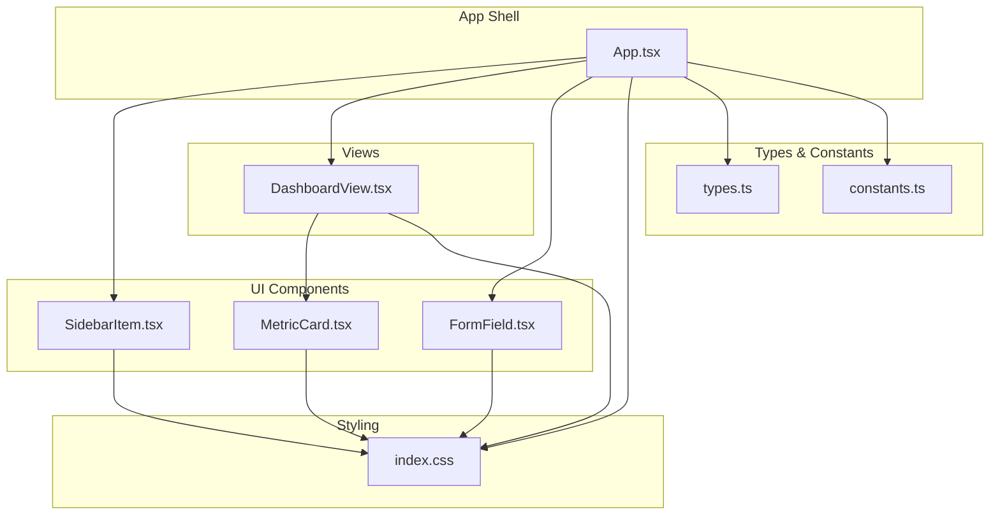
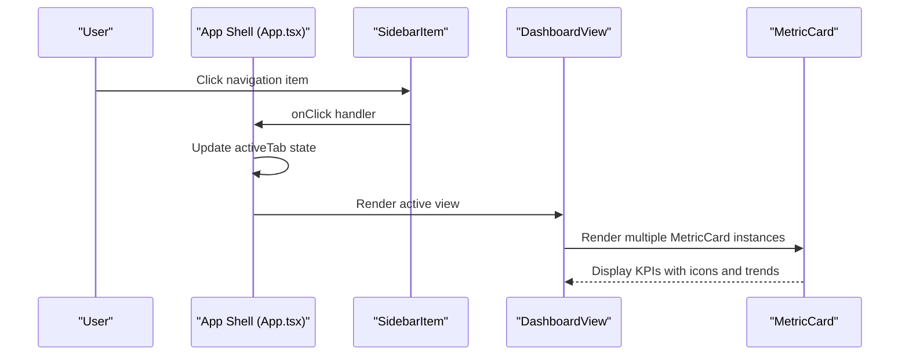
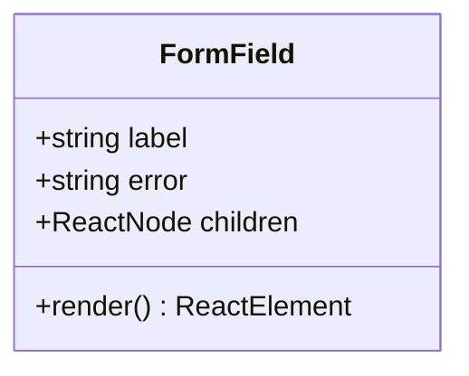
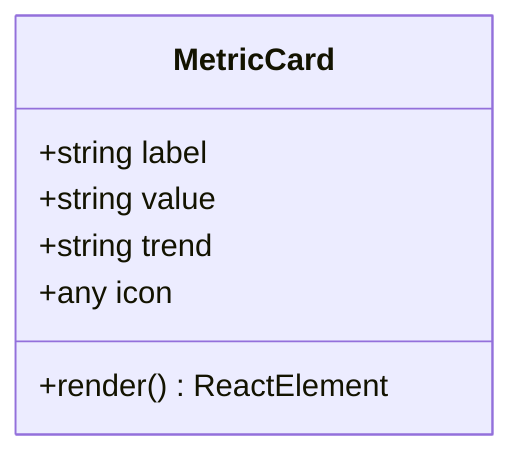
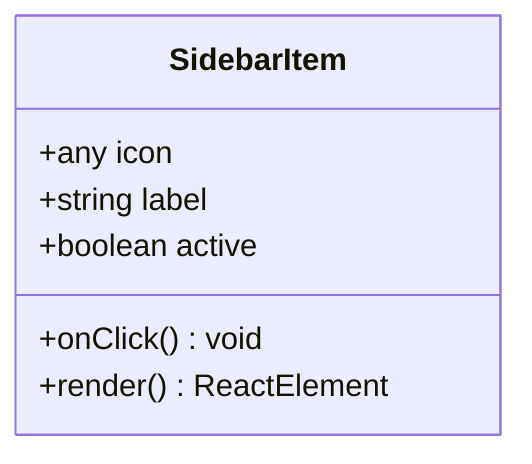
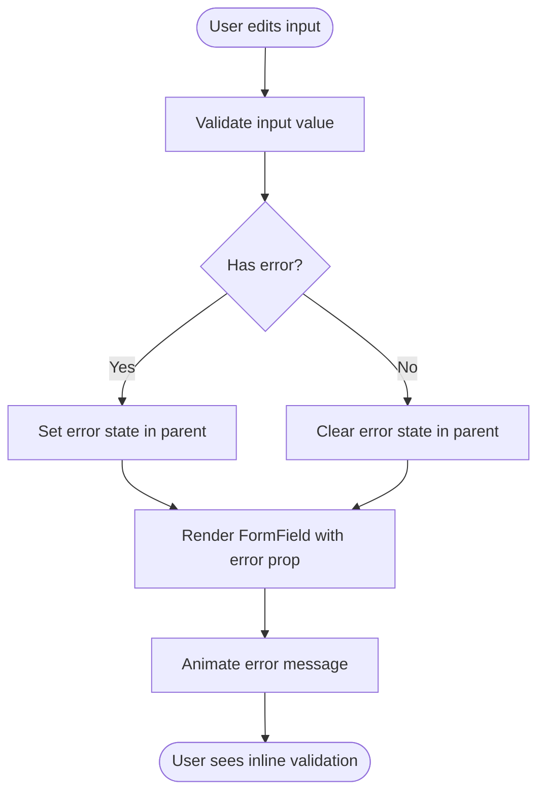
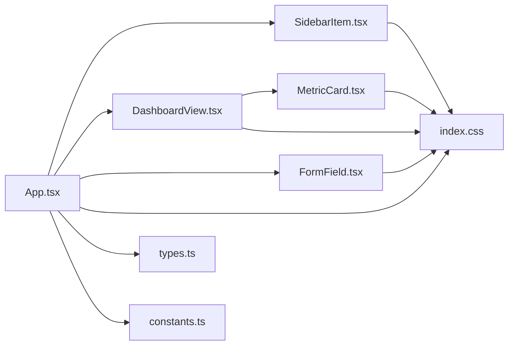

# UI Components

<cite>
**Referenced Files in This Document**
- [FormField.tsx](file://src/components/ui/FormField.tsx)
- [MetricCard.tsx](file://src/components/ui/MetricCard.tsx)
- [SidebarItem.tsx](file://src/components/ui/SidebarItem.tsx)
- [App.tsx](file://src/App.tsx)
- [DashboardView.tsx](file://src/components/views/DashboardView.tsx)
- [index.css](file://src/index.css)
- [types.ts](file://src/types.ts)
- [constants.ts](file://src/constants.ts)
</cite>

## Table of Contents
1. [Introduction](#introduction)
2. [Project Structure](#project-structure)
3. [Core Components](#core-components)
4. [Architecture Overview](#architecture-overview)
5. [Detailed Component Analysis](#detailed-component-analysis)
6. [Dependency Analysis](#dependency-analysis)
7. [Performance Considerations](#performance-considerations)
8. [Troubleshooting Guide](#troubleshooting-guide)
9. [Conclusion](#conclusion)
10. [Appendices](#appendices)

## Introduction
This document describes the EdiIA UI component library with a focus on three reusable components: a custom form field wrapper with validation feedback, a metric card for KPI display, and a sidebar navigation item. It explains component props, styling options, accessibility considerations, integration patterns, usage examples, customization guidelines, responsive design, component composition, state management, and performance optimization techniques.

## Project Structure
The UI components live under src/components/ui and are consumed by views and the main application shell. The global theme and design tokens are defined in the stylesheet, while domain types and constants support consistent data formatting and mock datasets.

**Diagram sources**
- [App.tsx:300-353](file://src/App.tsx#L300-L353)
- [DashboardView.tsx:68-91](file://src/components/views/DashboardView.tsx#L68-L91)
- [FormField.tsx:1-18](file://src/components/ui/FormField.tsx#L1-L18)
- [MetricCard.tsx:1-35](file://src/components/ui/MetricCard.tsx#L1-L35)
- [SidebarItem.tsx:1-20](file://src/components/ui/SidebarItem.tsx#L1-L20)
- [index.css:1-63](file://src/index.css#L1-L63)
- [types.ts:1-88](file://src/types.ts#L1-L88)
- [constants.ts:1-36](file://src/constants.ts#L1-L36)

**Section sources**
- [App.tsx:300-353](file://src/App.tsx#L300-L353)
- [index.css:1-63](file://src/index.css#L1-L63)

## Core Components
This section documents the three UI components: FormField, MetricCard, and SidebarItem. It covers props, styling, accessibility, and usage patterns.

### FormField
A lightweight wrapper for form controls that renders a compact label and optional animated error message. It accepts a child form element and displays validation errors with a subtle animation.

- Props
  - label: string — Label text for the field
  - error?: string — Optional error message to render below the field
  - children: ReactNode — The input or control to wrap

- Styling and Behavior
  - Label uses a small, uppercase, muted style with tracking.
  - Error message appears with a slide-up animation when present.
  - Intended to be composed with native inputs, selects, or custom controls.

- Accessibility
  - Pair with native HTML labels via external labeling for screen reader compatibility.
  - Ensure error messages are concise and actionable.

- Usage Pattern
  - Wrap inputs inside FormField and pass derived error state from parent forms.
  - Combine with controlled inputs and local validation.

- Example Reference
  - See usage in the settings user modal form where FormField wraps inputs and displays inline validation.

**Section sources**
- [FormField.tsx:1-18](file://src/components/ui/FormField.tsx#L1-L18)
- [App.tsx:1219-1243](file://src/App.tsx#L1219-L1243)

### MetricCard
A glass-morphism card designed to display KPIs with an icon, value, optional trend indicator, and hover effects.

- Props
  - label: string — Metric title
  - value: string — Displayed value
  - trend?: string — Optional percentage change (e.g., "+12%" or "-2%")
  - icon: any — Lucide icon component to render inside a branded circle

- Styling and Behavior
  - Uses a glass-card background with backdrop blur and subtle borders.
  - Hover reveals a soft glow and a brand-colored accent.
  - Trend badge color-codes positive/negative changes.
  - Includes a decorative blurred circle that fades in on hover.

- Accessibility
  - Ensure sufficient color contrast for trend badges and values.
  - Provide numeric formatting via shared constants for readability.

- Usage Pattern
  - Render multiple cards in a grid layout for dashboard summaries.
  - Pass formatted values from constants or service data.

- Example Reference
  - Used extensively in the dashboard view to show financial and occupancy metrics.

**Section sources**
- [MetricCard.tsx:1-35](file://src/components/ui/MetricCard.tsx#L1-L35)
- [DashboardView.tsx:68-91](file://src/components/views/DashboardView.tsx#L68-L91)
- [constants.ts:11-18](file://src/constants.ts#L11-L18)

### SidebarItem
A navigation button for the left-hand sidebar with active state styling, hover scaling, and optional pulse animation.

- Props
  - icon: any — Lucide icon component
  - label: string — Menu item text
  - active?: boolean — Whether the item is currently selected
  - onClick: () => void — Handler for navigation

- Styling and Behavior
  - Active item receives brand background, white text, and a glow effect.
  - Hover applies subtle background tint and text brightening.
  - Icon scales slightly on hover; active icon pulses gently.
  - Full-width layout with consistent padding and rounded corners.

- Accessibility
  - Use semantic buttons with clear labels.
  - Ensure keyboard focus visibility and consistent activation affordance.

- Usage Pattern
  - Render a list of SidebarItem components bound to state that tracks the active tab.

- Example Reference
  - Consumed by the main App shell to build the primary navigation.

**Section sources**
- [SidebarItem.tsx:1-20](file://src/components/ui/SidebarItem.tsx#L1-L20)
- [App.tsx:338-352](file://src/App.tsx#L338-L352)

## Architecture Overview
The components integrate with the app shell and views to deliver a cohesive UI. The shell manages navigation state and passes icons and labels to SidebarItem. Views compose MetricCard for KPIs and use FormField for forms with validation.

**Diagram sources**
- [App.tsx:338-352](file://src/App.tsx#L338-L352)
- [App.tsx:386-387](file://src/App.tsx#L386-L387)
- [DashboardView.tsx:68-91](file://src/components/views/DashboardView.tsx#L68-L91)
- [MetricCard.tsx:10-35](file://src/components/ui/MetricCard.tsx#L10-L35)

## Detailed Component Analysis

### FormField Component
FormField encapsulates label and error presentation around a child control. It leverages motion animations for smooth error transitions and relies on Tailwind classes for typography and spacing.

**Diagram sources**
- [FormField.tsx:4-18](file://src/components/ui/FormField.tsx#L4-L18)

**Section sources**
- [FormField.tsx:1-18](file://src/components/ui/FormField.tsx#L1-L18)

### MetricCard Component
MetricCard renders a self-contained metric with icon, value, and optional trend. It uses motion for entrance and hover effects, and combines clsx/twMerge for conditional classes.

**Diagram sources**
- [MetricCard.tsx:10-35](file://src/components/ui/MetricCard.tsx#L10-L35)

**Section sources**
- [MetricCard.tsx:1-35](file://src/components/ui/MetricCard.tsx#L1-L35)

### SidebarItem Component
SidebarItem is a single navigation entry with active state styling and hover interactions.

**Diagram sources**
- [SidebarItem.tsx:9-20](file://src/components/ui/SidebarItem.tsx#L9-L20)

**Section sources**
- [SidebarItem.tsx:1-20](file://src/components/ui/SidebarItem.tsx#L1-L20)

### Validation Flow with FormField
This flow shows how a parent form sets and clears validation errors, which are then passed to FormField to render.

**Diagram sources**
- [App.tsx:1219-1243](file://src/App.tsx#L1219-L1243)
- [FormField.tsx:8-16](file://src/components/ui/FormField.tsx#L8-L16)

## Dependency Analysis
The components depend on shared styling utilities and icons. They are consumed by the main app shell and views.

**Diagram sources**
- [App.tsx:300-353](file://src/App.tsx#L300-L353)
- [DashboardView.tsx:68-91](file://src/components/views/DashboardView.tsx#L68-L91)
- [FormField.tsx:1-18](file://src/components/ui/FormField.tsx#L1-L18)
- [MetricCard.tsx:1-35](file://src/components/ui/MetricCard.tsx#L1-L35)
- [SidebarItem.tsx:1-20](file://src/components/ui/SidebarItem.tsx#L1-L20)
- [index.css:1-63](file://src/index.css#L1-L63)
- [types.ts:1-88](file://src/types.ts#L1-L88)
- [constants.ts:1-36](file://src/constants.ts#L1-L36)

**Section sources**
- [App.tsx:300-353](file://src/App.tsx#L300-L353)
- [index.css:1-63](file://src/index.css#L1-L63)

## Performance Considerations
- Prefer memoization for expensive computations in parent containers when passing props to MetricCard and SidebarItem.
- Keep FormField error rendering lightweight; avoid heavy animations for frequent input changes.
- Use CSS containment and transform-style where appropriate to reduce layout thrashing during hover states.
- Lazy-load views to minimize initial bundle size; the app already uses dynamic imports for views.
- Reuse shared constants and formatters to avoid repeated allocations.

## Troubleshooting Guide
- Inline validation not visible
  - Ensure error prop is passed to FormField and that the error string is truthy.
  - Verify motion animations are enabled and the container supports layout.
- Trend badge color incorrect
  - Confirm trend string starts with "+" for positive or "-" for negative.
- Navigation item not highlighting
  - Check active prop binding and activeTab state synchronization.
- Hover effects not appearing
  - Confirm group and hover utilities are applied and Tailwind JIT compilation is active.

**Section sources**
- [FormField.tsx:8-16](file://src/components/ui/FormField.tsx#L8-L16)
- [MetricCard.tsx:20-27](file://src/components/ui/MetricCard.tsx#L20-L27)
- [SidebarItem.tsx:12-15](file://src/components/ui/SidebarItem.tsx#L12-L15)

## Conclusion
These UI components provide a consistent, accessible, and visually coherent foundation for EdiIA. FormField standardizes validation feedback, MetricCard communicates KPIs effectively, and SidebarItem delivers clear navigation affordances. Together with shared styles and types, they enable scalable composition across views and maintain a unified design language.

## Appendices

### Props Reference Summary
- FormField
  - label: string
  - error?: string
  - children: ReactNode
- MetricCard
  - label: string
  - value: string
  - trend?: string
  - icon: any
- SidebarItem
  - icon: any
  - label: string
  - active?: boolean
  - onClick: () => void

### Styling Tokens and Utilities
- Design tokens (brand, surfaces, ink) defined in the stylesheet.
- Utility classes for glass-card, brand-glow, and backdrop blur.
- clsx/twMerge helpers for conditional class composition.

**Section sources**
- [index.css:4-16](file://src/index.css#L4-L16)
- [index.css:44-46](file://src/index.css#L44-L46)
- [index.css:48-50](file://src/index.css#L48-L50)